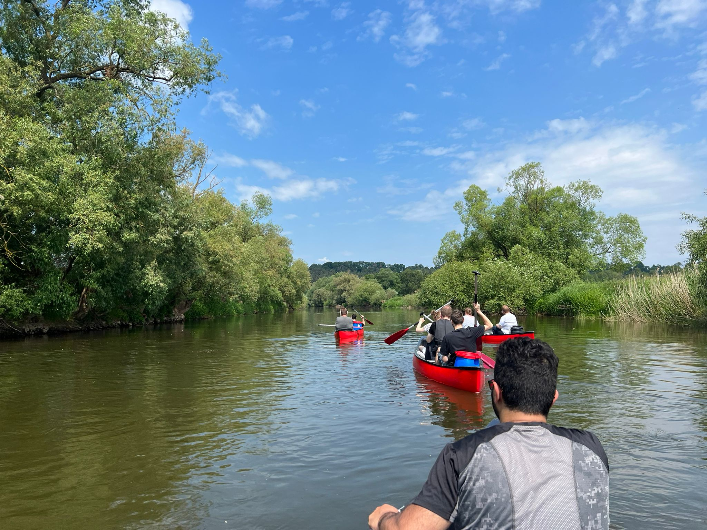

Umschüler und Interessenten für die Umschulung zum/zur Fach&shy;infor&shy;matiker:in für Anwendungs&shy;entwicklung erkundeten die Region mal aus anderer Perspektive.

===

### Vorbemerkung

*Als Softwareentwickler ist es leicht, sich in die Welt des Codes und der Technologie zu vertiefen. Der Druck, sich ständig mit komplizierten Sachverhalten zu beschäftigen, Projekte abzuschließen und Deadlines einzuhalten, kann dazu führen, dass Freizeitaktivitäten und Ausgleich vernachlässigt werden. Zur Aufrechterhaltung der geistigen Gesundheit, zum körperlichen Ausgleich und als soziale Maßnahme versucht die cdemy Code Academy daher, immer mal wieder auch Freizeitaktivitäten anzubieten, die einen Ausgleich zum Schul- und Entwicklungsalltag darstellen.*

Eingeladen waren alle Umschüler:innen, die zu dem Zeitpunkt schon feststehenden demnächst startenden Umschüler:innen, Praktikant:innen, Dozent:innen und im Prinzip auch Lebenspartner:innen aller Vorgenannten.

### Ablauf

Die Kanus wurden von der [Fulle-Marie in Bergshausen](https://www.fulle-marie.de/) angemietet, die uns die Boote auch direkt zum Startpunkt in Guxhagen transportierten. Nach einer Einweisung wurden Wertsachen verstaut, die eine oder andere Schwimmweste umgelegt und die Boote konnten ins Wasser gelassen werden.

[owl-carousel margin=10 loop=false autoplay=false responsive="{0:{items:1, margin: 0}, 850:{items:2, margin:10}}"]

  <!-- <h5 style="position: absolute; top: 0; left: 0; padding: 25px; margin: 0; background: rgba(0,0,0,0.4); color: #fff;">Ja, wenn</h2> -->
  <!-- 
"Kanus ins Wasser lassen"
 -->

  <!-- <h5 style="position: absolute; top: 0; left: 0; padding: 25px; margin: 0; background: rgba(0,0,0,0.4); color: #fff;">Nein, wenn</h2> -->
  <!-- 
"Kanus im Wasser"
 -->

[/owl-carousel]

Nachdem auch der Hund der Geschäftsführung seinen Platz im Kanu gefunden hatte, konnten wir dann aufbrechen und die Fulda aus ungewohnter Perspektive kennenlernen.

[owl-carousel margin=10 loop=false autoplay=false responsive="{0:{items:1, margin: 0}, 850:{items:2, margin:10}}"]

  <!-- <h5 style="position: absolute; top: 0; left: 0; padding: 25px; margin: 0; background: rgba(0,0,0,0.4); color: #fff;">Ja, wenn</h2> -->
  <!-- 
"Kanus ins Wasser lassen"
 -->

  <!-- <h5 style="position: absolute; top: 0; left: 0; padding: 25px; margin: 0; background: rgba(0,0,0,0.4); color: #fff;">Nein, wenn</h2> -->
  <!-- 
"Kanus im Wasser"
 -->

[/owl-carousel]

Zwei Zwischenstopps wurden eingelegt. Zum einen wollten zumindest einige auch prüfen, wie stark die Strömung der Fulda ist *(Spoiler: Dort ist die Strömung so stark, dass sie irgendwann aufgeben mussten)*. Und zum anderen musste natürlich auch ein Halt in einem Biergarten eingelegt werden.

[owl-carousel margin=10 loop=false autoplay=false responsive="{0:{items:1, margin: 0}, 850:{items:2, margin:10}}"]

  <!-- <h5 style="position: absolute; top: 0; left: 0; padding: 25px; margin: 0; background: rgba(0,0,0,0.4); color: #fff;">Ja, wenn</h2> -->
  <!-- 
"Kanus ins Wasser lassen"
 -->

  <!-- <h5 style="position: absolute; top: 0; left: 0; padding: 25px; margin: 0; background: rgba(0,0,0,0.4); color: #fff;">Nein, wenn</h2> -->
  <!-- 
"Kanus im Wasser"
 -->

[/owl-carousel]

Schließlich erreichten wir die Fulle-Marie in Bergshausen und gaben die Kanus nach einer Reinigung wieder ab.

[UmschulungAd]
