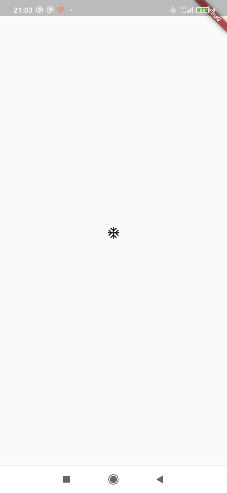

Dieses Tutorial ist als Einstieg in Flutter & Dart konzipiert und nimmt sich 
daher viel Zeit für ausführliche Erklärungen. Wir beginnen mit dem Datenmodell 
für Minesweeper.

===

# Schritt 1

### Wie dieses Tutorial funktioniert

Der Code, der in diesem Tutorial entwickelt wird, wurde veröffentlicht in einem 
Repo unter [AUSoftAndreas/flutter-minesweeper](https://github.com/AUSoftAndreas/flutter_minesweeper). 
Jedes Kapitel hat einen zugeordneten Branch. Dieses Kapitel ist beispielsweise 
Branch "step_a" als Branch zugeordnet. Wenn Ihr also nachvollziehen wollt, wie 
die App nach und nach entstanden ist, dann clont Euch das Repository und dann 
wechselt (in VSCode unten links) den Branch und geht auf "step_a". Gegebenenfalls 
müsst Ihr nochmal pullen, damit es wirklich der richtige Stand ist, aber 
prinzipiell sollten es sofort weniger Dateien sein und eine deutlich schlechtere 
App. :-)

### Schritt A.1: Grundlage schaffen

Ich startete mit einer blanken Vorlage aus dem VSCode-Menu. Also 
Strg + Shift + P und dann "Flutter: New Application Project". Dann wird das 
bekannte Beispiel mit dem Counter installiert, wobei ich den entsprechenden 
Code sofort löschte.

Meine main.dart ist daher sehr spartanisch:

```Dart
import 'package:flutter/material.dart';
import 'package:minesweeper/ui/start_screen.dart';

void main() {
  runApp(
    MyApp(),
  );
}

/// Base class of app
class MyApp extends StatelessWidget {
  @override
  // ignore: prefer_expression_function_bodies
  Widget build(BuildContext context) {
    return MaterialApp(
      routes: {
        '/': (context) => StartScreen(),
      },
      initialRoute: '/',
    );
  }
}
```

Ich erkläre kurz, was die main.dart tut. Im Wesentlichen ist das der Startpunkt 
für die App. Man sieht die `void main()`, die den eigentlichen Einstiegspunkt 
darstellt. Sie tut nicht mehr als die App zu starten, was zwar im Hintergrund 
sicher einiges an Prozessen startet, uns aber eher wenig beschäftigt.

MyApp ist das erste Widget, sozusagen das Stammwidget für alles, was kommt. 
Sämtliche GUI-Elemente in Flutter sind Widgets. Sie sind alle untereinander 
relativ austauschbar insofern, als dass sie alle sich auf die Basisklasse `Widget` 
beziehen. Dadurch ist der Bau einer GUI sehr flexibel, weil ein Widget wieder 
ein anderes Widget als child haben kann - und da ein Widget so vieles sein kann, 
gibt es da einfach viel Auswahl.

In jeder Klasse, die wiederum auf Widgets basiert (wie hier MyApp) gilt es eine 
build-Methode. Diese Methode ist das, was die Ausgabe auf dem Bildschirm erzeugt. 
Sie läuft unter Umständen, zu denen wir noch kommen werden, viele Male pro Sekunde 
ab. Sie kann aber auch über Minuten nicht laufen, wenn Ihr Euch einfach einen 
Screen in der App anschaut. Sie würde aber beispielsweise sofort ablaufen, wenn 
Ihr das Handy dreht. Die build-Methode returnt jeweils Widgets und die werden 
auf dem Bildschirm gerendert. Die Annotation '@override' wird vom Linter gewollt, 
weil technisch gesehen wir die build-Methode unserer Mutterklasse (StatelessWidget) 
überschreiben. Das wird also bei jeder build-Methode passieren. Die Zeile mit dem 
ignore sagt einfach, dass wir den blauen Linter-Hinweis ignorieren wollen, der 
sonst erschiene, wenn wir die Zeile nicht hätten. Das könnt ihr ja ausprobieren.

In unserem Fall setzt diese build-Methode einfach nur ein paar Werte fest. Das 
passiert mit dem MaterialApp-Widget. Hier geht es vor allem um die routes. 
Das heißt, dass wir unseren Screens in der App (also den verschiedenen GUI-
Bildschirmen) jeweils einen Namen zuordnen. Den Namen '/' (was ein Standard für 
den Startscreen ist) ordnen wir also die Klasse StartScreen zu.) Ihr ahnt es, auch 
StartScreen wird eine Tochter eines Widgets sein und in seiner build-Methode ein 
Widget returnen? Exakt.

Außerdem sagen wir, dass die erste Route (initialRoute), also der erste geladene 
Screen der StartScreen sein soll. Sonst passiert hier nix. Kommen wir zum 
StartScreen:

```Dart
import 'package:flutter/material.dart';

/// Welcome Screen for the app
class StartScreen extends StatelessWidget {
  @override
  // ignore: prefer_expression_function_bodies
  Widget build(BuildContext context) {
    return Material(
      child: Container(
        child: Center(
          child: IconButton(
            icon: const Icon(Icons.ac_unit),
            onPressed: () {},
          ),
        ),
      ),
    );
  }
}
```

Selber Aufbau. Und das erste kleine Beispiel dafür, wie GUI-Screens in Flutter 
beschrieben werden. Diese Baumstruktur mit den Einrückungen ist typisch (und 
im Prinzip HTML nicht ganz unähnlich). Gehen wir die Widgets durch:
- Das [Material-Widget](https://api.flutter.dev/flutter/material/Material-class.html) 
sorgt einfach dafür, dass die MaterialDesign-Google-Bibliotheken laufen. Das muss man 
also irgendwohin packen. Ich hatte es auch vergessen und es sorgt dann für 
Fehlermeldungen bei dem Icon-Button, weil Flutter nicht weiß, wie 
so ein Button aussieht, wenn es nicht irgendwo innerhalb eines Material-Widgets geschieht. 
Bei den meisten meiner Apps nutze ich für den Bildschirmaufbau das sogenannte 
[Scaffold-Widget](https://api.flutter.dev/flutter/material/Scaffold-class.html), 
das Material wohl einschließt und muss Material deswegen nicht verwenden. Das 
Scaffold sorgt für einen Seitenaufbau mit Titelleiste etc., aber in dieser App 
wollte ich keine Titelleiste.
- Innerhalb des Material-Widgets liegt ein 
[Container-Widget](https://api.flutter.dev/flutter/widgets/Container-class.html). 
Container-Widgets kommen häufig vor und sind im Prinzip wie `<div></div>` in 
HTML, also einfach eben ein Container um das, was da drin ist. Im Kern wird 
einfach die ganze Seite erstmal in einen Container gepackt.
- In dem Container ist dann ein [Center-Widget](https://api.flutter.dev/flutter/widgets/Center-class.html). 
Ein Center-Widget zentriert einfach alles (vertikal und horizontal), was seine 
Nachkommen sind.
- Und schließlich kommt ein [IconButton-Widget](https://api.flutter.dev/flutter/material/IconButton-class.html). 
Wie man vom Namen her annehmen kann, wird hier ein Button produziert, der wiederum 
ein Icon darstellt. Ihm gibt man dann als Attribute das Icon mit, das dargestellt wird 
(siehe oben `Icon(Icons.ac_unit)`) und man muss auch definieren, was passieren soll, 
sobald der Button gedrückt wird. In dem Fall definierte ich eine anonyme Funktion 
ohne Inhalt. Also eigentlich passiert nichts.

*Was Ihr an dieser Stelle tun könnt und solltet:
- Cursor in `Material` platzieren, rechts clicken und "Refactor" auswählen im 
Kontextmenu. Seht, welche Möglichkeiten Ihr habt. Wählt "Remove widget" und seht, 
dass VSCode Euch hilft. Es entfernt das Material-Widget und die dadurch notwendige 
Klammer am Ende des Blocks. alle anderen Widgets rücken eine Ebene hoch (also 
weiter nach links im Editor). Nun könnt Ihr den Container ebenfalls markieren und 
rechtsclicken. Wiederum "refactor" wählen und "Wrap with widget". Dann wird 
Euer Container in ein noch zu benenndes Widget gehüllt. Nennt das wieder 
`Material` und wir haben den Anfangszustand wieder erreicht. VSCode hilft Euch 
sehr bei der Tipparbeit und das solltet Ihr in Zukunft oft nutzen.
- Fahrt mit dem Mauszeiger über die einzelnen Widgetnamen und VSCode zeigt Euch 
dann an, wie dieses Widget definiert ist und Ihr seht all die Attribute, die Ihr 
definieren KÖNNTET beim Aufruf. Testen wir das mal bei einem aus:
  - Fahrt mit dem Mauszeiger über den Container. Wie Ihr sehen könnt, könnte man 
  einem Container eine Farbe geben, indem man das Attribut color setzt. Okay, tun 
  wir das.
  - Ändert
  ```Dart
      child: Container(
        child: Center(
  ```
  zu
  ```Dart
      child: Container(
        color: Colors.red,
        child: Center(
  ```
  - Seht, dass Ihr dadurch den Container rot gefärbt habt, was man auch in der 
  App sofort sieht. Solche Änderungen werden Euch übrigens immer sofort in der 
  App angezeigt, wenn sobald Ihr die Datei speichert (Strg+S).
  - Begreift den Aufbau: Jeder Widget-Aufruf (ein Konstruktor) erlaubt Euch, 
  bestimmte Attribute zu setzen, die zu dem Widget gehören. Manche Attribute 
  gehen vielleicht sogar wiederum über mehrere Zeilen. Sie enden dann mit einem 
  Komma. Das Schwierigste ist eigentlich, den Überblick über all die Kommans und 
  Klammern zu behalten. Auch da hilft VSCode, indem es hinter die schließenden 
  Klammern einen Text setzt, um Euch zu sagen, zu welchem Element die Klammer 
  gehört.
- Das Komma nach dem letzten Attribut kann man eigentlich weg lassen, aber 
VSCode formatiert den Code schöner, wenn man darauf achtet, eigentlich immer auch 
Kommas zu setzen.

Okay. Halten wir fest: Wir haben jetzt eine App, die nix kann und nach nix 
aussieht. :-)

### Schritt A.2: Models

Die Grundlage ist eigentlich immer, dass man mit den Daten beginnt. Die UI ist 
ja nur eine grafische Representation des sogenannten State. Wir müssen nun überlegen, 
was den State der App ausmacht, also den Zustand, den - würde man ihn komplett 
kennen - einen in die Lage versetzen würde, den Bildschirm zu zeichnen.

Es ist nicht allzu schlimm, wenn man dabei etwas vergisst. Man kann ja nachlegen, 
aber das Arbeiten an GUI etc. macht keinen Sinn ohne ein Verständnis davon zu 
haben, was man eigentlich darstellen will. Ich habe mir folgende 
Sachen erstmal überlegt:

- Im Prinzip ist Minesweeper ein Spiel, wo das Spielfeld aus einer variablen 
Anzahl von Blöcken besteht. Alle Interaktionen spielen sich bezogen auf diese 
Blöcke ab.
- Ich werde also höchstwahrscheinlich mindestens mal eine Klasse für das Spielfeld 
haben müssen, wo es jeweils ein aktives geben wird - und eine Klasse für einen 
einzelnen Block, wobei gleichzeitig ggf. hunderte Blöcke existieren werden
- Ansprechbar soll jeder Block über seine Position sein.

Mein allererster, kleiner Schritt war daher, dass ich auch eine Klasse für 
Positionen schaffen wollte. Das ist nicht zwingend notwendig, aber eine Klasse 
heißt ja zugleich, dass sie zu einem gültigen Variablentyp wird - und mir fielen 
viele Beispiele ein, wo es praktisch wäre, eine Position irgendwo zu speichern 
oder zu übergeben. Gesagt, getan, eine Klasse `Position` war geschaffen:

```Dart
import 'package:flutter/foundation.dart';

/// Defines an absolute position (of a block)
@immutable
class Position {
  /// Horizontal component of position, from 0 (left) to numCols-1 (right)
  final int _x;

  /// Vertical component of position, from 0 (bottom) to numRows-1 (top)
  final int _y;

  /// Standard constructor for position
  const Position(this._x, this._y);

  /// Horizontal component of position, from 0 (left) to numCols-1 (right)
  int get x => _x;

  /// Vertical component of position, from 0 (bottom) to numRows-1 (top)
  int get y => _y;

  /// Overridden toString method, for better output instead of "Instance of <Posiion>"
  @override
  String toString() => 'Position($x/$y)';

  @override
  bool operator ==(Object o) => o is Position && o.x == _x && o.y == _y;

  @override
  int get hashCode => 1000 * x + y;
}
```

Keine Sorge, das ist alles einfacher als es aussieht. Bereinigen wir es mal um 
Kommentare und Annotationen, die ja funktional nicht wirklich notwendig sind.

!!! Annotationen sind Markierungen wie zum Beispiel `@override`. Sie tun 
!!! eigentlich nichts, sie zeigen sind nur ein Weg, mit dem Dart SDK zu 
!!! kommunizieren. Mit `@override` signalisieren wir dem Dart SDK, dass wir 
!!! uns dessen bewusst sind, dass wir hier Methoden überschreiben, die eine 
!!! eine Klasse von einer Mutterklasse (oder Mutter der Mutter ...) geerbt 
!!! hat. Das ist zulässig, könnte aber auch versehentlich geschehen, weil man 
!!! einfach den selben Namen nutzt. Durch `@override` sagen wir, dass es nicht 
!!! zufällig geschah. Ebenso sagen wir dem SDK durch `@immutable`, dass wir 
!!! hier eine unveränderliche Klasse schaffen wollen - und das SDK wird uns 
!!! bei jedem Verstoß gegen diesen Vorsatz korrigieren.

!!! Kommentare werden in Dart durch `//` eingeleitet und haben keinerlei 
!!! Auswirkungen auf das Programm. Sie dienen nur uns als Gedankenstütze und 
!!! sorgen dafür, dass sich andere in Eurem Code besser zurechtfinden. 
!!! Effizientes Kommentieren ist eine wichtige Schlüsselqualifikation.

```Dart
import 'package:flutter/foundation.dart';

@immutable
class Position {
  final int _x;
  final int _y;

  const Position(this._x, this._y);

  int get x => _x;
  int get y => _y;

  String toString() => 'Position($x/$y)';

  bool operator ==(Object o) => o is Position && o.x == _x && o.y == _y;

  int get hashCode => 1000 * x + y;
}
```

Gehen wir den Code durch:
- `final int _x;`
  `final int _y;`
  Eine Position wird bestimmt durch eine X- und eine Y-Koordinate. Beides sind 
  Ganzzahlen, weil es keine halbe Position gibt auf dem Spielfeld. Also definieren 
  wir beides als Attribute einer Position. Da ich eigentlich nicht will, dass eine 
  Position im Nachhinein von irgendwem geändert wird, sind beide als private 
  definiert, was durch den Unterstrich klar gemacht wird. Wenn man aber eine Position 
  hat, dann soll man sie durchaus auslesen können. Man soll sie nur nicht 
  verändern dürfen.
- `int get x => _x;`
  `int get y => _y;`
  Diese Zeilen, sogenante Getter, sorgen dafür, dass die Attribute auslesbar sind. 
  Sie definieren ein öffentliches Attrubut x bzw. y, das man von außen getten, also 
  lesen kann. Man bekommt dann (=>) den Inhalt der beiden privaten Attribute 
  _x bzw. _y ausgegeben. Einfach sich daran erinnern:
  ```Dart
  int get x => _x;
  ```
  ist nur eine andere Schreibweise für  
  ```Dart
  int get x {
    return _x;
  }
  ```
- `const Position(this._x, this._y);`
  Eine Position wird zukünftig erstellt, indem man zum Beispiel einfach 
  Position(2,3) schreibt, damit beschreibt man eindeutig den Block in der 3. 
  Spalte von rechts und der 4. Zeile von unten (Indizes sind meistens 0-basiert, 
  also es gibt Zeile/Spalte 0). Es werden (da wir keine `[]` oder `{}` verwenden) 
  positionale Argumente benötigt, man kann auch keines weglassen. Das erste 
  Argument, was man verwendet, wird automatisch in _x geschrieben, das zweite 
  automatisch in _y. `this` steht stellvertretend für "dieses Objekt". Das 
  `const` wurde mir seitens Linter empfohlen. Generell ist es eine Art Zusicherung, 
  dass das Objekt, wenn es denn von irgendwem erstellt wurde, sich nie wieder 
  ändert. Und das ist ja hier der Fall. Eine Position bleibt immer genau diese 
  Position. Der Inhalt der Position mag sich vielleicht verändern (also der 
  Block, der da liegt), aber "3 Reihen von unten, 5 Blöcke von links" bleibt 
  immer "3 Reihen von unten, 5 Blöcke von links".

Und das ist schon das Ende für den Code, der wirklich klassenbezogen ist. Da ich 
hin und wieder Log-Ausgaben produziere und ich da nicht jedesmal etwas schreiben will wie 
`log('Position erstellt mit dem Koordinaten ${pos.x} / ${pos.y}');` habe ich 
die toString-Methode, die jedes Objekt hat, überschrieben. Die sorgte in ihrer 
Standardfassung dafür, dass ein `log('$pos');` immer die Ausgabe `Instance of <Position>` 
erzeugt, was wenig aussagefähig ist. Durch meine Veränderung wird jetzt bspw. 
`Position(2/3)` ausgegeben.

Für die nächsten beiden Codeabschnitte müssen wir kurz etwas Theorie wiederholen. 
Eine Variable enthält in der Regel nicht das Objekt selbst, sondern einen 
Verweis darauf. Bei den sogenannten "Primitives" (primitive Werte wie String, 
int, double) ist alles so eingerichtet, dass man Werte miteinander vergleichen kann. 
Bei den eigenen Klassen allerdings nicht. Man beachte folgenden Code (den Ihr 
in einem Tool wie [DartPad](https://dartpad.dev/) gut nachvollziehen könnt):

```Dart
class SimpleClass {
  String attribute;
  SimpleClass(this.attribute);
}

void main() {
  var a = 'Hallo';
  var b = 'Hallo';
  print(a==b); // => true
  var c = SimpleClass('Hallo');
  var d = SimpleClass('Hallo');
  print(c==d); // => false
}
```

Man sieht, dass er bei zwei Instanzen der SimpleClass nicht wirklich prüft, ob 
die Inhalte gleich sind. Stattdessen sagt er einfach "es sind zwei verschiedene 
Instanzen, also sind sie ungleich". Das ist natürlich, gerade bei großen Klassen, 
auch die viel schnellere Prüfroutine und oft genug passt sie. Hier aber nicht. 
Wir werden oft Positionen vergleichen und dazu werden wir Positionen erzeugen 
und dann soll eben gelten, dass `Position(2,3) == Position(2,3)` ist.

Daher overriden wir den Operator `==` mit dem nachfolgenden Code:
```Dart
bool operator ==(Object o) => o is Position && o.x == _x && o.y == _y;
```
Wir sagen dadurch: Eine Position(x/y) ist dann **gleich** einem anderen Objekt 
(ganz allgemein), wenn auch das andere Objekt eine Position ist und wenn dann 
auch x und y übereinstimmen mit unseren Attributen _x und _y (man beachte 
die Unterstriche, denn die sind ja privat, wobei wir auch x und y schreiben könnten, 
denn unsere Klasse würde dann über den Getter ja auch _x und _y bekommen).

Und schließlich gab es die Linter-Aufforderung, dass man nie nur den Equality-Operator 
overriden soll, sondern auch den sogenannten hashCode, der dem Computer 
dabei hilft, Werte zu vergleichen. Er soll den Inhalt schneller repräsentieren 
als wenn man wirklich händisch alle Attribute vergleicht. Nunja, die von mir 
gefundene Funktion `1000 * x + y` garantiert, dass jede wirklich verschiedene 
Position auch einen unterschiedlichen hashWert hat und deswegen nahm ich sie.

Alle anderen Änderungen an der Datei waren Linter-bezogen, also weil er zum 
Beispiel bemängelte, dass eine Dokumentation fehlt oder dass man das Keyword 
final verwenden soll. Das gilt zum Beispiel für _x und _y. Warum? Nun, wenn 
ich keinerlei Setter habe, mit dem man den Wert von _x und _y ändern kann und 
auch keine meiner Methoden in dieser Klasse es tut, dann sind die Variablen 
per definitionem final, also unveränderbar.

Das heißt, dass ein Objekt der 
Klasse nach Instanziierung nie verändert werden darf. Warum? Weil man verhindern 
will, dass ein Vergleich ergibt, dass zwei Objekte gleich sind, dann verändert 
man bei einem der beiden die Eigenschaften und schon sind sie eben nicht mehr 
gleich. Nunja, uns störte es nicht, weil eine Position hier sich nie ändert.

Im Endeffekt haben wir dann eine Klasse, mit der sich Objekte instanziieren lassen, 
die jeweils eine Position auf dem Spielfeld repräsentieren. Ein kleiner, 
wichtiger Schritt.

###### Exkurs: var, final und const

Relativ häufig erinnert uns der Linter daran, dass wir unsere Variablen als 
`final` deklarieren sollen. Ebenso häufig wird er uns später daran erinnern, 
dass wir ein Widget mit `const` markieren sollen. Was ist damit gemeint?

Für den Rechner ist es mehr Arbeit, wenn er bei einer Variablen dafür sorgen 
muss, dass der Wert sich auch ändern kann. Daher nehmen wir ihm Arbeit ab, 
wenn wir ihm sagen, dass eine Variable sich nicht ändern wird. Dabei gibt 
es zwei Stufen.

Eine Variable ist `const`, wenn Ihr Wert schon dann feststeht, wenn wir den 
Code schreiben. Wenn wir beispielsweise `var a = 2` schreiben und diesen 
Wert nie ändern, dann ist es eigentlich sogar eine Konstante. Denn uns ist 
klar, dass der Wert 2 ist und immer sein wird, solange wir das Programm 
nicht umschreiben. Der Wert ist also schon zur Compilezeit feststehend.

Eine Variable ist `final` wenn Ihr während das Programm läuft ein für uns bei 
der Programmierung nicht vorhersagbarer Wert zugewiesen wird und sich dieser 
danach nicht mehr ändert.

Im Endeffekt kann man das alles weg lassen, aber es optimiert die Geschwindigkeit, 
wenn wir möglichst häufig `final` und `const` einsetzen. Beispielsweise 
weiß der Rechner bei einem Neurendern der GUI, dass ein Widget-Zweig, der nur 
konstante Widgets enthält, nicht neu gezeichnet werden muss.

#### Schritt A.3: Der Block

Als nächstes habe ich mich dem Block zugewendet. An jeder Position sitzt 
später ein Block und der hat ebenfalls Informationen, die ihm zugeordnet sind. 
Im ersten Schritt habe ich nur diese Informationen erstmal abgebildet.

```Dart
import 'package:minesweeper/models/position.dart';

/// Class representing a single block on the playing field of the game.
class Block {
  /// Absolute position of block on field.
  final Position _position;

  /// Indicates whether block is mined or not
  final bool _mine;

  /// Indicates whether block is mined or not
  bool get mine => _mine;

  /// Indicates whether block is fagged or not
  bool flagged = false;

  /// How many mines are on the neighboring 8 blocks
  int _closeMines = 0;

  /// How many mines are on the neighboring 8 blocks
  int get closeMines => _closeMines;

  /// Indicates whether the player already opened this block or not
  bool open = false;

  /// Standard contructor for a block.
  Block({required position, mine = false})
      : _position = position,
        _mine = mine;

  /// List of all neighboring blocks. Convenience getter, so that we do not
  /// have to implement the same logic whenever we need that information
  List<Block> _neighbors(Map<Position, Block> map) {
    final list = <Block>[];
    if (map[Position(_position.x + 0, _position.y + 1)] != null) list.add(map[Position(_position.x + 0, _position.y + 1)]!);
    if (map[Position(_position.x + 1, _position.y + 1)] != null) list.add(map[Position(_position.x + 1, _position.y + 1)]!);
    if (map[Position(_position.x + 1, _position.y + 0)] != null) list.add(map[Position(_position.x + 1, _position.y + 0)]!);
    if (map[Position(_position.x + 1, _position.y - 1)] != null) list.add(map[Position(_position.x + 1, _position.y - 1)]!);
    if (map[Position(_position.x + 0, _position.y - 1)] != null) list.add(map[Position(_position.x + 0, _position.y - 1)]!);
    if (map[Position(_position.x - 1, _position.y - 1)] != null) list.add(map[Position(_position.x - 1, _position.y - 1)]!);
    if (map[Position(_position.x - 1, _position.y + 0)] != null) list.add(map[Position(_position.x - 1, _position.y + 0)]!);
    if (map[Position(_position.x - 1, _position.y + 1)] != null) list.add(map[Position(_position.x - 1, _position.y + 1)]!);
    return list;
  }

  /// Updates the count of mines within the neighboring fields
  void updateCloseMines(Map<Position, Block> map) {
    _neighbors(map).forEach((block) {
      if (block.mine) _closeMines++;
    });
  }
}
```

Wieder ist der Part eigentlich verdaubar. Was geschieht?
- Jeder Block hat eine Position (private) und zudem die folgenden Eigenschaften 
(in der Regel auch privat, also von außen weder auslesbar noch veränderbar):
  - Liegt hier eine Mine oder nicht? Diese Information wird von anderen Stellen 
  benötigt (zum Beispiel Anzeige) und daher richten wir zusätzlich einen Getter 
  ein, mit dem man die Information auslesen kann. Sie ist aber nicht veränderbar, 
  da es keinen Setter gibt.
  - Hat der Spieler ein Fähnchen hinein gesteckt oder nicht? (Standardwert nein) 
  Natürlich ist die Information auslesbar, weil die Anzeige ein Fähnchen darstellen 
  muss. Und in diesem Fall ist sie auch veränderbar, weil man von außen (via 
  GUI ein Fähnchen hinein stecken kann). Also hab ich die Variable einfach 
  public gestellt (dadurch, dass sie keinen Unterstrich vorm Namen hat).
  - Wie viele Minen liegen auf den 8 Nachbarfeldern? (Standardwert 0) Die Info 
  ist wieder für die GUI interessant und ist daher mit einem Getter versehen. Sie 
  wird aber ausschließlich von der Klasse selbst verwaltet, daher hat sie keinen 
  Setter.
  - Hat der Spieler dieses Feld bereits geöffnet? (Standardwert nein) Selbe Überlegung 
  wie bei flagged.

Wie jede Klasse braucht auch der Block einen Konstruktor, also eine Funktion, 
mit der man einen Block produzieren kann. Hier verlangt (`required`) der Konstruktor nach 
einer Position. Die Angabe, ob hier eine Mine liegt, kann man auch weglassen (dann nein).

Ein bischen ungewohnt ist die Form des Konstruktors. Dart unterscheidet beim Konstruktor sozusagen 
drei verschiedene Orte, an denen man Werte setzen kann. 

```
Konstruktor(1) : 2 {
    3
} 
```

Wir können Werte direkt in der Argumentenliste(1) entgegennehmen (this.x bei der 
Position zum Beispiel). Das klappt aber nicht, wenn die Attribute einen Unterstich 
im Namen haben und benannte Attribute sind. Es würde klappen mit 
`Block(this._position, this._mine)` .... Aber ich mag es häufig, wenn die Attribute mit 
Namen aufgerufen werden müssen, also `Block(position: Bla, mine: blun)`. Daher die 
Schreibweise mit den geschweiften Klammern und dann geht dieses direkte Weiterreichen 
per `this` nicht. Dann gibt es wie bei jeder Funktion die Möglichkeit, etwas im Body 
zu tun (3) und natürlich können wir hier auch etwas in die Attribute der Klasse 
schreiben. Dann ist das Objekt aber bereits erstellt! Es ist sozusagen der Code, 
der laufen soll, nachdem das Objekt instanziiert ist. Man kann hier beispielsweise 
keine finale Variable mehr ändern, auch nicht wenn das die Erstbelegung ist, weil 
die Variable **wurde** ja schon erstellt. Und dann gibt es eben den Block 2, der 
in meiner Variante verwendet wurde. Hier können Attribute initialisiert werden, 
während das Objekt noch nicht existiert - und für die Attribute, deren Belegung 
nicht durch die Argumentenliste gehandhabt wurde.

Wenn man übrigens keinen Body (3) benötigt, kann man stattdessen einfach ein 
Semikolon setzen, was hier getan wurde. Auch darauf wird man aber vom Linter 
hingewiesen, wenn man das stattdessen mit Klammern schreiben. An der Stelle können 
wir mal festhalten, dass der Linter uns vieles von dem erheblich erleichtert, 
was uns jetzt noch schwer vorkommen mag.

So, und dann sind da noch zwei Methoden, die auch erst einen Ticken später 
geschrieben wurden, als die Spielfeld-Klasse geschrieben war, und die tatsächlich 
was mit dem Spiel zu tun haben. Zuerst muss man sich vergegenwärtigen, dass 
mehrfach im Spiel ein Block mit seinen Nachbarn interagieren muss. Einmal dann, 
wenn er die Anzahl der Minen im Umfeld berechnen muss. Dann muss er gucken, welcher 
Nachbar eine Mine hat. Und das andere mal, hier noch nicht implementiert, wenn er 
selbst geöffnet wird. Wenn nämlich der Block eine 0 Minen in der Umgebung hat, dann 
deckt er auch alle seine Nachbarn auf, die wiederum ihre Nachbarn aufdecken, so sie 
auch 0 Minen im Umfeld haben. In beiden Fällen ist es sinnvoll, nicht jedesmal 
den langen Block zu schreiben nach dem Motto "mein Nachbar oberhalb, der oben rechts, 
der rechts, der unten rechts, der....", sondern das einmal zu tun und deswegen 
habe ich eine Methode geschrieben, die einfach eine Liste aller Nachbarblöcke 
produziert. Das macht die anderen beiden Methoden schlanker. Gucken wir uns den 
Code an:
```Dart
  List<Block> _neighbors(Map<Position, Block> map) {
    final list = <Block>[];
    if (map[Position(_position.x + 0, _position.y + 1)] != null) list.add(map[Position(_position.x + 0, _position.y + 1)]!);
    if (map[Position(_position.x + 1, _position.y + 1)] != null) list.add(map[Position(_position.x + 1, _position.y + 1)]!);
    if (map[Position(_position.x + 1, _position.y + 0)] != null) list.add(map[Position(_position.x + 1, _position.y + 0)]!);
    if (map[Position(_position.x + 1, _position.y - 1)] != null) list.add(map[Position(_position.x + 1, _position.y - 1)]!);
    if (map[Position(_position.x + 0, _position.y - 1)] != null) list.add(map[Position(_position.x + 0, _position.y - 1)]!);
    if (map[Position(_position.x - 1, _position.y - 1)] != null) list.add(map[Position(_position.x - 1, _position.y - 1)]!);
    if (map[Position(_position.x - 1, _position.y + 0)] != null) list.add(map[Position(_position.x - 1, _position.y + 0)]!);
    if (map[Position(_position.x - 1, _position.y + 1)] != null) list.add(map[Position(_position.x - 1, _position.y + 1)]!);
    return list;
  }
```
Zuerst zur Deklaration der Methode. Die Methode hat einen Rückgabewert vom Typ 
`List<Block>`, also eine Liste von Blöcken. Sie heißt _neighbors. Der Unterstrich 
macht sie wieder private, sie ist also nicht von außerhalb der Klasse aufzurufen. 
Die Methode basiert darauf, dass man ihr eine map aller Positionen im Spiel 
als Parameter übergibt. Eine Map ist eine Zuordnung von Werten zu anderen 
Werten. In anderen Sprachen nennt man sowas einen assoziativen Array. 
Eine typische Liste sieht zum Beispiel so aus:
```
 var a = {
  "name": "Andreas",
  "hobby": "Programmieren",
  "partner": "Mariia",
  "hund": "Lizy"
};
```
Ich denke man erkennt das System. Das wäre eine Map<String, String>, weil jedem 
String (links) ein anderer String (rechts) zugeordnet ist. Wenn man keinen genauen 
Map-Type definiert, dann ist eine Map in Dart standardmäßig eine `Map<String, dynamic>`, 
also eine Zuordnung eines Strings (sozusagen der Name der Eigenschaft) zu 
irgendwas Unbestimmbarem (String, Zahl, etc.).

Wenn man in meinem Beispiel wissen wollte, wie mein Hund heißt, müsste man dann 
folgendermaßen vorgehen:
```Dart
var b = a["hund"];
```
Man fragt also nach der Zuordnung zu dem String "hund" in der Map.

Unsere Map, die wir bekommen werden, ist eine Map, wo jeder Position ihr 
jeweiliger Block zugeordnet ist. Die kommt aus der Field-Klasse, mit der wir uns 
später beschäftigen.

Zurück zu unserem Code: Ws wird eine Liste namens list als Variable definiert. 
Das kann man entweder manchen wie bei der Methodendeklaration, also man könnte 
schreiben
```Dart
final List<Block> list = [];
```
Dann meckert aber der Linter, weil er nicht will, dass wir den Typ hinschreiben. 
Die gewählte Variante `final list = <Block>[];` hingegen gefällt dem Linter. 
Das `[]` zeigt dem Linter es ist eine Liste, aber sie ist noch leer.

Die nächsten Zeilen prüfen jeweils, ob es für die rechnerisch berechnete Nachbar-Position 
einen Block gibt. Wenn die Position außerhalb des Spielfelds liegt, wird es keinen 
Block dort geben, insofern müssen wir diese Fälle nicht gesondert abfangen. Wenn 
es keinen Eintrag in der Map gibt, dann gibt es da keinen Block. Wenn es einen gibt, dann 
wird unsere Nachbarn-Liste um einen Eintrag ergänzt. Das sind also maximal 8 Einträge. 
Das Hinzufügen zur Liste geschieht über list.add.

Dem aufmerksamsten aller Leser mag sich die Frage stellen, wieso wir Einträge einer 
Liste hinzufügen dürfen, obwohl die Liste doch `final` ist. Hier verweise ich 
nochmal auf Ausführungen zuvor: Eine Variable enthält in der Regel nicht die 
Werte selbst, sondern nur eine Referenz auf diese Werte. Wenn wir einer Liste 
einen Wert hinzufügen, dann verändern wir diese Referenz nicht. Insofern ist 
das `final`-kompatibel. Was hingegen nicht geht, wäre eine neue Liste zu erstellen, 
jetzt mit allen Elementen der alten Liste plus der neue Eintrag. Das wäre eben 
eine neue Liste und damit eine neue Referenz.

#### Schritt B.4: Das Spielfeld

```Dart
import 'dart:math' as math;

import 'package:flutter/foundation.dart';
import 'package:minesweeper/models/block.dart';
import 'package:minesweeper/models/position.dart';

@immutable

/// Class representing the game field
class Field {
  /// A map (associative array), linking each Position to its corresponding block.
  late final Map<Position, Block> map;

  /// Number of mines on the field
  final int mines;

  /// Number of rows
  final int numRows;

  /// Number of columns
  final int numCols;

  /// Is the game already lost?
  final bool gameLost;

  /// Will the next click of the user plant a flag (instead of opening a block)?
  final bool flagMode;

  /// Constructs a game field for our game
  /// It is an empty field. We just use it for instantiating the game in
  /// lib/notifiers/_notfifiers.dart. It will be reconstructed many times using
  /// the .withArguments constructor.
  Field()
      : map = {},
        mines = 0,
        numRows = 0,
        numCols = 0,
        gameLost = false,
        flagMode = false;

  /// Constructs a game field for our game
  Field.withArguments({required this.numRows, required this.numCols, required this.mines})
      : gameLost = false,
        flagMode = false {
    final newMap = <Position, Block>{};
    var leftMines = mines;
    var leftFields = numRows * numCols;
    final rng = math.Random();
    for (var col = 0; col < numCols; col++) {
      for (var row = 0; row < numRows; row++) {
        final pos = Position(col, row);
        final prob = (100 * leftMines) ~/ leftFields;
        final mine = rng.nextInt(100) < prob;
        newMap[pos] = Block(position: pos, mine: mine);
        if (mine) {
          leftMines--;
        }
        leftFields--;
      }
    }
    // Let each field calculate its nearby mines
    newMap.forEach((pos, block) {
      block.updateCloseMines(newMap);
    });
    map = newMap;
  }

  // ignore: prefer_const_constructors_in_immutables
  Field._internal({
    required this.map,
    required this.mines,
    required this.numRows,
    required this.numCols,
    required this.gameLost,
    required this.flagMode,
  });

  /// Returns new Field object, which is a copy of this object, but with
  /// some differences specified when calling this method.
  Field copyWith({Map<Position, Block>? map, int? mines, int? numRows, int? numCols, bool? gameLost, bool? flagMode}) => Field._internal(
        map: map ?? this.map,
        mines: mines ?? this.mines,
        numRows: numRows ?? this.numRows,
        numCols: numCols ?? this.numCols,
        gameLost: gameLost ?? this.gameLost,
        flagMode: flagMode ?? this.flagMode,
      );
}
```

Das ist natürlich datenseitig das Kernstück unserer Arbeit. Deswegen ist es auch 
ein bisserl mehr. Argumente schenke ich mir diesmal

###### Zu den Konstruktoren

Ich habe einen mehr oder weniger leeren Konstruktor angelegt. Das ist nur 
nötig, weil ich aus Gründen des State Management, mit denen wir uns im nächsten 
Kapitel beschäftigen werden, schon beim Starten der App einen State haben muss.
Das repräsentiert also sozusagen ein 0-Spielfeld.

Dann gibt es zwei weitere Konstruktoren. Dart erlaubt beliebig viele Konstruktoren 
für eine Klasse, wobei die sich durch einen Punkt und dann eine 
Namensergänzung unterscheidbar sind. Man kann also entweder ein mehr oder 
weniger leeres Spielfeld erstellen (Standard-Konstruktor) oder mit einigen 
Argumenten ein vernünftiges Spielfeld (Field.withArguments, wobei ich fürchte, 
dass das falsches Englisch war, aber nun ist es zu spät, um das umzsuchreiben). 

Außerdem haben wir die Möglichkeit geschaffen, alle Feinheiten zu kontrollieren. 
Dafür wurde ein Konstruktor geschaffen, mit dem man quasi alles bestimmen kann. Dieser 
dient uns in der copyWith-Methode, zu der wir nun kommen.

###### Exkurs: Mehere Konstruktoren in anderen Sprachen
Der Dart-Weg mit den beliebig vielen Konstruktoren ist sehr smart und schön. 
Prinzipiell ist es in den meisten Programmiersprachen so, dass es möglich ist, 
mehrere Konstruktoren zu definieren. 

Mal ein praktisches Beispiel: Angenommen wir wollen ein Schüler-Objekt in einer 
Schulverwaltung instanziieren (weil wir dann einige Berechnungen vornehmen 
wollen). Die Objekterstellung erfolgt an vielen Stellen (Programmteilen) und 
an diesen Stellen stehen uns unterschiedliche Informationen zur Verfügung zur 
Instanziierung. Beispiele:
- Wir kennen alle Daten des Schülers, weil wir sie gerade eingegeben haben 
(also in dem Formular zur Schülerdatenpflege). Wir können aus unseren Daten 
den Schüler mit allen seinen Eigenschaften instanziieren.
- Wir kennen nur seine ID und wollen, dass die Klasse sich automatisch alles 
fehlende aus der Datenbank kennt.
- Wir wollen eigentlich gar keinen spezifschen Schüler, sondern irgendeinen 
Zufalls-gefüllten Test-Schüler instanziieren, für Tests anderswo oder während 
der Programmierung.

Viele Sprachen gehen aber den Weg der sogenannten Überladung von Konstruktoren. 
Das heißt, dass man mehrere Konstruktoren definiert, die sich nur in ihren 
Argumenten unterscheiden. Wir hätten also einen Konstruktor, der nur ein 
int-Argument (die ID) annimmt und einen, der ganz viele Werte annimmmt und für 
unseren Test-Schüler noch einen Konstruktor, der gar keine Argumente hat. Wenn 
wir nun irgendwie eine Zeile haben wie 
```Java
Schueler a = new Schueler(); // JAVA-Syntax, nicht wundern :-)
```
dann leitet der Compiler aus der Tatsache, dass wir den Schueler-Konstruktor ohne 
Argumente aufgerufen haben, ab, dass wir die Testdaten wollen und keinen 
konkreten Schüler.

Der Dart-Weg ist da deutlich lesbarer und flexibler:
```Dart
var a = Schueler.mockData();
var b = Schueler.fromId(id);
var c = Schueler({name: 'Andreas', ......});
```

###### copyWith

Diese Art der Funktion ist bei State Management mit sogenanntem immutable State 
wichtig. Auch wenn wir darauf nochmal zu sprechen kommen werden, sei die 
Grundlage zumindest erähnt: Der State ist der Gesamtstatus der App (ggf. kann 
eine App auch mehrere Teil-States haben, aber so komplex ist diese App nicht). 
Das Grundproblem sind die Updates der GUI, wenn sich der State ändert. Und ganz 
klassisch gibt es zwei, logisch nachvolziehbare, Ansätze:
- **Mutable State**: Der State kann sich verändern. Pausenlos schreiben irgendwelche 
Methoden Änderungen in den State. Durch pausenlose Überwachung wird immer wieder 
der Jetzt-Status des State mit dem letzten Status des State verglichen. Wenn es eine 
Änderung gab, wird die GUI geupdated.
- **Immutable State**: Der State ändert sich nie. Stattdessen ist eine Änderung 
des States in echt die Instanziierung eines komplett neuen States. Dieser ist 
dann wahrscheinlich meistens dem alten State ähnlich (also nur eine kleine 
Änderung), aber programmatisch gesehen ist er ein komplett neues Objekt.

Die copyWith-Methode erzeugt eine Kopie des jetzigen States mit Abweichungen. Wenn 
wir also beispielsweise eine Zeile haben wie
```
state = state.copyWith(gameLost: true);
```
dann führt das dazu, dass der Variablen state ein neuer Wert zugewiesen wird. Dieser 
neue Wert ist eine Kopie des alten States, nur eben mit einem veränderten Attribut.

Gucken wir uns die copyWith-Methode ruhig im Detail an:
```Dart
  Field copyWith({Map<Position, Block>? map, int? mines, int? numRows, int? numCols, bool? gameLost, bool? flagMode}) => Field._internal(
        map: map ?? this.map,
        mines: mines ?? this.mines,
        numRows: numRows ?? this.numRows,
        numCols: numCols ?? this.numCols,
        gameLost: gameLost ?? this.gameLost,
        flagMode: flagMode ?? this.flagMode,
      );
```
Die Fragezeichen bei den Argumenten sagen, dass hier auch `null`-Werte übergeben 
werden können. Wenn wir kein Argument angeben, dann sind das jeweils `null`-Werte. 
Unser Beispiel-Methodenaufruf mit dem `gameLost`-Attribut übergibt eben für jede 
Variable den Wert `null`, bis auf die Variable `gameLost`, der gibt sie den Wert 
true.

Die Funktion ist kurz und übergibt uns direkt per `=>` ihren Rückgabewert. Dieser 
ist ein neu konstruiertes Field-Objekt (ein neuer State), und hier übergeben wir 
jedem Attribut prinzipiell die Variablen, die wir bei unserem Funktionsaufruf 
bekamen. Wenn es aber `null`-Werte sind, wird stattdessen der aktuelle Wert des 
Attributs in `this` (diesem) Objekt übergeben. In der Wirkung führt das dazu, dass 
bei obigem Funktionsaufruf `state.copyWith(gameLost: true) also ein neues 
Field-Objekt erstellt wird und dieses Objekt bekommt als Attrubute:
- Eine Map. Da wir keine Map übergeben haben beim Methodenaufruf, ist der Wert der 
Variablen `null`. Wenn der Wert aber `null` ist (das macht der `??`-Operator, er 
fragt, ob der Wert `null` ist), dann wird stattdessen der Wert unseres Attribus 
map übergeben. Im vorliegenden Fall wird also der gegenwärtige Wert von map in das 
neue Field-Objekt übernommen.
- Selbiges passiert bei allen anderen Werten ebenso - bis auf gameLost. Hier 
springt der `??`-Operator nicht an, denn der Wert `true` ist ja nicht `null`.

#### Nochmal zu dem Konstruktor Field.withArguments

Kommen wir noch zu diesem Code. Das ist ja der Konstruktor, der nicht irgendwelchen 
Dummy-Kreationen zu Beginn geschuldet ist und auch nicht dem Konstruieren eines 
Objektes im Zuge des State Managament. Hier geht es wirklich um das Generieren 
eines neuen Spielfelds. Lasst uns diesen Code erstmal erneut anschauen:

```Dart
  /// Constructs a game field for our game
  Field.withArguments({required this.numRows, required this.numCols, required this.mines})
      : gameLost = false,
        flagMode = false {
    final newMap = <Position, Block>{};
    var leftMines = mines;
    var leftFields = numRows * numCols;
    final rng = math.Random();
    for (var col = 0; col < numCols; col++) {
      for (var row = 0; row < numRows; row++) {
        final pos = Position(col, row);
        final prob = (100 * leftMines) ~/ leftFields;
        final mine = rng.nextInt(100) < prob;
        newMap[pos] = Block(position: pos, mine: mine);
        if (mine) {
          leftMines--;
        }
        leftFields--;
      }
    }
    // Let each field calculate its nearby mines
    newMap.forEach((pos, block) {
      block.updateCloseMines(newMap);
    });
    map = newMap;
  }
```

Gehen wir wieder alles von oben an durch:
- Der Konstruktor (mit benannten Parametern) erfordert, dass man ihm sagt, wie 
groß das Spielfeld sein soll (`numRows`, `numCols`). Außerdem muss man ihm sagen, 
wie viele Minen das Spielfeld enthalten soll.
- `gameLost` und `flagMode` werden dann im Nachgang auf false gesetzt, noch während 
das Objekt nicht instanziiert ist. Damit sind alle Attribute des Objekts 
definiert, bevor der eigentliche Body des Konstruktors läuft, so wie das bei 
`final`-Attributen in einer immutable-Klasse gefordert ist - bis auf die map. 
Um die Map zu generieren, brauchen wir Informationen aus den anderen Feldern und 
daher können wir die Map erst im Body definieren. Das führt dazu, dass wir bei 
der Attribitsdeklaration das Keyword `late` hinzufügen mussten. Das heißt 
übersetzt "ja, dieser Wert kommt später. Ich übernehme die Verantwortung dafür, 
dass der Wert auf jeden Fall initialisiert wurde - und zwar nicht auf `null`, 
gib mir nur etwas Zeit".
- Dann legen wir mit `final newMap = <Position, Block>{};` eine neue Map an, also 
eine Zuordnung von Werten zu anderen Werten, hier wird Positionen jeweils ein 
Block zugeordnet. Das ist die Map, mit der wir uns schon im letzten Abschnitt 
beschäftigt haben.
Wir richten uns zwei Felder ein, `leftMines` (für die Anzahl der noch zu platzierenden 
Minen im Spielfeld, was logischerweise mit der Anzahl der Minen beginn) und 
`leftFields` (für die Anzahl der noch zu instanziierenden Blöcke, was logischertweise 
am Anfang die Anzahl der Spalten mal die Anzahl der Zeilen ist).
- Mit `final rng = math.Random();` instanziieren wir einen Zufallszahlengenerator, 
der aus der math-Bibliothek von dart kommt (siehe Imports am Anfang der Datei). 
Da die Math-Bibliothek auch eine Logarithmus-Funktion enthält und diese mit 
`log` bezeichnet ist, ich aber ein Freund der `log`-Funktion (aus der developer-
Bibliothek von Dart) bin, die Logausgaben im Debugmodus produziert, sind 
`log`-Befehle nicht mehr eindeutig definiert. Aus diesem Grund wurde beim 
Import der math-Bibliothek (oben gucken) diese mit dem Begriff `math` assoziiert und hier 
wird dann jedem Verweis auf die Bibliothek ein `math.` vorangestellt. Das ist 
einfach eine Reaktion auf eine Fehlermeldung, als ich auch `log`-Ausgaben in der 
Klasse hatte.
- Danach starten zwei ineinander verschachtelte Schleifen. Die erste zählt 
die Variable `col` hoch und produziert soviele Durchgänge wie es Spalten gibt.
- Die zweite zählt die Variable `row` hoch und produziert so viele Durchgänge 
wie es Reihen gibt.
- Bei einer solchen Verschachtelung gilt: Die äußere Schleife läuft mneinetwegen 
10mal und bei jedem dieser 10 Durchgänge läuft die innere Schleife dann auch 
10mal. Insgesamt gibt es also 100 Durchgänge.
- In jedem dieser Durchgänge gilt dann:
  - Wir definieren mit `final pos = Position(col, row);` die dem Schleifendurchlauf 
  entsprechende Position, also von (0/0) bis (Anzahl Spalten -1 / Anzahl Zeilen - 1).
  - Wir errechnen eine Wahrscheinlichkeit dafür, dass der nächste Block eine Mine 
  enthält. Die Formel sorgt dafür, dass die Wahrscheinlichkeit ansteigt oder sinkt, 
  je nach dem Zahlenverhältnis zwischen Minen und Restfeldern. Mal vereinfacht:
    - Wenn wir nur noch 5 Felder übrig haben, aber wir haben auch nur noch 5 
    Felder zu definieren, dann ist die Wahrscheinlichkeit 100 Prozent, dass das 
    nächste Feld eine Mine ist.
    - Wenn wir noch 5 Felder zu zeichnen haben, aber wir haben schon soviele 
    Minen platziert wie wir platzieren sollten, dann ist die Wahrscheinlichkeit 
    für eine nächste Mine 0%.
    - Das dient dazu, dass am Ende wirklich genau so viele Minen platziert wurden , 
    wie sie anfangs festgelegt wurden.
  - Wir würfeln dann eine Zahl aus zwischen 0 und 99 (`.nextInt(100)` erwürfelt nie 
  die 100, sondern eben 0 bis 99, zufällig).
  - Wenn wir kleiner würfeln als die Wahrscheinlichkeit für eine Mine ist, dann 
  wird im nächsten Feld eine Mine platziert.
  - Unserer Map `newMap` fügen wir jetzt jeweils einen neuen Eintrag hinzu, also 
  die Zuordnung der Position (die sich aus der Schleife ergibt) zu einem 
  Block, den wir in diesem Moment auch instanziieren, mit Mine oder ohne, je 
  nach vorherigen Berechnungen.
  - Wenn wir eine Mine platziert haben, wird die Anzahl der noch zu reduzierenden 
  Minen um eins reduziert.
  - Generell wird mit jedem Durchgang ein Block instanziiert, also reduziert sich 
  die Anzahl der noch zu generierenden Blöcke um 1.
- Nach der Schleife gehen wir dann die Map durch. Und für jeden Eintrag, den wir 
ja produziert haben, wird dem zugehörigen Block mitgeteilt, dass er bitte die 
Anzahl der Minen um sich herum aktualisiert. Das kann erst jetzt passieren, nachdem 
die Map erstmal gefüllt wurde, weil erst jetzt auch alle Blöcke schon vorhanden sind.
- Zum Schluss wird dem Klassenattribut map die neue Map zugewiesen. Sie ist also 
`late` initialisiert worden und ist nicht `null`, womit dann auch alles okay ist.


### Lange Rede, kurzer Sinn
Wir haben jetzt einen Zwischenstand erreicht, bei dem die Daten einigermßan passen, 
aber die App kann noch nicht viel, wie folgender Screenshot beweist. :-)




# Schritt 2

!!! Der Code führt das Projekt ist weiterhin unter 
!!! [AUSoftAndreas/flutter-minesweeper](https://github.com/AUSoftAndreas/flutter_minesweeper) 
!!! abrufbar. Der für diesen Tutorial-Abschnitt relevante Branch ist 
!!! "step_b". Wechselt auf diesen Branch. 

### Schritt B.1: Libraries

Bei manchen meiner / unserer Projekte nutzen wir eine Library namens 
[Bloc](https://bloclibrary.dev/#/) im Hintergrund, die als Mittler zwischen 
Daten und GUI funginert (das schon mehrfach angesprochene State Management). 
Aus persönlichen Lerngründen habe ich mich für Minesweeper dazu entschieden, 
mit einer relativ neuen Lösung namens [Riverpod](https://riverpod.dev/) 
zu arbeiten, einfach weil ich das ausprobieren wollte.

Im Endeffekt führt jedes State Management System dazu, dass man reativ bequem mit 
sich veränderndem State arbeiten kann. Ungefähre Grundidee von diesen Systemen ist:
- Eine GUI bildet den gegenwärtigen State ab.
- Der State ist unveränderbar (immutable).
- Wir können aber einen **neuen State** definieren und wenn wir das tun, dann 
werden automatisch alle Elemente / Screens, die sich auf den State beziehen, 
geupdated.
- Dadurch fallen die Flutter-eigenen Lösungen für das Thema State im Prinzip flach, 
also wenn Ihr in einem Tutorial etwas über `StatefulWidget` lernt, dann kann 
es sein, dass Ihr diese nicht notwendig habt, wenn Ihr Bloc oder Riverpod nutzt.
- Im Endeffekt muss man sich State so vorstellen, dass er irgendwo als Objekt 
  kreiert wird. Und wenn wir ihn überall in der App dann verwenden wollten, dann 
  müssten wir ihn als Argument immer durchreichen auf jeden Screen.
- State Managament Systeme wie Riverpod deklarieren den State irgendwo und 
stellen dann Methoden bereit, um aus jeder Ecke auf den State zuzugreifen und 
sorgen dann dafür, dass State-Updates auch zu GUI-Updates führen.

##### Kurz zum StatefulWidget
Das `StatefulWidget` war eine für den sogenannten local State. Local State meint 
den State eines GUI-Bildschirms. Es ging darum, dass Benutzereingaben ja zu 
Änderungen dessen führen können, was auf genau dem Screen, auf dem der 
Benutzer etwas getan hat, zu Änderungen führt. Beispielsweise habt Ihr einen 
Button, mit dem der User zwischen Day und Night Mode der App switchen kann. 
Natürlich wollt Ihr, dass ein Klick des Users dann dazu führt, dass auf einmal 
alles dunkler ist. Also muss die GUI neu gerendert werden. Das war das 
Aufgabengebiet des `StatefulWidget`. Ein Problem war aber, wenn das, was den 
State ändert, von außen kommt. Bibliotheken wie bloc oder Riverpod nehmen einem 
den Aufwand ab, das im Detail zu arrangieren, dass zum Beispiel irgendwelche 
neuen Daten erstmal jedem GUI-Screen einzeln bekannt gemacht werden müssen.

##### Zurück zum Thema
Ausgehend von den Beschreibungen auf der [Riverpod](https://riverpod.dev/)-Homepage 
habe ich erstmal das Riverpod-Package und das damit zusammenhängende "Flutter-Hooks"-
Package in unser Projekt integriert. Das ist recht einfach und geschieht über die 
pubspec.yaml-Datei im Stammverzeichnis.

Riverpod musste auch installiert werden. Die Installation von Libraries ist 
erdenklich einfach. Dazu musste einach die /pubspec.yaml geändert werden. In 
dieser Datei werden alle Libraries gelistet, die zum Einsatz kommen, zusammen 
mit ihren Versionsnummern. Der interessante Abschnitt ist dieser:

```Yaml
environment:
  sdk: ">=2.12.0-0 <3.0.0"

dependencies:
  flutter:
    sdk: flutter
  flutter_hooks: ^0.16.0-nullsafety.0
  hooks_riverpod: ^0.13.0-nullsafety.3
```

Der sdk-Eintrag sagt, welche Version des Dart SDK (Software Development Kit) 
zum Einsatz kommen wird. Wenn eine Version größer als 2.12 da steht, dann 
wählt man damit automatisch aus, dass man das neue Dart-Feature null-safety 
verwenden will. Dazu folgt irgendwann ein Artikel im Wiki, aber im Wesentlichen 
kann ich das zusammenfassen als:
- Jede Variable wird normalerweise auf `null` initialisiert. Das ist der Wert, 
den sie hat, wenn an ihr nicht einen anderen zuweist.
- `null` ist insofern problematisch, als dass man mit diesem Wert vieles nicht 
machen kann und daher pausenlos sogenannte null-Checks durchführen muss. Beispiele 
(Länge eines Strings bestimmen, aber im String steht `null` oder eine Rechenoperation 
durchführen, aber eine der Zahlen ist `null`). Das ergibt jeweils eine Fehlermeldung 
und deswegen gibt es überall Checks a la `if(variable == null)`.
- Das kaskadiert. Wenn Variablen herum gereicht werden zwischen zum Beispiel 
Funktionen, dann muss jede Funktion erneut sicher gehen, dass die Variable nicht 
`null` ist.
- Deswegen unterscheidet Dart (ab 2.12) zwischen Variablen, die `null` als 
Wert haben dürfen und solchen, die es nicht dürfen. Eine normal bezeichnete 
Variable (`String`, `int`, `double`) darf kein `null` enthalten. Eine Variable, die 
`null` enthalten kann, wird mit ? gekennzeichnet (`String?`, `int?`, `double?`).
- Das heißt, dann auch jede Variable initialisiert werden muss. Es gibt also 
keine zeilen mehr a la 
  ```Dart
  int a;
  a = 3;
  ```
  In diesem Fall hätte `a` zumindest für einen kurzen Moment den Wert `null` und 
  das ist nicht zulässig.

Also, durch den Eintrag in der `pubspec.yaml` sagte ich, dass ich mich den Regeln 
der null-Safety unterwerfen werde. Das war von Anfang an der Fall, weil man 
ja schon im letzten Tutorial-Abschnitt sah, dass ich an manchen Stellen mit ? 
hinter dem Variablentyp gearbeitet habe.

Außerdem sage ich in der `pubspec.yaml` ebenfalls, dass zwei 
Libraries / Packages installiert werden.

- **hooks_riverpod** ist eine Variante des Riverpod-Packages, wo sich für mich der 
Code relativ angenehm lesen ließ. Diese Variante setzt aber voraus, dass man 
- **flutter_hooks** ebenfalls installiert hat, was dann eine logische Konsequenz 
war.

Die Versionsnummern kann man jeweils den Webseiten der Packages entnehmen. Ich nahm 
jeweils die neueste Version, die aber ebenfalls null-safe sein muss. Ihr 
könnt Euch auf [pub.dev](https://pub.dev/) ja auch einfach zum Spaß mal ansehen, 
was es alles für Packages gibt.

Ich hab zusätzlich die Datei `/analysis_options.yaml` aus unserem Tetris-Projekt 
kopiert, damit ich auch die vielen Code-Verbesserungsvorschläge bekomme, Dokumentationen 
nicht vergesse, etc.

### Schritt B.2: Änderungen an main.dart

Aufgrund der Installation von Riverpod folgte ich dessen Turorial. Irgendwo, 
mmöglichst weit oben im Widget-Tree muss man einen Provider-Scope definieren, 
also ab wo der State bekannt sein soll. Das geschieht einfach, indem MyApp, das
ja die Oberklasse für alles ist, noch eine Stufe oben drauf bekommt.

```Dart
void main() {
  runApp(
    ProviderScope(
      child: MyApp(),
    ),
  );
}
```

Außerdem muss irgendwo festgelegt werden, welche Provider von State es gibt.  
Bei Riverpod braucht man dafür eine globale Variable, die eine Referenz auf 
das das StateNotifier-Objekt enthält, das den State verwaltet. Dazu später mehr. 

Dafür habe ich eine eigene Datei `/lib/notifiers/_notifier.dart` angelegt, die 
nur den folgenden Inhalt hat:

```Dart
import 'package:hooks_riverpod/hooks_riverpod.dart';
import 'package:minesweeper/notifiers/field_notifier.dart';

/// Global variable holding a reference to our state object
final globFieldNotifier = StateNotifierProvider((ref) => FieldNotifier());
```

Folglich lässt sich dann über die Variable `globFieldNotifier` jederzeit ein 
Verweis auf das zuständige Objekt der FieldNotifier-Klasse finden. Das soll 
jetzt echt nicht so klingen, als müsse man das verstehen. Ich folge hier auch 
blind einem Tutorial. Es sind einfach Voraussetzungen, die man schaffen muss, 
um das Riverpod-Package zu verwenden. :-)

Aber im Kern gitl einfach, dass hier ein `FieldNotifier`-Objekt erstellt wird und 
die Referenz darauf ist folglich immer abrufbar über die Variable. Das 
`FieldNotifier`-Objekt bzw. die Klasse habe ich geschrieben, zu der kommen wir 
also noch, aber die Grundidee ist einfach: Dieses Objekt wird, solange die 
App läuft, unseren State verwalten. Sie nimmt Nachrichten aus dem GUI entgegen 
und sie gewöhrt dem GUI Zugriff auf Informationen aus dem State der App (also 
im Wesentlichen Auskünfte über den Zustand des Spielfelds). Dadurch, dass jeder 
Zugriff über sie läuft, ist sichergestellt, dass auch immer die GUI-Updates 
ausgelöst werden, wenn ein neuer State vorliegt.

### Schritt B.3: FieldNotifier

Ja, jetzt haben wir so lange über Riverpod gesprochen und über StateNotifier als 
zentralen Hub für alle Interaktionen mit der GUI. Das muss ja eine wahnsinnig 
komplexe Klasse sein, oder? Nunja, hier der Code:

```Dart
import 'package:hooks_riverpod/hooks_riverpod.dart';
import 'package:minesweeper/models/field.dart';

/// The FieldNotifier is the connection between GUI and state. All state
/// changes go through FieldNotifier. It extends StateNotifier which handles
/// all GUI updates. Part of Riverpod.
class FieldNotifier extends StateNotifier<Field> {
  /// Constructor (from Riverpod tutorial)
  FieldNotifier() : super(Field());

  /// Creates a new playing field ... just by instantiating a new state
  /// with a new playing field
  void create({required int numRows, required int numCols, required int mines}) {
    state = Field.withArguments(numRows: numRows, numCols: numCols, mines: mines);
  }
}
```

Eigentlich passiert weniges, wie man sieht. Ich bin auch nur dem Tutorial 
gefolgt bei der Klassendefinition. Die einzige Ergänzung ist der Name und die 
Klasse des zuständigen State-Objektes, was ja in unserem Fall Field ist.

Wirklich geschrieben habe ich dann lediglich die erste Interaktionsmöglichkeit. 
Man kann ein neues Spielfeld generieren mit der Methode create. Es lohnt sich, 
kurz darüber zu sprechen, wie es funktioniert. Die Methode ruft offensichtlich 
den Konstruktor `Field.withArguments` auf, über den wir schon redeten. Dieser 
konstruiert ein komplettes Spielfeld. Und dieses neue Spielfeld wird dann 
der Variablen state zugewiesen (bzw. dem Attribut). Aber wir haben doch gar kein 
Attribut state definiert? Genau. Aber unsere Klasse hier `extends StateNotifier`. 
Und das heißt, dass sie alle Methoden und Attribute von StateNotifier erbt und 
StateNotifier hat eben ein Attribut namens state, das wir somit auch haben.

Ich habe keinerlei Ahnung, wie Riverpod intern funktioniert, aber die folgende 
Erklärung ist für mich hinreichend sinnvoll:
- `StateNotifier` hat eigentlich ein privates Feld `_state`, hat aber auch Setter 
und Getter dafür definiert. Durch den Getter erhalten wir dann den Inhalt 
dieses privaten Attributs. Wichtiger noch: Die GUI kann über uns den State 
abfragen und ihn darstellen.
- Was der State ist, haben wir definiert: Eine Instanz eines `Field`-Objektes. 
Unser Spielfeld ist also der State.
- Zudem wurde ein  Setter für `_state` implementiert. Das heißt wir schreiben 
einen State in das Attribut `_state` (private) durch den Setter `state` (public). 
Und dieser Setter wurde so geschrieben, dass - wann immer wir ihn nutzen, also 
einen neuen State setzen, er automatisch auch die GUI informiert, dass sie sich 
jetzt neu zu bauen hat.
- Um diese Details müssen wir uns aber nicht kümmern. Das DARF über unseren 
Verstand hinausgehen, sowas selbst zu prorammieren. Wir müssen es nur 
ungefähr verstehen und dann entsprechend mit dieser Technik umgehen. Merken wir 
uns fürs erste nur: Wann immer wir dem Attribut `state` einen neuen 
Wert zuweisen, wird automatisch die GUI upgedated.

Alle anderen Änderungen, die sich durch den Einbau von Riverpod ergaben, sind 
gering. Im Wesentlichen führte es dazu, dass sowohl in main(), als auch im 
StartScreen das oberste Widget jetzt ein `HookWidget` ist, kein `StatelessWidget` 
mehr. HookWidgets sind eben auch ein Teil von Riverpod, und es wird darauf 
hinauslaufen, dass durch diese Widgets Riverpod Zugriff auf die GUI bekommt.

### Schritt B.4: Unit testing

Wir haben immer noch keine wirkliche GUI, nur einen leeren Bildschirm mit einem 
IconButton in der Mitte. Wir haben aber schon komplexe Datenstrukturen geschrieben 
und dabei können uns Fehler unterlaufen sein. Deswegen generieren wir jetzt einige 
Tests, um das richtige Verhalten unserer Daten sicherzustellen.

Dazu existiert nun eine Datei `/lib/test/field_test.dart`. Dart ist so aufgebaut, dass
es alle Dateien mit _test am Ende des Dateinamens nicht als normalen Teil der 
App betrachtet, sondern als separat ausführbare Tests. Schauen wir in den Code:

```Dart
import 'package:flutter_test/flutter_test.dart';
import 'package:minesweeper/notifiers/field_notifier.dart';

void main() {
  test('Field should be created and have the right number of fields/mines', () {
    final fieldNotifier = FieldNotifier();
    // ignore: cascade_invocations
    fieldNotifier.create(numRows: 10, numCols: 10, mines: 20);
    // ignore: invalid_use_of_protected_member
    final state = fieldNotifier.state;
    var numMines = 0;
    var numFields = 0;
    var numFlags = 0;
    state.map.forEach((pos, block) {
      numFields++;
      if (block.mine) numMines++;
      if (block.flagged) numFlags++;
    });
    expect(numMines, 20);
    expect(numFields, 100);
    expect(numFlags, 0);
  });
}
```
Zuerst wird ein Test definiert mit frei wählbarer Beschreibung. Der Test selbst 
wird als anonyme Funktion definiert. Wie sieht unser Test aus?

Wir instanziieren einen FieldNotifier, was ja normal unsere App auch macht. Wir 
geben diesem den Befehl, ein neues Spiel zu kreieren  mit einer festgelegten 
Anzahl an Minen und Feldern. Danach lesen wir den state aus. Das sollte jetzt 
genau das instanziierte neue Spielfeld sein, da der `state` immer den aktuellen 
Stand produziert. Nun gehen wir durch die Map, die Positionen und Blöcke 
miteinander verbindet und über die wir schon redeten. Wir gehen alle Blöcke 
durch und zählen die Minen und Flags.

Am Ende sagen wir, welchen Wert wir eigentlich erwarten, wenn die Klasse richtig 
funktioniert. Wenn das nicht stimmt, dann schlägt unser Test fehl.

In VSCode gibt es die Schaltfläche Test. Hier sieht man, dass VSCode unseren 
definierten Test erkannt hat. Und wir können diesen (oder alle) Test laufen lassen. 
Wenn wir es tun, erhalten wir die Info, dass die Tests erfolgreich durchlaufen 
wurden.


## Fazit

Wir haben eine App, die immer noch nix kann und nach nix aussieht, aber es 
gibt zumindest einige Datenmodelle, die auch zu funktionieren scheinen. 
Jetzt wird es Zeit, dass wir auch was sehen.


# Schritt 3

!!! Der Code führt das Projekt ist weiterhin unter 
!!! [AUSoftAndreas/flutter-minesweeper](https://github.com/AUSoftAndreas/flutter_minesweeper) 
!!! abrufbar. Der für diesen Tutorial-Abschnitt relevante Branch ist 
!!! "step_c". Wechselt auf diesen Branch. 

### Schritt C.1: Einiges Drumherum

Wir bekommen in dieser Lektion endlich eine GUI. Das heißt, dass wir wirklich 
etwas sehen und dann natürlich auch an der Game Logik arbeiten können.

Eine Voraussetzung ist aber noch zu schaffen: Wir müssen den neuen Screen auch 
erreichen können. Zuerst gilt es, in der `main.dart` eine neue Route für den 
neuen Screen anzulegen.

```Dart
import 'package:flutter/material.dart';
import 'package:hooks_riverpod/hooks_riverpod.dart';
import 'package:flutter_hooks/flutter_hooks.dart';
import 'package:minesweeper/ui/match_screen.dart';
import 'package:minesweeper/ui/start_screen.dart';

void main() {
  runApp(
    ProviderScope(
      child: MyApp(),
    ),
  );
}

/// This class is the central class of the app, it starts everything else
class MyApp extends HookWidget {
  @override
  // ignore: prefer_expression_function_bodies
  Widget build(BuildContext context) {
    return MaterialApp(
      routes: {
        '/': (context) => StartScreen(),
        '/match': (context) => MatchScreen(),
      },
      initialRoute: '/',
    );
  }
}
```
Neu ist nur, dass jetzt zwei Routes definiert sind.

Und wenn wir auf diesen IconButton auf unserem StartScreen klicken, wollen wir 
zum Spiel kommen (es muss aber auch ein Spiel vorbereitet werden). Das heißt, 
dass wir hier zum ersten Mal wirklich Riverpod nutzen und uns auf diesem Weg 
Kontrolle über den State geben.

```Dart
import 'package:flutter/material.dart';
import 'package:flutter_hooks/flutter_hooks.dart';
import 'package:hooks_riverpod/hooks_riverpod.dart';
import 'package:minesweeper/notifiers/_notifiers.dart';

/// StartScreen of the app
class StartScreen extends HookWidget {
  @override
  Widget build(BuildContext context) {
    final fieldNotifier = useProvider(globFieldNotifier);
    return Material(
      child: Container(
        child: Center(
          child: IconButton(
            icon: const Icon(Icons.ac_unit),
            onPressed: () {
              fieldNotifier.create(numRows: 10, numCols: 10, mines: 20);
              Navigator.pushNamed(context, '/match');
            },
          ),
        ),
      ),
    );
  }
}
```

Dank Provider bekommen wir durch die einfache Zeile `final fieldNotifier = useProvider(globFieldNotifier);` Zugriff 
auf das zuständige FieldNotifier-Objekt. Den brauchen wir im onPressed des IconButtons. 
Durch den Aufruf der Methode `Navigator.pushNamed(context, '/match');` wechseln 
wir den Screen zum Match-Screen. Der Navigator ist ein durch Flutter bereitgestelltes 
Tool, mit dem wir durch die App navigieren können.

### Schritt C.2: Der Match-Screen

Nun kommt Euer erster wirklich umfangreicher Flutter-Screen und er wird Euch 
erschlagen auf den ersten Blick. Bleibt dabei und versucht, Euch nach und 
nach einzufinden in den Code.

Wir machen das hier ausnahmsweise abschnittsweise:

```Dart
import 'package:flutter/material.dart';
import 'package:flutter_hooks/flutter_hooks.dart';
import 'package:hooks_riverpod/hooks_riverpod.dart';
import 'package:minesweeper/models/block.dart';
import 'package:minesweeper/models/field.dart';
import 'package:minesweeper/models/position.dart';
import 'package:minesweeper/notifiers/_notifiers.dart';
import 'package:minesweeper/notifiers/field_notifier.dart';

/// Central GUI Screen. Represents a playing field and handles user input
class MatchScreen extends HookWidget {
  @override
  Widget build(BuildContext context) {
    final fieldNotifier = useProvider(globFieldNotifier);
    final field = useProvider(globFieldNotifier.state);
    final height = MediaQuery.of(context).size.height * 0.8;
    final width = MediaQuery.of(context).size.width;
    final max = height > width ? width : height;
    final orientation = MediaQuery.of(context).orientation;
```

Die Klasse heißt `MatchScreen` und wie das bei Riverpod üblich ist, ist es ein 
`HookWidget`. Das ermöglicht uns, über die Methode `useProvider()` jeweils auf den 
von uns definierten `FieldNotifier` und auf seinen State, also das `Field` zuzugreifen. 
Das wurde ja gesagt, dass das die zentrale Aufgabe von Riverpod ist. Wie das 
erreicht wird, kann uns prinzipiell egal sein. Das sind also nur aus der 
Anleitung abgeschriebene Codezeilen.

Danach beziehen wir Höhe und Breite des Bildschirms (bzw. Fenster) in Pixeln. 
Diese Angaben verwenden wir später beim Aufbau. Auch hier: Wann immer man sowas 
braucht, googelt man dann "flutter find out screen size". Mittels ternärem Operator 
(also die `a ? b : c`-Operation) legen wir fest, was die größere der beiden 
Auflösungen ist und wir merken uns die gegenwärtige Orientierung des Geräts 
(das ist entweder Portrait oder Landscape).

Und nun kann die GUI-Definition beginnen:

```Dart
    return Material(
      child: Container(
        color: field.gameLost ? Colors.red[700] : Colors.grey[300],
        height: height,
```

Das [Material-Widget](https://api.flutter.dev/flutter/material/Material-class.html) 
wurde von diversen anderen Widgets ausdrücklich verlangt (per Fehlermeldung). Was 
es macht, kann man nachlesen. Ich verstehe es so, dass den Look der GUI beeinflusst. 
Nutzte man es nicht, hab es eine Fehlermeldung. Deswegen nutze ich es. :-)

Danach kommt ein Container. Dieser Container umfasst im Prinzip unsere gesamte 
GUI. Die Breite ist automatisch auf die Bildschirmbreite gesetzt. Die Höhe habe 
ich manuell auf die oben festgelegte Höhe beschränkt. Der Container wird grau gefärbt, 
wenn das Spiel läuft, und rot, wenn das Spiel verloren ist. Der Container ist 
eigentlich unser Hintergrund für den Bildschirm.

```Dart
        child: Flex(
          direction: orientation == Orientation.landscape ? Axis.horizontal : Axis.vertical,
          children: [
```

Innerhalb unseres Hintergrund-Containers wird dann ein 
[Flex-Widget](https://api.flutter.dev/flutter/widgets/Flex-class.html) gesetzt. 
Ein Flex-Widget ist im Wesentlichen eine Art, andere Widgets entweder vertikal 
(untereinander) oder horizontal (nebeneinander) anzuordnen. In diesem Fall machen 
wir die Richtung abhängig von der Orientierung des Geräte. Sind wir im Landscape-Modus, 
dann werden wir die folgenden Elemente nebeneinander anorden, sonst übereinander.

Man beachte: Ein `Flex`-Widget hat nicht, wie die meisten Widgets, ein Child, 
sondern mehrere Children. Das ist ja auch sinnig, wenn man drüber nachdenkt: 
Wenn das `Flex`-Widget Widgets unter- oder nebeneinander anordnet, dann muss 
es dazu auch mehr als ein Widget habe. Das `Flex`-Widget hat noch ein paar 
Besonderheiten, aber im Wesentlichen verhält es sich wie entweder eine Spalte 
oder eine Zeile, je nachdem wie das Attribut `direction` festgelegt wurde.

Da es mehrere Kinder sein können, wird hinter "children" nicht direkt das 
nächste Objekt instanziiert, sondern die eckigen Klammern heißen eindeutig: Jetzt 
folgt eine Liste von Elementen. Direkte Kinder des Flex sind folglich alle 
Elemente der Liste auf der nächsten Ebene in Sachen Einrückung.

```Dart
            Expanded(
              child: GridView.count(
                crossAxisCount: field.numCols,
                children: _buildBlocks(field, fieldNotifier),
              ),
            ),
            Flex(
              direction: orientation == Orientation.landscape ? Axis.vertical : Axis.horizontal,
              mainAxisSize: MainAxisSize.min,
              mainAxisAlignment: MainAxisAlignment.center,
              children: [
                Padding(
                  padding: EdgeInsets.all(max > 500 ? max * 0.05 : 25),
                  child: Container(
                    decoration: BoxDecoration(
                      color: field.flagMode ? Colors.green : Colors.transparent,
                      border: Border.all(),
                    ),
                    child: IconButton(
                      icon: const Icon(Icons.flag),
                      iconSize: max > 500 ? max * 0.1 : 50,
                      onPressed: () {
                        fieldNotifier.toggleFlagMode();
                      },
                    ),
                  ),
                ),
                Padding(
                  padding: EdgeInsets.all(max > 500 ? max * 0.05 : 25),
                  child: Container(
                    decoration: BoxDecoration(
                      border: Border.all(),
                    ),
                    child: IconButton(
                      icon: const Icon(Icons.replay),
                      iconSize: max > 500 ? max * 0.1 : 50,
                      onPressed: () {
                        fieldNotifier.create(numRows: 10, numCols: 10, mines: 20);
                      },
                    ),
                  ),
                ),
              ],
            ),
```

Das ist zwar viel Code, aber wenn Ihr genau guckt, dann erkennt Ihr, dass unser 
Flex direkt zwei Kinder hat. Das eine ist der Expanded-Block, das andere ist 
ein erneuter Flex-Block. Alles andere sind wiederum Nachkommen dieser Widgets.

Wenden wir uns diesen beiden Blöcken einzeln zu.

#### Der Expanded-Block im Flex # 1

```Dart
            Expanded(
              child: GridView.count(
                crossAxisCount: field.numCols,
                children: _buildBlocks(field, fieldNotifier),
              ),
            ),
```

Ein [Expanded-Widget](https://api.flutter.dev/flutter/widgets/Expanded-class.html) 
sorgt dafür, dass sein Child innerhalb eines `Flex`-Layouts den maximal verfügbaren 
Platz einnimmt und entsprechend alle anderen Children des `Flex` nur noch den 
jeweils minimalen Platz, den sie halt benötigen, bekommen. Wir wollen also 
VIEL Platz für das, was danach kommt und das ist hier ein 
[GridView-Widget](https://api.flutter.dev/flutter/widgets/GridView-class.html). 
Ein `GridView` ist ein Gitter von Elementen, ganz ähnlich dem CSS-Grid, das Ihr 
auch schon kennt. Sprich: Die nachfolgenden Elemente sortieren sich in 
Spalten und Zeilen ein. Wir haben für unser `GridView` einen besonderen Konstruktor 
genutzt (wir erinnern uns daran, dass man in Dart mehrere Konstruktoren 
definieren kann, mit dem Klassennamen und dann ein Punkt, genau wie hier). 
Der `GridView.count`-Konstruktor erlaubt uns, unser Layout allein mit Hilfe eines 
`crossAxisCount`-Attributs festzulegen.

Da stellt sich die nächste Frage ... Was ist ein `crossAxisCount`? Grundsätzlich, 
an vielen Stellen, unterscheidet Flutter zwischen der `MainAxis` (Hauptachse) und 
der `CrossAxis` (Querachse). Das hängt vom Umfeld ab. Einem Grid kann man sagen, 
in welche Richtung es bei Bedarf (also sehr viele Widgets) scrollen soll. 
Standard ist, dass ein Grid von oben nach unten scrollt. Die `MainAxis` ist nun 
gleichzusetzen mit der Scroll-Richtung. Und die `CrossAxis` ist die Achse, die 
quer zur Scroll-Richtung liegt. Unser `GridView` scrollt von oben nach unten, also 
ist die `CrossAxis` von links nach rechts. Mit `crossAxisCount` teilen wir dem 
`GridView` einfach mit, wie viele Items es nebeneinander darstellen soll. Und wie 
viele Items nebeneinander sollen es sein? So viele wie es Spalten in unserem 
Spielfeld gibt.

Die Items selbst übergeben wir normalerweise einfach als Liste im children-Attribut, 
so wie bei dem `Flex` auch. Hier gehen wir einen anderen Weg, indem wir einfach 
eine Methode namens `_buildBlocks` aufrufen, die dann die entsprechenden Widgets, 
eines für jedes Element unseres GridViews produziert.

Anstatt jetzt streng weiter von oben nach unten im Code uns zu bewegen, folgen 
wir jetzt mal diesem Funktionsaufruf und schauen uns die Funktion `_buildBlocks` 
an.

```Dart
  List<Widget> _buildBlocks(Field field, FieldNotifier fieldNotifier) {
    final widgets = <Widget>[];
    for (var row = field.numRows - 1; row >= 0; row--) {
      for (var col = 0; col < field.numCols; col++) {
        final block = field.map[Position(col, row)];
        if (block != null) {
          widgets.add(
            InkWell(
              onTap: () {
                fieldNotifier.handleClick(block);
              },
              child: _buildBlock(block),
            ),
          );
        }
      }
    }
    return widgets;
  }
```

`_buildBlocks` ist eine private Methode, also nicht von außerhalb unserer Klasse 
aufrufbar. Damit wir Zugriff auf das Spielfeld bzw. den `FieldNotifier` haben, lassen 
wir uns diese als Argumente mitgeben. Der Rückgabewert von `_buildBlocks` ist eine 
List von Widgets - und das passt ja auch zu dem Punkt, an dem wir die Funktion 
aufgerufen haben. Wir waren ja innerhalb des children-Attributs von GridView, also 
waren wir an einer Stelle, wo ja eine Liste von Widgets verlangt wird.

Okay, was macht `_buildBlocks` nun? Es baut wieder zwei verschachtelte Schleifen und 
produziert so jede mögliche Adresse auf unserem Spielfeld. Da unser `GridView` zwar 
von links nach rechts die Items gerne hätte, aber eben auch von oben nach unten, 
gleichzeitig unsere Art der Nummerierung von Positionen aber zwar von links nach 
rechts, zugleich aber von unten nach oben verläuft (wir hatten Zeile 0 als die 
unterste Zeile definiert), müssen wir die row-Schleife etwas anders als gewohnt 
ausbauen.

Wenn wir also eine Position generiert haben, dann prüfen wir anhand der Map in 
unserer `Field`-Instanz, ob zu dieser `Position` in unserem Field ein `Block` existiert. 
Wenn einer existiert, dann erweitern wir unsere Liste von Widgets, die wir 
am Ende returnen um ein [InkWell-Widget](https://api.flutter.dev/flutter/material/InkWell-class.html). 
Ein `InkWell`-Widget empfängt Clicks (bzw. Bildschirm-Tappen) und sorgt dafür, dass 
der User ein optisches Feedback darauf erhält, indem eine Art Tintenklecks auf 
dem darunter liegenden Widget angezeigt wird (kurz nur) und das Widget kurz 
aufgehellt wird. Außerdem können wir noch eine Funktion hinterlegen, die das 
beinhaltet, was geschehen soll, wenn jemand klickt.

In unserem Fall sagen wir, dass die Methode `handleClick` des FieldNotifiers 
aufgerufen werden soll und wir melden ihm, in welchem Block das geschah. Das 
Child des `InkWell` ist also das Objekt, was man eigentlich sieht (ein `InkWell` 
ist sozusagen unsichtbar, solange nicht geklickt wurde). In unserem Fall wurde 
das produzieren dieses Inhalts wieder ausgelagert an eine weitere Methode 
`_buildBlock`, die für jeden einzelnen Block aufgerufen wird. Folgen wir auch 
hier weiter der Logik.

```Dart
  Widget _buildBlock(Block block) {
    var color = Colors.transparent;
    if (block.open && !block.mine) {
      color = Colors.white;
    }
    return Container(
      decoration: BoxDecoration(
        border: Border.all(),
        color: color,
      ),
      child: FittedBox(
        child: Center(
          child: _buildBlockCenter(block),
        ),
      ),
    );
  }
```

Für jeden Block läuft diese Funktion einmal. Zuerst wird eine Farbe festgelegt 
auf transparent, aber wenn der Block bereits geöffnet wurde und da keine 
Mine liegt, dann wird die Farbe auf weiß umgestellt. Wo nutzen wir die Farbe?

Nun, letztlich returnen wir aus dieser Funktion eine
[Container-Widget](https://api.flutter.dev/flutter/widgets/Container-class.html). 
Dieser `Container` hat als `decoration` ein [Box-Decoration](https://api.flutter.dev/flutter/painting/BoxDecoration-class.html). 
Das ist ein Weg, um einem `Container` mehr Optik zu verleihen. Man kann hier 
Farben definieren, aber eben auch Rahmen und dergleichen. Wir verleihen ihm 
einen Rahmen auf allen Seiten. Der `Container` bekommt außerdem die zuvor 
festgelegte Farbe.

In dem `Container` (als child) ist dann wiederum ein 
[FittedBox-Widget](https://api.flutter.dev/flutter/widgets/FittedBox-class.html). 
Ein `FittedBox`-Widget sorgt dafür, dass sein Child gegebenenfalls gedehnt oder 
gestaucht wird, um in die Box zu passen. Nit anderen Worten: Egal, welche 
Icons oder Texte wir nun da rein schreiben... Sie werden so skaliert, dass 
sie den Block füllen.

Für den Fall, dass der Inhalt nicht exakt passt, wird er zudem mit dem 
[Center-Widget](https://api.flutter.dev/flutter/widgets/Center-class.html) innerhalb 
des Feldes zentriert. Was genau da zentriert wird, haben wir erneut in eine 
Methode ausgelagert, nun namens `_buildBlockCenter`.

```Dart
  Widget _buildBlockCenter(Block block) {
    var color = Colors.black;
    if (block.flagged) {
      return const Icon(Icons.flag);
    } else if (!block.open) {
      return const Text('');
    } else if (block.mine) {
      return const Text('M');
    } else {
      if (block.closeMines <= 2) {
        color = Colors.green;
      } else if (block.closeMines <= 4) {
        color = Colors.blue;
      } else {
        color = Colors.red;
      }
      return Text(
        block.closeMines == 0 ? '' : block.closeMines.toString(),
        style: TextStyle(
          color: color,
        ),
      );
    }
  }
```

Es wird wieder eine Standardfarbe (schwarz) festgelegt. Eigentlich passiert 
hier nichts Komplexes mehr... Je nachdem, wie der Status des Feldes ist 
(geflagged, geöffnet, mit Mine oder ohne und Anzahl der Minen im Umfeld 
wird irgendwas in den Block geschrieben.

Zusammengenommen ist das oberste `Expanded`-Widget also dafür zuständig dafür, dass 
gesamte Spielfeld darzustellen.

#### Flex 2 in Fex 1

Kommen wir zurück zum Anfang. Wir hatten also ein `Flex`, das mal in Längs- und 
mal in Querrichtung läuft, je nach Handy-Orientierung. Konzentrieren wir uns 
mal auf den Landscape-Modus. Dann ist das `Flex` horizontal aufgebaut. Links wäre 
unser zuvor besprochenes `Expanded`-Widget, was das eigentliche Spielfeld 
darstellt, wie wir uns gerade erarbeitet haben.

Rechts davon wäre jetzt ein erneutes [Flex-Widget](https://api.flutter.dev/flutter/widgets/Flex-class.html). 
Wir wissen schon, dass ein `Flex`-Widget eine Art Zeile oder Spalte definiert, in 
der mehrere Widgets übereinander oder nebeneinander platziert werden. Ob über- oder 
nebeneinander ergibt sich aus dem Attribut `direction`. Hier machen wir es 
wieder von der Orientierung des Geräts abhängig. Wenn wir im Landscape-Modus sind, dann 
haben wir also links das Spielfeld und daneben eine Spalte mit meherern Elementen 
untereinander. Im Portrait-Modus haben wir oben das Spielfeld und darunter eine 
Zeile mit mehreren Elementen.

```Dart
            Flex(
              direction: orientation == Orientation.landscape ? Axis.vertical : Axis.horizontal,
              mainAxisSize: MainAxisSize.min,
              mainAxisAlignment: MainAxisAlignment.center,

```

Durch das Zusammenspiel von `MainAxisSize.min` und `MainAxisAlignment` erreichen wir, 
dass die Elemente in unserer Spalte/Zeile eng beieinander gehalten und in der 
Mitte der Zeilen / Spalte gehalten werden.

Kommen wir abschließend zu dem, was da unter- oder nebeneinander dargestellt 
werden soll.

```Dart
            Flex(
              direction: orientation == Orientation.landscape ? Axis.vertical : Axis.horizontal,
              mainAxisSize: MainAxisSize.min,
              mainAxisAlignment: MainAxisAlignment.center,
              children: [
                Padding(
                  padding: EdgeInsets.all(max > 500 ? max * 0.05 : 25),
                  child: Container(
                    decoration: BoxDecoration(
                      color: field.flagMode ? Colors.green : Colors.transparent,
                      border: Border.all(),
                    ),
                    child: IconButton(
                      icon: const Icon(Icons.flag),
                      iconSize: max > 500 ? max * 0.1 : 50,
                      onPressed: () {
                        fieldNotifier.toggleFlagMode();
                      },
                    ),
                  ),
                ),
                Padding(
                  padding: EdgeInsets.all(max > 500 ? max * 0.05 : 25),
                  child: Container(
                    decoration: BoxDecoration(
                      border: Border.all(),
                    ),
                    child: IconButton(
                      icon: const Icon(Icons.replay),
                      iconSize: max > 500 ? max * 0.1 : 50,
                      onPressed: () {
                        fieldNotifier.create(numRows: 10, numCols: 10, mines: 20);
                      },
                    ),
                  ),
                ),
              ],
            ),
```
Beide children sind ähnlich aufgebaut. Erst kommt ein 
[Padding-Widget](https://api.flutter.dev/flutter/widgets/Padding-class.html). 
Ein Padding-Widget produziert einfach Abstand zu anderen Objekten, ähnlich wie 
das Padding im CSS. `Padding` ist ringsherum (um das Child) mindestens 50 Pixel 
groß und wächst danach in Abhängigkeit von der ScreenSize.

Innerhalb des Paddings ist wieder ein altbekanntes `Container`-widget. Der `Container ` 
hat eine Linie außenrum und im Falle des ersten Buttons wird er grün 
eingefärbt, falls man sich derzeit im flag-Modus befndet.

Innerhalb des `Container` sitzt dann ein [IconButton-Widget](https://api.flutter.dev/flutter/material/IconButton-class.html), 
einmal mit einem Flagge-Icon und einmal mit einem Reload-Icon. Außerdem wurde 
jeweils eine Funtion unterlegt, die ausgeführt wird, wenn man den entsprechenden 
Button drücktt.

### Spiel-Logik

Im nächsten Teil des Tutorials kümmern wir uns um die Spiellogik. So ein bisschen 
ist die ja schon angeklungen, weil die GUI stellenweise Methoden des FieldNotifiers 
aufgerufen hat, die wir noch nicht besprochen haben.


!!! Der Code führt das Projekt ist weiterhin unter 
!!! [AUSoftAndreas/flutter-minesweeper](https://github.com/AUSoftAndreas/flutter_minesweeper) 
!!! abrufbar. Der für diesen Tutorial-Abschnitt relevante Branch ist 
!!! "step_d". Wechselt auf diesen Branch. 

### Basis

Ich kann gar nicht genug betonen, dass Programmieren immer auch Ausprobieren und 
Experimentieren bedeutet. Man muss nicht für alles einen großen Plan haben. auch 
wenn er oft hilft.

Daher hab ich einiges umgestrickt in diesem Teil des Projektes, einfach weil ich 
mehr über Riverpod lernte - und vor allem lernte, was nicht so funktionierte, wie 
ich es wollte. :-)

### Schritt D.1: Settings

Ich wollte, dass man auswählen kann, wie groß das Spielfeld ist. Aus diversen 
Gründen habe ich mich dazu entschieden, die folgenden drei Settings festzulegen:
- Anzahl der Reihen (rows)
- Anzahl der Spalten (cols)
- Prozentanteil der Minen

Für jeden dieser Werte setzte ich zudem einen Minimal- und Maximalwert fest und 
definierte diese als Konstanten. Alles zusammen kam dann in die Klasse 
`Settings` in `/lib/models/settings.dart`. Um ehrlich zu sein habe ich vorher 
eine Weile versucht, das einfach irgendwie als globale Variablen zu speichern 
und diese per Riverpod zu verwalten - und irgendwie hat es nicht geklappt. 
Allerdings ist das Ergebnis auch besser und übersichtlicher.

Der Code der Klasse ist wenig spektakulär

```Dart
import 'package:flutter/foundation.dart';

@immutable

/// General settings of the app
class Settings {
/*-----------------------------------------------------------------------------\
| Constants                                                                    |
\-----------------------------------------------------------------------------*/
  /// Standard number of columns
  static const stdCols = 10;

  /// Minimum number of columns
  static const stdColsMin = 4;

  /// Maximum number of columns
  static const stdColsMax = 30;

  /// Standard number of rows
  static const stdRows = 10;

  /// Minimum number of rows
  static const stdRowsMin = 4;

  /// Maximum number of rows
  static const stdRowsMax = 30;

  /// Standard percentage of mines on field
  static const stdMinePercentage = 15;

  /// Minimum percentage of mines on field
  static const stdMinePercentageMin = 5;

  /// Maximum percentage of mines on field
  static const stdMinePercentageMax = 50;

/*-----------------------------------------------------------------------------\
| Attributes                                                                   |
\-----------------------------------------------------------------------------*/
  final int _rows;

  final int _cols;

  final int _minePercentage;

/*-----------------------------------------------------------------------------\
| Getters / Setters for attributes                                             |
\-----------------------------------------------------------------------------*/
  int get rows => _rows;
  int get cols => _cols;
  int get minePercentage => _minePercentage;

/*-----------------------------------------------------------------------------\
| Constructors                                                                 |
\-----------------------------------------------------------------------------*/
  /// Standard constructor, only constructs a fixed standard game
  const Settings()
      : _rows = stdRows,
        _cols = stdCols,
        _minePercentage = stdMinePercentage;

  /// Internal constructor, used by copyWith method
  const Settings._internal({required int rows, required int cols, required int minePercentage})
      : _rows = rows,
        _cols = cols,
        _minePercentage = minePercentage;

/*-----------------------------------------------------------------------------\
| Methods                                                                      |
\-----------------------------------------------------------------------------*/
  /// Copies the current settings into a new Settings object, changing values in that moment
  Settings copyWith({int? rows, int? cols, int? minePercentage}) => Settings._internal(
        cols: cols ?? _cols,
        rows: rows ?? _rows,
        minePercentage: minePercentage ?? _minePercentage,
      );
}
```
Auch wenn es lang ist ... Es sind wahrlich nicht viele Überraschungen darin. Diesen 
Code solltet Ihr inzwischen weitestgehend verstehen. Bisher haben wir nicht 
mit Konstanten gearbeitet. Es sind festgelegte Werte, die einen Vorteil haben: 
Wenn man sie an diversen Stellen nutzt und dann im Nachhinein doch einen anderen 
Wert festlegt, dann muss man nicht an zig Stellen suchen, wo man noch den falschen 
Wert stehen hat. Alle Informationen liegen hier in der Klasse beisammen. Und wenn 
wir hier den Wert von bspw. `stdMinePercentageMax` ändern, dann ist er überall 
im Code automatisch anders.

Neu dürfte nur sein, dass alle Konstanten ein `static` vorweggestellt bekamen, und 
das ist wieder einen kleinen Ausflug wert.

##### Exkurs: Das static-Keyword

Kernelement der objektorientierten Programmierung ist, dass die Daten und 
Methoden in Klassen definiert werden, aber dann später sich auf Objekte, also 
eine einzelne Instanz dieser Klasse beziehen. Wir legen also beispielsweise fest, 
dass die Klasse `Schueler` in unserer Schulverwaltung ein Attribut `name` beinhaltet. 
Das heißt, dass jeder unserer 2.000 Schüler ein Attribut `name` hat.

Wir könnten aber auch in der Klasse die Information speichern, dass Schüler 
keinen Zugang zur Lehrertoilette haben.

```Dart
static const zugangLehrertoilette = false;
```

Das `static` sorgt dafür, dass diese Information nicht bei den 2.000 Schülern 
jeweils einzeln abgespeichert wird, sondern stattdessen einmal für die gesamte 
Klasse. Auch statische Methoden sind denkbar. Sie dürfen sich dann nicht 
auf das Objekt beziehen, sondern haben eher einen allgemeinen Einsatzzweck.

##### Wieder zurück

Der Rest der Klasse ist ziemlicher Standard. Wieder legen wir einen Konstruktor 
an, der mehr oder weniger ein Standard-Setting-Objekt instanziiert (weil wir 
für Riverpod am Anfang ein Objekt brauchen) und einen Konstruktor, mit dem man 
alle Feinheiten einstellen kann, der aber nur intern genutzt wird im Zusammenhang 
mit der copyWith-Methode. Diese ist analog zu der Methode in `/lib/models/field.dart` 
aufgebaut.

### Schritt D.2: Der Spielstatus

Wir hatten ja bereits den Zustand, dass das Spiel als verloren galt, wenn man 
eine Mine aufdeckte. Mir ist aber bewusst geworden, dass ein Spiel auch 
gewonnen werden kann, und deswegen habe ich diese Informationen zusammengefasst 
und auch hier eine neue Klasse geschaffen. Diese ist aber ein kleiner Sonderfall, 
nämlich eine `enum`. Code:

```Dart
/// Status of game
enum GameStatus {
  /// The game is running
  gameRunning,

  /// The game is over because it is already won
  gameWon,

  /// The game is over because it is already lost
  gameLost
}
```

Tja, überschaubar, nicht wahr? Aber was ist eine Enum? Nun, eine Enum ist 
im Wesentlichen eine Aufzählung von möglichen Werten für etwas. Es hilft dabei, 
klareren Code zu schreiben, denn anstatt sich das beispielsweise als Zahlen 
zu merken (running = 1, verloren = 2, etc.), schreibt man dann einfach Code 
wie `x = GameStatus.gameRunning;`. Man kann dann auch leicht weitere mögliche 
Werte später nachpflegen.

Aufgrund dessen musste ich die Klasse `Field` in `/lib/models/field.dart` 
umschreiben. Hinzu kam noch eine gewisse Strategie, welche Teile der Spiellogik 
ich in `Field` und welche im `FieldNotifier` unterbringe. Das kann man im 
Wesentlichen natürlich handhaben, wie man will. Mein Grundgedanke war aber, dass 
eine Klasse eigentlich die Aufgabe hat, seine eigenen Daten zu verwalten. In 
diesem Zusammenhang fand ich es suboptimal, wenn der `FieldNotifier` dafür 
zuständig ist, zum Beispiel festzulegen, dass jemand gewonnen hat. Wenn die 
Klasse `Field` das nicht selbst verwaltet, dann produziert sie inkonsistente 
Zustände, also beispielsweise ein Spielfeld, bei dem eine Mine aufgedeckt ist, 
dass aber noch `GameStatus.gameRunning` behauptet.

```Dart
import 'dart:developer';
import 'dart:math' as math;

import 'package:flutter/foundation.dart';
import 'package:minesweeper/models/block.dart';
import 'package:minesweeper/models/game_status.dart';
import 'package:minesweeper/models/position.dart';

@immutable

/// Class representing the game field
class Field {
/*-----------------------------------------------------------------------------\
| Attributes                                                                   |
\-----------------------------------------------------------------------------*/
  /// A map (associative array), linking each Position to its corresponding block.
  late final Map<Position, Block> map;

  /// Number of mines on the field
  final int _mines;

  /// Percentage of mines on the field
  final int _minePercentage;

  /// Number of rows
  final int _numRows;

  /// Number of columns
  final int _numCols;

  /// The status of the game
  late final GameStatus _gameStatus;

/*-----------------------------------------------------------------------------\
| Getters and Setters for private attributes                                   |
\-----------------------------------------------------------------------------*/
  /// Number of mines on the field
  int get mines => _mines;

  /// Number of rows
  int get numRows => _numRows;

  /// Number of columns
  int get numCols => _numCols;

  /// The status of the game
  GameStatus get gameStatus => _gameStatus;

/*-----------------------------------------------------------------------------\
| Constructors                                                                 |
\-----------------------------------------------------------------------------*/
  /// Constructs a game field for our game
  /// It is an empty field. We just use it for instantiating the game in
  /// lib/notifiers/_notfifiers.dart. It will be reconstructed many times using
  /// the .withArguments constructor.
  Field()
      : map = {},
        _mines = 0,
        _minePercentage = 0,
        _numRows = 0,
        _numCols = 0,
        _gameStatus = GameStatus.gameRunning;

  /// Constructs a game field for our game
  Field.withArguments({required numRows, required numCols, required minePercentage})
      : _numRows = numRows,
        _numCols = numCols,
        _minePercentage = minePercentage,
        _mines = (numRows * numCols * minePercentage) ~/ 100,
        _gameStatus = GameStatus.gameRunning {
    final newMap = <Position, Block>{};
    var leftMines = _mines;
    var leftFields = _numRows * _numCols;
    final rng = math.Random();
    for (var col = 0; col < _numCols; col++) {
      for (var row = 0; row < _numRows; row++) {
        final pos = Position(col, row);
        final prob = (100 * leftMines) ~/ leftFields;
        final mine = rng.nextInt(100) < prob;
        newMap[pos] = Block(position: pos, mine: mine);
        if (mine) {
          leftMines--;
        }
        leftFields--;
      }
    }
    // Let each field calculate its nearby mines
    newMap.forEach((pos, block) {
      block.updateCloseMines(newMap);
    });
    map = newMap;
  }

  // ignore: prefer_const_constructors_in_immutables
  Field._internal({
    required this.map,
    required mines,
    required minePercentage,
    required numRows,
    required numCols,
    required gameStatus,
  })   : _minePercentage = minePercentage,
        _mines = mines,
        _numRows = numRows,
        _numCols = numCols {
    _gameStatus = _calculateGameStatus();
  }

/*-----------------------------------------------------------------------------\
| Methods                                                                      |
\-----------------------------------------------------------------------------*/
  /// Returns new Field object, which is a copy of this object, but with
  /// some differences specified when calling this method.
  Field copyWith({Map<Position, Block>? map, int? minePercentage, int? mines, int? numRows, int? numCols, GameStatus? gameStatus}) => Field._internal(
        map: map ?? this.map,
        mines: mines ?? _mines,
        minePercentage: minePercentage ?? _minePercentage,
        numRows: numRows ?? _numRows,
        numCols: numCols ?? _numCols,
        gameStatus: gameStatus ?? _gameStatus,
      );

  GameStatus _calculateGameStatus() {
    var status = GameStatus.gameWon;
    for (var pos in map.keys) {
      final block = map[pos]!;
      if (block.mine && block.open) {
        for (var block2 in map.values) {
          if (block2.mine) {
            block2.open = true;
          }
        }
        return GameStatus.gameLost;
      }
      if (!block.mine && !block.open) {
        status = GameStatus.gameRunning;
      }
    }
    // If the game is won now, we open all fields that are still closed
    if (status == GameStatus.gameWon) {
      for (var block in map.values) {
        if (block.mine && !block.open) block.open = true;
      }
    }
    return status;
  }

/*-----------------------------------------------------------------------------\
| Fake getters                                                                 |
\-----------------------------------------------------------------------------*/
  /// Number of flags set on the field
  int get numberOfFlagsSet {
    var flags = 0;
    map.forEach((pos, block) {
      if (block.flagged) flags++;
    });
    return flags;
  }

  /// Number of flags still to be places
  /// The number is limited to the number of mines on the field
  int get numberOfFlagsLeft => _mines - numberOfFlagsSet;
}
```

Ich habe insgesamt einige Attribute auf private gestellt, die es noch nicht waren. 
Das ist fast immer eine gute Idee. Neu sind eigentlich, bis auf die Implementation 
von GameStatus, nur ein paar Methoden am Ende.

In `_calculateGameStatus()` wird der Status des Spiels berechnet. Das geschieht 
jedesmal, wenn ein neues Field-Objekt durch die copyWith-Methode produziert wird, 
was ja bei jeder Veränderung des Status passiert. Die Logik dieser Methode ist:
- Grundsätzlich gehen wir davon aus, dass das Spiel gewonnen ist .... Ja, das 
war einfacher, als von laufend auszugehen, weil von "gewonnen" aus jeweils einzeln 
Ergebnisse alles verändern. Eine einzige geöffnete Mine ändert den Status auf 
"verloren" und nur ein einziger nicht geöffneter Block ohne Mine setzt das 
Spiel auf "running".
- Wir iterieren über alle Positionen unseres Spielfelds hinweg. Wenn wir eine Mine 
finden, die geöffnet wurde, dann öffnen wir auch alle anderen Minen und werten 
das Spiel als verloren.
- In der gleichen Schleife prüfen wir auch, ob es einen noch nicht geöffneten 
Block gibt. Wenn ja, dann ist das Spiel eben noch nicht beendet.
- Bei einem gewonnen Spiel decken wir zum Schluss auch alle Minen auf.

Im `FieldNotifier` in `lib/notifiers/field_notifier.dart` gab es nicht allzuviel 
Neues:

```Dart
import 'package:hooks_riverpod/hooks_riverpod.dart';
import 'package:minesweeper/models/block.dart';
import 'package:minesweeper/models/field.dart';
import 'package:minesweeper/models/game_status.dart';

/// The FieldNotifier is the connection between GUI and state. All state
/// changes go through FieldNotifier. It extends StateNotifier which handles
/// all GUI updates. Part of Riverpod.
class FieldNotifier extends StateNotifier<Field> {
  /// Standard constructor
  FieldNotifier() : super(Field());

  /// Creates a new playing field ... just by instantiating a new state
  /// with a new playing field
  void create({required int numRows, required int numCols, required int minePercentage}) {
    state = Field.withArguments(numRows: numRows, numCols: numCols, minePercentage: minePercentage);
  }

  /// Is triggered by users clicking on a certain block in the game (MatchScreen)
  // ignore: avoid_positional_boolean_parameters
  void handleClick(Block block, bool flagMode) {
    if (state.gameStatus != GameStatus.gameRunning) return;
    if (flagMode) {
      block.flagged = !block.flagged;
      state = state.copyWith();
      return;
    }
    if (block.flagged) return;
    if (block.open) return;
    block.reveal(state.map);
    state = state.copyWith();
  }
}
```

Die `create()`-Methode wurde leicht angepasst, weil wir nicht mehr die 
Anzahl der Minen direkt mitgeben, sondern einen Prozentsatz für den Anteil der 
Minen (damit, wenn man später die Spielfeldgröße erhöht, man das Spiel nicht 
automatisch leichter macht).

Die in einem früheren Zustand noch vorhandene Methode `toggleFlagMode()` musste 
weichen, auch aufgrund einer strukturellen Überlegung. Ob wir im FlagMode sind, 
also ob wir Fähnchen setzen statt Blöcke zu öffnen, ist eigentlich eher eine 
GUI-Funktion und sollte dann auch dort verwaltet werden. Warum? Nunja, wenn wir 
zum Beispiel daraus irgendwann eine Windows-Version machen, dann ist es 
wahrscheinlich so, dass wir einfach Rechtsclicks als "Fähnchen setzen" interpretieren, 
und dann macht es wenig Sinn, überhaupt einen FlagMode zu haben bzw. zwischen 
Modi hin und her zu schalten. Viel sinnvoller ist es, wenn die GUI, die ja 
die Klicks mitbekommt, bei jedem einzelnen Klick auch sagt "das war ein FlagMode-Klick" 
(oder eben nicht).

Nur die Methode `handleClick()` ist neu:
- Wenn das Spiel verloren ist oder gewonnen, 
dann zählen weitere Klicks nicht.
- Wenn wir im FlagMode sind, dann flaggen wir 
einen Block.
- Wenn der Block, auf den wir klickten, eine Flagge enthält (und wir nicht im FlagMode 
sind), dann passiert ebenfalls nicht, denn die Fähnchen schützen uns ja vorm 
Bombenclick.
- Ein offener Block wird nicht erneut geöffnet.
- Nur, wenn das alles nicht zutraf, werten wir den Klick und öffnen den Block.

### Schritt D.3: Riverpod (für die Settings)

Nun ging es darum, die Settings, ähnlich wie das Field, prinzipiell immer zur 
Verfügung zu stellen, egal wo wir uns auf irgendwelchen Seiten aufhalten. Hinzu 
kommt, dass die GUI auf Updates der Daten reagiert.

Unsere `Settings`-Klasse bekam daher, ebenso wie das `Field` mit `FieldNotifier` eine 
Br+cke zwischen GUI und Daten - unter dem folgerichtigen Namen `SettingsNotifier` 
in der Datei `/lib/notifiers/settings-notifier.dart`.

```Dart
import 'package:hooks_riverpod/hooks_riverpod.dart';
import 'package:minesweeper/models/settings.dart';

/// The FieldNotifier is the connection between GUI and state. All state
/// changes go through FieldNotifier. It extends StateNotifier which handles
/// all GUI updates. Part of Riverpod.
class SettingsNotifier extends StateNotifier<Settings> {
  /// Standard constructor
  SettingsNotifier() : super(Settings());

  void setCols(int cols) {
    state = state.copyWith(cols: cols);
  }

  void setRows(int rows) {
    state = state.copyWith(rows: rows);
  }

  void setMinePercentage(int minePerc) {
    state = state.copyWith(minePercentage: minePerc);
  }
}
```

Die Klasse tut nicht viel, außer eben diese Brücke darzustellen, die man halt 
braucht. Hinzu kommen die Funktionen, mit denen man die Settings-Einstellungen 
verändern kann.

Ebenso wie der `FieldNotifier` war dann auch der `SettingsNotifier` noch als 
globale Variable abzulegen, sodass man auf diesen zugreifen kann. Das 
geschah und geschieht in `lib/notifiers/_notifiers.dart`. Ja, das ist aus 
dem Tutorial für Riverpod, das habe ich mir auch nicht ausgedacht. :-)

```Dart
import 'package:hooks_riverpod/hooks_riverpod.dart';
import 'package:minesweeper/notifiers/field_notifier.dart';
import 'package:minesweeper/notifiers/settings_notifier.dart';

/// Global variable holding a reference to our state object
final globFieldNotifier = StateNotifierProvider((ref) => FieldNotifier());

/// Global variable holding a reference to an int indicating number of columns in the game
final globalSettingsNotifier = StateNotifierProvider((ref) => SettingsNotifier());
```

Die Änderungen im MatchScreen könnt Ihr Euch angucken, sie sind nicht allzu spannend:
- Überall, wo wir uns zuvor auf das `Field`-Attribut "gameLost" bezogen, mussten 
wir auf die Enum GameStatus umstellen.
- Ob die Buttons für FlagMode und Restart rechts oder unterhalb vom Spielfeld 
platziert werden, ist jetzt abhängig von der Bildschirmorientierung.
-  Der FlagMode wird jetzt lokal in der GUI verwaltet (siehe oben). Dabei kommt 
wieder Riverpod zum Einsatz, wobei das nur ein simpler true/false-Wert ist.
- Entsprechend geben wir den gegenwärtigen Zustand des FlagMode nun bei jedem 
Klick in den FieldNotifier.
- Wenn wir "reload" drücken, dann wird das neue Spielfeld nun anhand unserer 
Settings dimensioniert, nicht mehr mit immer-gleichen Standardwerten.

### Schritt D.4: Der Willkommensbildschirm und Sliders
Für den `StartScreen` in `/lib/ui/start_screen.dart` gilt, dass wir endlich 
weg kommen von dem leeren Bildschirm mit dem einen traurigen Button. Und weil 
die langen Codes eines Flutter-Bildschirms abschreckend sind, gehen wir auch 
diesen schrittweise durch:

```Dart
import 'package:flutter/material.dart';
import 'package:flutter_hooks/flutter_hooks.dart';
import 'package:hooks_riverpod/hooks_riverpod.dart';
import 'package:minesweeper/models/settings.dart';
import 'package:minesweeper/notifiers/_notifiers.dart';

/// Welcome Screen for the app
class StartScreen extends HookWidget {
  @override
  Widget build(BuildContext context) {
    final fieldNotifier = useProvider(globFieldNotifier);
    final settingsNotifier = useProvider(globalSettingsNotifier);
    final settings = useProvider(globalSettingsNotifier.state);
```

Mehr oder weniger aus Tutorial geklaute Zugriffe auf die State-Objekte mittels 
Riverpod, sodass wir sie dann hier verwenden können.

```Dart
    return Scaffold(
      appBar: AppBar(title: const Text('Flutter-Minesweeper')),
```

Ein [Scaffold-Widget](https://api.flutter.dev/flutter/material/Scaffold-class.html) 
baut einen Standard-Bildschirm mit Titelseite und Body und, wenn man das will, 
auch mit Drawer-Menu und Fußleiste etc.

```Dart
      body: Padding(
        padding: const EdgeInsets.all(16),
        child: Flex(
          direction: Axis.vertical,
          children: [
            const Text(
              'Spiel-Einstellungen',
              style: TextStyle(
                decoration: TextDecoration.underline,
                fontSize: 22,
                fontWeight: FontWeight.bold,
              ),
            ),
```

Wie man sieht, kann man bei einem Text mittels TextStyle-Objekt noch einiges 
mehr an Einstellungen vornehmen.

```Dart
            Padding(
              padding: const EdgeInsets.only(top: 24),
              child: Text('Anzahl Reihen: ${settings.rows}'),
            ),
```

Hier wird erstmals auf den State zugegriffen.

```Dart
            Slider(
              value: settings.rows.toDouble(),
              min: Settings.stdRowsMin.toDouble(),
              max: Settings.stdRowsMax.toDouble(),
              label: 'Reihen: ${settings.rows}',
              onChanged: (newValue) {
                settingsNotifier.setRows(newValue.toInt());
              },
            ),
            Padding(
              padding: const EdgeInsets.only(top: 24),
              child: Text('Anzahl Spalten: ${settings.cols}'),
            ),
            Slider(
              value: settings.cols.toDouble(),
              min: Settings.stdColsMin.toDouble(),
              max: Settings.stdColsMax.toDouble(),
              label: 'Spalten: ${settings.cols}}',
              onChanged: (newValue) {
                settingsNotifier.setCols(newValue.toInt());
              },
            ),
            Padding(
              padding: const EdgeInsets.only(top: 24),
              child: Text('Minen-Anteil(%): ${settings.minePercentage} %'),
            ),
            Slider(
              value: settings.minePercentage.toDouble(),
              min: Settings.stdMinePercentageMin.toDouble(),
              max: Settings.stdMinePercentageMax.toDouble(),
              label: 'Minen-Anteil: ${settings.minePercentage} %',
              onChanged: (newValue) {
                settingsNotifier.setMinePercentage(newValue.toInt());
              },
            ),
            Padding(
              padding: const EdgeInsets.only(top: 48),
              child: ElevatedButton(
                child: const Text(
                  'Spiel starten',
                  style: TextStyle(fontSize: 22),
                ),
                onPressed: () {
                  fieldNotifier.create(numRows: settings.rows, numCols: settings.cols, minePercentage: settings.minePercentage);
                  Navigator.pushNamed(context, '/match');
                },
              ),
            ),
          ],
        ),
      ),
    );
  }
}
```

Wie man sieht, werden hier drei Slider produziert und mit den Settings-Werten 
verknüpft.

### Weitere GUI-Arbeiten

Dadurch, dass der FieldNotifier sozusagen die Schnittstelle zwischen GUI und 
Daten darstellt, ist hier die meiste Game-Logik untergebracht. Fangen wir hier 
an. Wir haben ja schon einige Elemente der FieldNotifier-Klasse durchgesprochen
und deswegen konzentrieren wir uns jetzt hier auf einzelne Methoden.

```
  /// Handles click events from GUI.
  void handleClick(Block block) {
    if (state.gameLost) return;
    if (block.open) return;
    if (state.flagMode) {
      block.flagged = !block.flagged;
      state = state.copyWith();
      return;
    }
    if (block.flagged) return;
    block.reveal(state.map);
    if (block.mine) {
      state.map.forEach(
        (pos, block) {
          if (block.mine) block.open = true;
        },
      );
      state = state.copyWith(gameLost: true);
      return;
    }
    state = state.copyWith();
  }
```

Diese Methode wird von der GUI ausgelöst, wann immer wir auf einen Block im 
Spielfeld klicken. Einfache Logik:
- Wenn das Spiel schon verloren ist, dann haben die Klicks keine Wirkung mehr.
- Wenn der Block schon geöffnet wurde, hat ein weiterer Klick keine Wirkung mehr.
- Wenn wir im FlagMode sind, dann stellen wir einfach nur per Klick den Flag-Mode 
um.
- Wenn wir NICHT im FlagMode sind, aber auf dem gegenwärtigen Block eine Flagge 
klebt, dann passiert nichts bei einem Click.
- Danach wird der Block aufgedeckt durch Aufruf einer Methode des Blocks.
- Nach dem Aufdecken wird geprüft, ob es sich um eine Mine deckte, die da 
aufgedeckt wurde. Wenn ja, dann werden ALLE Minen aufgedeckt. Außerdem ist das 
Spiel verloren.

Immer bedenken .. Wir haben diese `state = ???`-Anweisungen, in denen ja 
jeweils ein neuer State (meistens per `copyWidth`-Methode des alten States) 
deklariert wird. Diese Zeilen sind es, die jeweils die GUI updaten lassen.

Die einzige Funktion, die in FieldNotifier aufgerufen wird, mit der wir uns 
noch nicht beschäftigt haben, ist die reveal-Methode der Block-Klasse. Gucken 
wir uns also auch diese an.

```
  /// Reveals (opens) this block. If this block has no mines in its neighboring
  /// fields, it will reveal its neighbors too.
  void reveal(Map<Position, Block> map) {
    if (open) return;
    open = true;
    if (mine) return;
    if (closeMines == 0) {
      _neighbors(map).forEach((block) {
        if (!block.open) {
          block.reveal(map);
        }
      });
    }
  }
```

Ziemlich simple Mechanik. Prinzipiell führt die Methode dazu, dass der Block 
geöffnet wird. Wenn es sich um ein Feld mit dem Minen-drumherum-Wert 0 handelt, 
dann werden auch alle Nachbarn aufgedeckt. Ausnahme: Da technisch auch 
Minen den Wert "0 Minen im Umfeld" haben können, werden Minenfelder zuvor 
ausgenommen.

In ersten Versuchen mit dieser Art des Aufdeckens produzierte ich eine Endlosschleife, 
weil ein Feld seine Nachbarn aufdeckte, aber jeder von diesen Nachbarn auch wieder 
seine Nachbarn aufdecken wollte und da dann unendlich oft Blöcke sich gegenseitig 
aufforderten, einander zu revealen. Jetzt ist klar, dass die Öffnung des Feldes 
zuerst erfolgt und DANN die Nachbarn geprüft werden. Das heißt der Block, der 
den Prozess startete, startet ihn nicht erneut, weil er ja dann beim nächsten 
Durchgang schon open ist.

### Was noch fehlt

Im nächsten Schritt des Tutorials geht es ans Feintuning:
- Gewinnbedingung: Es muss festgestellt werden, ob der User schon gewonnen hat. 
Wenn ja, dann muss das Spiel abbrechen (und gratulieren).
- Möglichkeit, das Spiel mit selbst bestimmter Höhe / Breite / Minendichte 
zu spielen.
- StartScreen streichen ... Ich denke er ist nicht notwendig. Wir können auch 
direkt ins Spiel starten.
- Optische Feinheiten.

Aber so im Wesentlichen bin ich schon ganz zufrieden mit dem Zustand. Und deswegen 
kann es durchaus ein Weilchen dauern, bis ich mich diesem Tutorial wieder 
zuwende.