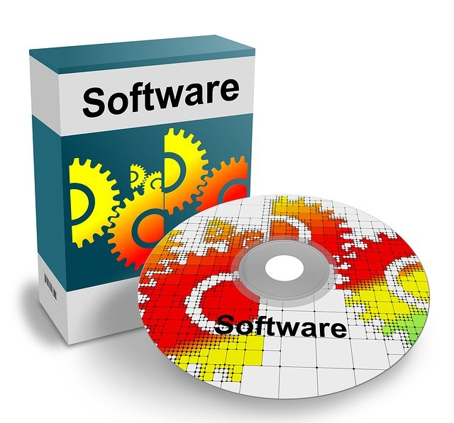

In diesem Artikel stellen wir dar, welche Software für die Umschulung benötigt bzw. empfohlen wird.

===



### Vorbemerkung

Ich empfehle, sich sowohl für die installierten Tools (in Sachen Programmierung) als auch für die eigentlichen Projekte jeweils ein Verzeichnis anzulegen. Und aus Bequemlichkeit sollten diese einfach erreichbar sein. Außerdem geschieht von Seiten des Betriebssystems für unseren Geschmack zu viel Ungeplantes in den Standard-Verzeichnissen wie C:\Programme bzw. C:\User\Documents - mal davon ab, dass hier viele Rechte-Einschränkungen gelten. Daher empfehlen wir:

- **C:\src** für einige Tools und Programmiersprachen
- **(Documents)\projects** für alle Projekte

Jedes Projekt hat dann ein Verzeichnis unter in dem projects-Ordner. Diesen legen wir unter 
Documents ab, weil so sichergestellt ist, dass auch in Mehrbenutzer-Umgebungen die 
Projekte jeweils einzeln bearbeitet werden können.

(Die Kleinschreibung ist bewusst, da manche Betriebssyste zwischen Groß- und Kleinschreibung unterscheiden - und dann ist es gut, wenn man von vornherein Missverständnisse ausschließt)

## Zu installierende Software

[Git](https://git-scm.com/) ist das Standard-Versionierungssystem für Programmierer. Damit wird auf Eurem PC (bzw. im jeweiligen Arbeitsverzeichnis) stets gespeichert, welche Änderungen Ihr am Code vorgenommen habt. So kann man Änderungen, auch über Monate, nachvollziehen. Und mit einem Remote Repository (sozusagen Code-Speicherplatz) kann dann auch nix passieren, wenn Euer PC explodiert. Legt Euch außerdem einen [Github](https://github.com)-Account an.

[Android Studio](https://developer.android.com/studio) ist das Standard-Softwareentwicklungs-Programm von Google für Android. Dieses verwenden wir eigentlich nicht, aber wir nutzen einige seiner Funktionalitäten, insbesondere den Handy-Emulator. Daher einfach installieren, einmal starten und wieder schließen. Später muss man hier u.U. noch im SDK-Manager ein Handy-Betriebssystem auswählen, dass dem eigenen Handy entspricht. Da werdet Ihr von flutter doctor drauf hingewiesen.

[Visual Studio Community Edition](https://visualstudio.microsoft.com/de/downloads/) ist vor allem bei den C#-Entwicklern beliebt. Wir benötigen es, um Windows-Apps mittels Flutter zu entwickeln. Wichtig ist dabei, die "Desktop-Entwicklung mit C++" zu aktivieren in der Installation. Nun gut, was heißt wichtig ... Man kann Vergessenes leicht nachinstallieren.

Die Wahl der richtigen IDE ist für viele Programmierer sozusagen eine religiöse Angelegenheit, aber für uns ist es am Wichtigsten, dass wir miteinander maximale Kompatibilität haben. Daher empfehlen wir [Visual Studio Code](https://code.visualstudio.com/) für alle unsere Teilnehmer:innen, weil sich damit die meisten Sprachen abdecken lassen und zurzeit ist es auch der beliebteste Editor. Und von den Features gibt es auch wenig **definitiv** besseres.

### Plugins in Visual Studio Code

Generell empfehlen wir die folgenden Plugins für VSCode, die Ihr einfach in dem geöffneten VSCode durch einen Klick auf den Button "Extensions" in der ganz linken Leiste und dann die Eingabe von Suchworten findet:

- Community Material Theme: Das ist nur eine Grafikveränderung, kann man auch weglassen.
- Material Icon Theme: Weitere Icons, mit denen die Oberfläche etwas hübscher ist, Auch das ist optinal.
- Draw.io Integration: Damit kann man Grafiken aus Draw.io anschauen. Das erspart, dass man sie jeweils extern öffnen muss. Draw.io kann man gut nutzen für UML-Diagramme und dergleichen. Das ist generell ein Browserprogramm, das man einfach öffnen kann, indem man auf die Adresse draw.io surft.
- Git Graph: Schöne Ergänzung, die den Verlauf von Bearbeitungen an einem Projekt veranschaulicht.
- GitHub Pull Request and Issues: Tolles Plugin, mit dem man direkt aus VSCode mit Github interagieren kann. Im späteren Verlauf wird das durch ein Atlassian-Plugin ergänzt, weil wir dann auch mit Bitbucket, Jira und Confluence statt Github arbeiten.

Nachdem alles installiert wurde, VSCode schließen.

**Microsoft Teams**
Wir nutzen [Microsoft Teams](https://www.microsoft.com/de-de/microsoft-teams/group-chat-software), unter anderem für den Unterricht.

**Flutter**
Installiert [Flutter](https://flutter.dev/). Das installiert Dart automatisch mit. Dafür folgt ihr der sehr langen Installationsanleitung Schritt für Schritt.

### Die richtige Konfiguration
Hier kommen wir dann zu dem Punkt, bei dem es unweigerlich zu Problemen kommen wird. Das ist alles komplexer als die Installation von Standardsoftware, weil das alles Tools von Profis für zukünftige Profis sind. Betrachtet es einfach als die erste Hürde. Seid insofern beruhigt, als dass auch ich immer mal wieder wild klicke und versuche, wenn irgendwas bei GIT hakt. :-)

Teil der Installation von Flutter ist ja, immer wieder "flutter doctor" in die Powershell einzugeben. Im Endeffekt sollten bei Euch nur grüne Häkchen stehen. Ebenfalls Teil der "flutter doctor"-Tyrannei ist auch, sein eigenes Handy per USB an den PC anzuschließen und den Dev-Modus für dieses freizuschalten. Das geht am einfachsten, wenn man einfach googelt "*Redmi 9 Pro* Entwickleroptionen" ... nur halt Euren Handytypen stattdessen einsetzen.

Schließlich wäre noch git zu initialisieren, einfach in der Befehlszeile:

```
git config --global user.email "meine@email.com"
git config --global user.name "Max Mustermann"
(Eigene Infos eintragen)
```

Außerdem ist es zweckmäßig, ein paar Umgebungsvariablen zu setzen, zumindest in Windows. Das geht folgendermaßen:

- Auf Startmenu-Button drücken
- Anfagen zu tippen "Env" (für environment variables oder so, ich machs jedenfalls immer Englisch)
- Danach "Umgebungsvariablen für dieses System" oder "diesen Benutzer" auswählen. Da es unwahrscheinlich ist, dass es irgendwen anders behindert, ziehe ich das System vor, aber manchmal lassen das die Sicherheitseinstellungen nicht zu.
- Wenn die Variablen nicht vorhanden sind, würde ich zumindest die folgenden setzen:
- "FLUTTER_ROOT" = "C:\src\flutter"
- und in Path kann man mehrere Eintragen, auf jeden Fall sollten zu den Pfaden dort hinzu:
- C:\src\flutter
- C:\src\flutter\bin
(Natürlich alles anpassen, wenn Ihr andere Pfade habt)

Im Rahmen der <a href="/academy/umschulung_anwendungsentwicklung">Umschulung in Kassel</a> kommen dann noch andere Programme zum Einsatz, insbesondere die gesamte Bandbreite an MS Office Software.

[UmschulungAd]
