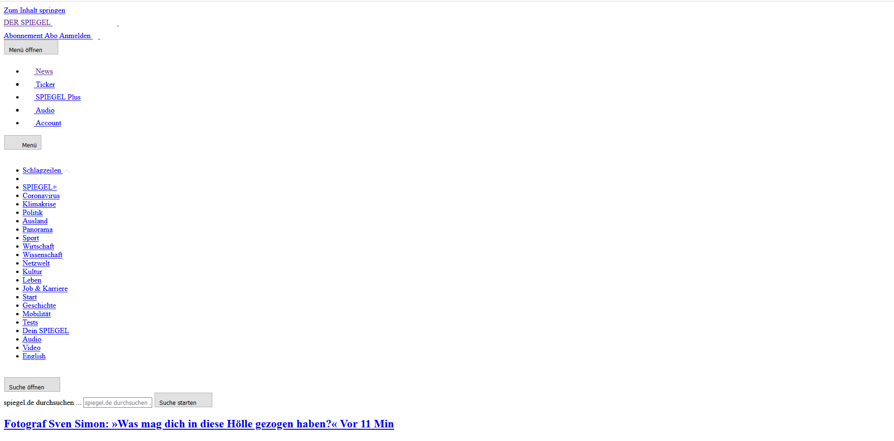
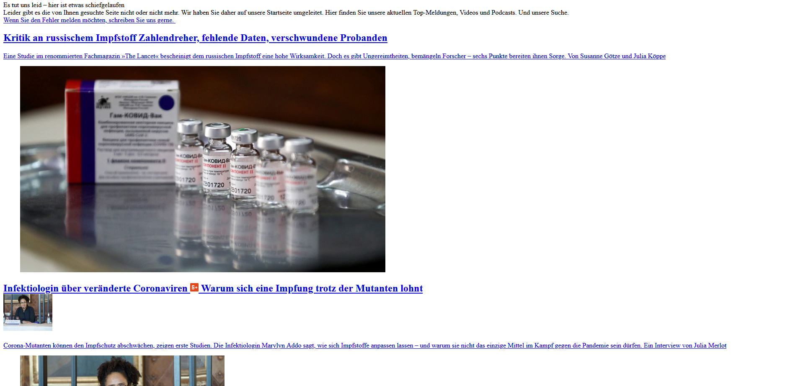
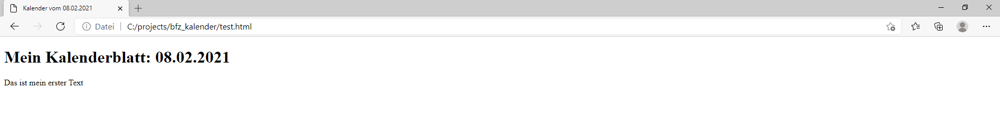
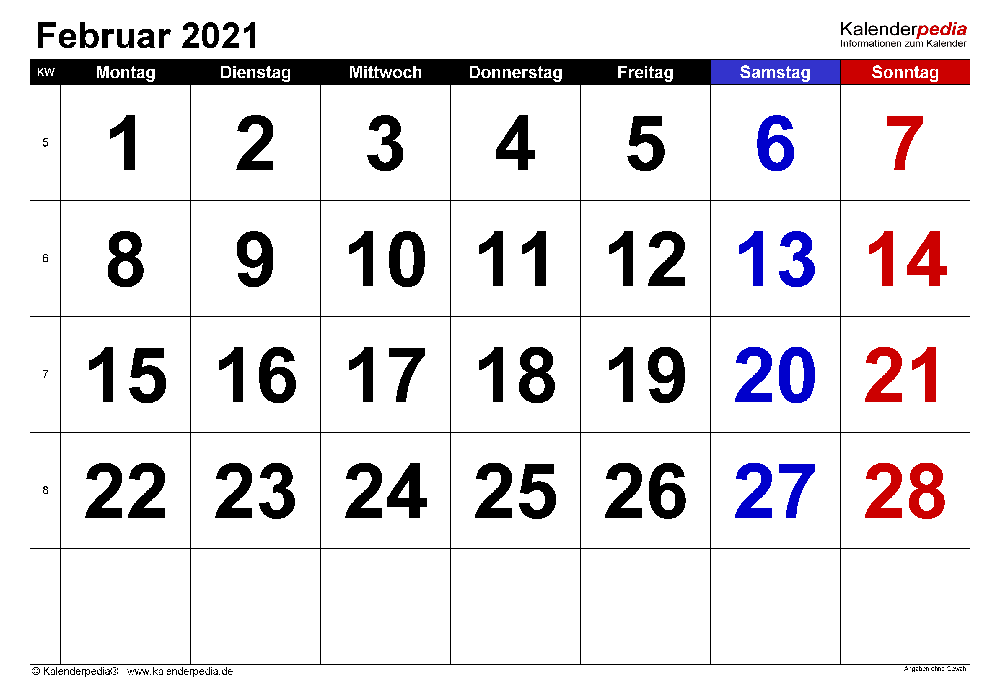
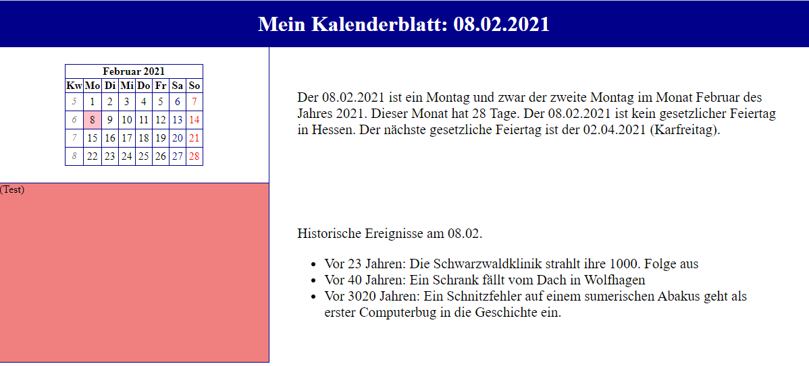
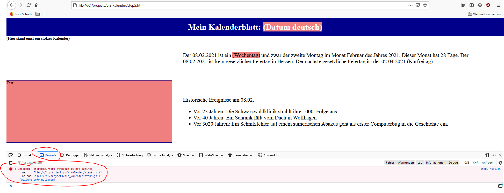
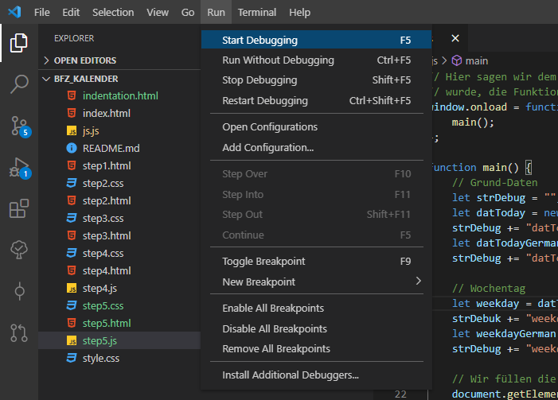
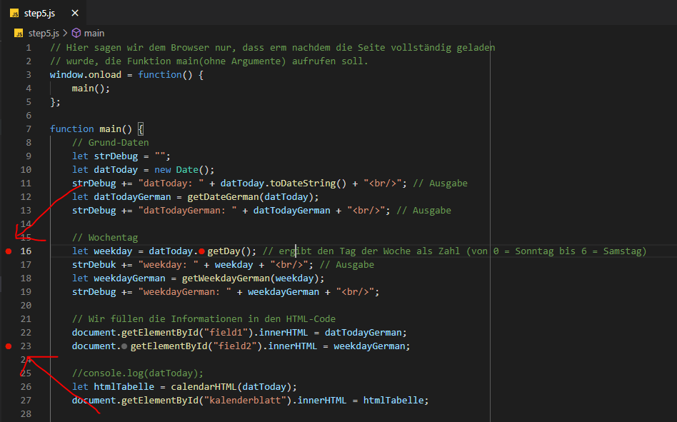
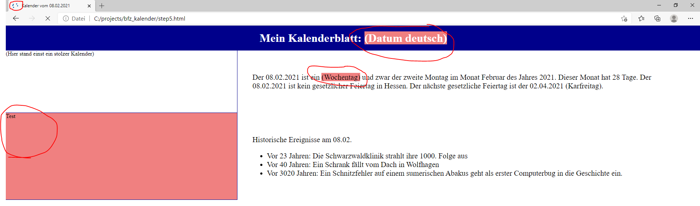
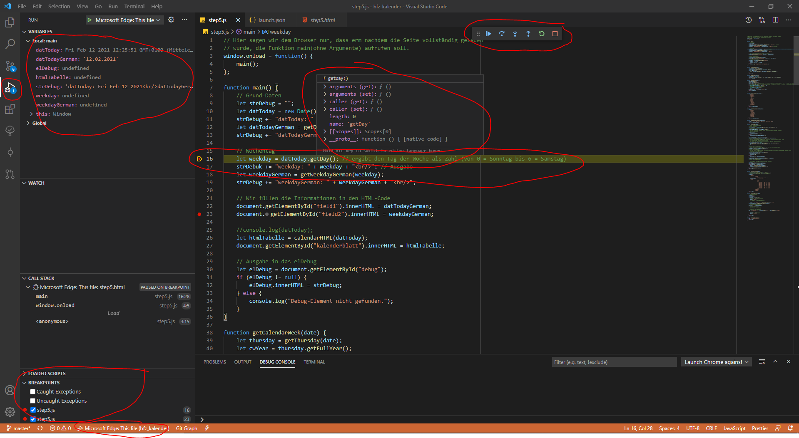

Das Kalenderprojekt ist so aufgebaut, dass es Euch immer wieder vor 
Herausforderungen stellt, die Euch dazu anregen sollen, selbst Lösungen zu 
recherchieren und zu implementieren. Eher selten wollen wir einen festen 
Lösungsansatz präsentieren. Dieses Projekt ist als Einstieg in die 
Webtechnologien HTML, CSS und Javascript gedacht.

===

# Schritt 1

!!! Wir gehen davon aus, dass Ihr VSCode installiert habt. Andere Editoren 
!!! gehen natürlich auch, aber dann mag das eine oder andere anders 
!!! funktionieren.

### HTML - Hypertext Markup Language

HTML ist die Standard-Sprache für das WWW, genauer gesagt für den **Inhalt** 
von Webseiten. Warum die Fettschreibung? Weil es bei HTML nicht (oder kaum) 
darum geht, wie diese Inhalte präsentiert werden. Es geht nur darum, was diese 
Inhalte sind. Eine pure HTML-Seite ist deswegen sehr, sehr schlicht. Aber sie 
enthält eben schon alle Inhalte die eine HTML-Seite enthät. An einem Beispiel 
mal verdeutlicht:

Das ist die Webseite spiegel.de, wie wir sie kennen bzw. wie sie aussieht, wenn 
wir sie aufrufen:


Und das ist der HTML-Teil alleine:




Man erkennt, dass es da gewisse Unterschiede gibt. :-)

Das, was Webseiten hübsch macht, ist also eher nicht im HTML zu verorten. Aber: 
Jeder Inhalt muss im HTML stehen und kann dann mit anderen Methoden schöner 
werden.

#### Die erste HTML-Datei erstellen

Im Prinzip: Im Explorer an eine beliebige Stelle navigieren, dort dann rechte 
Maustause, neue Textdatei erstellen und dafür sorgen, dass die Dateiendung html 
ist, nicht txt. Mag sein, dass in Euren Windows-Einstellungen deaktiviert ist, 
dass Ihr die Dateiendung ändern könnt. Das müsst Ihr dafür deaktivieren (Google 
hilft) .....

.... oder Ihr geht direkt in einen Codeeditor Eurer Wahl, bei uns eben VSCode, 
erstellt dort ein neues Projekt (=neuer Ordner) und dann könnt ihr auch dort 
per Click einfach eine neue Datei erstellen und sie zum Beispiel index.html 
nennen.

!!! index.html ist ein typischer Standard-Dateiname .... die Datei wird 
!!! geöffnet, wenn Ihr eine Datei nicht direkt mit Namen ansteuert. Die meisten 
!!! Server sind so konfiguriert, dass Ihr, wenn Ihr eine WWW-Adresse (URL) 
!!! aufruft, dann, wenn ihr den Dateinamen nicht explizit erähnt, automatisch 
!!! die index.html aufgerufen wird.

Und dann schreibt Ihr Eure ersten Zeilen, die ungefähr so aussehen könnten:

```HTML
<!DOCTYPE html>
<html lang="de">

<head>
    <meta charset="UTF-8">
    <meta name="viewport" content="width=device-width, initial-scale=1.0">
    <title>Kalender vom 08.02.2021</title>
</head>

<body>
    <h1>Mein Kalenderblatt: 08.02.2021</h1>
    <p>Das ist mein erster Text</p>
</body>

</html>
```

Wenn Ihr einfach im Explorer diese Datei öffnet ... oder sie in einem Browser 
direkt öffnet oder auch aus VSCode heraus per Run/Debug (ggf. muss man da noch 
ein bisserl konfigurieren), dann erhaltet Ihr ungefähr das folgende Resultat im 
Browser Eurer Wahl:



Versucht zu verstehen, wie Euer Code zusammenhängt mit der Ausgabe. Der Code 
besteht aus ein paar Meta-Informationen, die uns zum Beispiel sagen:
- Die Seite hat Inhalt in deutscher Sprache.
- und ist in UTF-8 codiert. Das ist ziemlicher Standard.
- Sie ist nicht irgendwie verzerrt darzustellen, sondern 1:1 in der Größe und so 
breit, wie das Gerät breit ist.
- Der Titel ist "Kalender vom 08.02.2021" und diese Zeile findet Ihr wieder im 
Namen des Tabs, in dem die Seite im Browser dargestellt ist.
- Im eigentlichen Anzeigebereich (body) sehen wir eine Überschrift (h1 = header 
der Kategorie 1) namens "Mein Kalenderblatt: 08.02.2021". Andere Header gibt es 
auch, von h2 bis h6.
- Und danach folgt einen Textabsatz (p = paragraph) mit "Das ist mein erster 
Text".

Und all das findet sich auf der Seite wieder. Jetzt bauen wir den Code noch 
etwas aus:

```HTML
<!DOCTYPE html>
<html lang="de">

<head>
    <meta charset="UTF-8">
    <meta name="viewport" content="width=device-width, initial-scale=1.0">
    <title>Kalender vom 08.02.2021</title>
</head>

<body>
    <div id="seitenkopf">
        <h1>Mein Kalenderblatt: 08.02.2021</h1>
    </div>
    <div id="kalenderblatt">
        <p>Hier fehlt noch ein Kalenderblatt</p>
    </div>
    <div id="introtext">
        <p>
            Der 08.02.2021 ist ein Montag und zwar der zweite Montag im Monat 
            Februar des Jahres 2021. Dieser Monat hat 28 Tage. Der 08.02.2021 
            ist kein gesetzlicher Feiertag in Hessen. Der nächste gesetzliche 
            Feiertag ist der 02.04.2021 (Karfreitag).
        </p>
    </div>
    <div id="historie">
        <p>
            Historische Ereignisse am 08.02.
        </p>
        <ul>
            <li>
                Vor 23 Jahren: Die Schwarzwaldklinik strahlt ihre 1000. Folge 
                aus
            </li>
            <li>
                Vor 40 Jahren: Ein Schrank fällt vom Dach in Wolfhagen
            </li>
            <li>
                Vor 3020 Jahren: Ein Schnitzfehler auf einem sumerischen Abakus 
                geht als erster Computerbug in die Geschichte ein.
            </li>
        </ul>
    </div>
</body>
</html>
```

Schaut Euch auch dieses Ergebnis im Browser an. Im Code könnt Ihr sehen, dass 
wir mit den `<div></div>` Tags etwas Ordnung in das Ganze gebracht haben. Wir 
haben sozusagen Abschnitte, die erstmal nix weiter als unsichtbare Kästen / 
Container sind, geschaffen. Das hilft uns später, wenn wir die Bereiche anders 
darstellen wollen.

Diese Grundstruktur, dass etwas mit einem öffnenden Tag, zB `<div>` oder `<p>` 
oder `<ul>` geöffnet wird und dann eben so lange gilt, bis es mit `</div>` oder 
`</p>` oder `</ul>` wieder geschlossen wird, ist in ganz vielen beschreibenden 
Bereichen ähnlich. Ihr findet das wieder in XML, aber auch in Flutter werden wir 
auf ähnliche Strukturen stoßen. Ein HTML-Dokument ist immer eine Art Baumstruktur. 
Gewöhnt Euch auch an diese Form der Einrückung. Wenn wir mit einem Tag etwas 
öffnen, egal was, dann ist jede Zeile danach um einen Tab weiter eingerückt 
(Tabs sind dann, je nach IDE, 2 oder 4 Leerzeichen). Schließen wir es wieder, 
dann erfolgt das Schließen wieder auf der gleichen Eben wie das Öffnen und alles 
danach ist auch auf der gleichen Ebene. Auf diese Weise können wir zum Beispiel 
leicht sehen, wenn wir etwas geöffnet haben, aber vergessen haben, es auch 
wieder zu schließen.

Das konsequente Arbeiten und Verstehen der Einrückungen ist essentiell auch für 
viele echte Programmiersprachen (HTML hat ja keine Programm-Ablauflogik, sondern 
stellt nur etwas dar, deswegen kann sie nicht als rechte Programmiersprache 
gelten).

Recherchiert selbständig die Tags, die Ihr noch nicht kanntet, also zum Beispiel 
`<ul>` und `<li>`.

Eure erste Aufgabe ist nun, etwas zu basteln, was in etwa so aussieht:

**Februar 2021**

| Kw  | Mo  | Di  | Mi  | Do  | Fr  | Sa  | So  |
| --- | --- | --- | --- | --- | --- | --- | --- |
| 5   | 1   | 2   | 3   | 4   | 5   | 6   | 7   |
| 6   | 8   | 9   | 10  | 11  | 12  | 13  | 14  |
| 7   | 15  | 16  | 17  | 18  | 19  | 20  | 21  |
| 8   | 22  | 23  | 24  | 25  | 26  | 27  | 28  |

Das dann bitte einbauen in den Bereich, der dafür in unserem Code vorgesehen war 
.... Hinweis: Dafür könnt Ihr beispielsweise eine Tabelle in HTML benutzen, die 
unter anderem die Tags `<table>`, `<tr>` und `<td>` verwendet. Experimentiert 
einfach damit. :-)


# Schritt 2

!!! Aber zuerst: Wir wissen nicht, wie Euer bisheriger Fortschritt aussieht. 
!!! Solltet Ihr gar nicht zurecht gekommen sein, könnt Ihr mit dem nachfolgenden 
!!! HTML-Code wieder einsteigen. Dann versucht aber unbedingt, diesen Code 
!!! Stück für Stück nachzuvollziehen und nicht einfach nur zu kopieren.

```HTML
<!DOCTYPE html>
<html lang="de">

<head>
    <meta charset="UTF-8">
    <meta name="viewport" content="width=device-width, initial-scale=1.0">
    <title>Kalender vom 08.02.2021</title>
</head>

<body>
    <div id="seitenkopf">
        <h1>Mein Kalenderblatt: 08.02.2021</h1>
    </div>
    <div id="kalenderblatt">
        <table>
            <thead>
                <tr>
                    <th colspan="8">Februar 2021</th>
                </tr>
                <tr>
                    <th>Kw</th>
                    <th>Mo</th>
                    <th>Di</th>
                    <th>Mi</th>
                    <th>Do</th>
                    <th>Fr</th>
                    <th>Sa</th>
                    <th>So</th>
                </tr>
            </thead>
            <tbody>
                <tr>
                    <td>5</td>
                    <td>1</td>
                    <td>2</td>
                    <td>3</td>
                    <td>4</td>
                    <td>5</td>
                    <td>6</td>
                    <td>7</td>
                </tr>
                <tr>
                    <td>6</td>
                    <td>8</td>
                    <td>9</td>
                    <td>10</td>
                    <td>11</td>
                    <td>12</td>
                    <td>13</td>
                    <td>14</td>
                </tr>
                <tr>
                    <td>7</td>
                    <td>15</td>
                    <td>16</td>
                    <td>17</td>
                    <td>18</td>
                    <td>19</td>
                    <td>20</td>
                    <td>21</td>
                </tr>
                <tr>
                    <td>8</td>
                    <td>22</td>
                    <td>23</td>
                    <td>24</td>
                    <td>25</td>
                    <td>26</td>
                    <td>27</td>
                    <td>28</td>
                </tr>
            </tbody>
        </table>
    </div>
    <div id="introtext">
        <p>
            Der 08.02.2021 ist ein Montag und zwar der zweite Montag im Monat 
            Februar des Jahres 2021. Dieser Monat hat 28 Tage. Der 08.02.2021 
            ist kein gesetzlicher Feiertag in Hessen. Der nächste gesetzliche 
            Feiertag ist der 02.04.2021 (Karfreitag).
        </p>
    </div>
    <div id="historie">
        <p>
            Historische Ereignisse am 08.02.
        </p>
        <ul>
            <li>
                Vor 23 Jahren: Die Schwarzwaldklinik strahlt ihre 1000. Folge 
                aus.
            </li>
            <li>
                Vor 40 Jahren: Ein Schrank fällt vom Dach in Wolfhagen
            </li>
            <li>
                Vor 3020 Jahren: Ein Schnitzfehler auf einem sumerischen Abakus 
                geht als erster Computerbug in die Geschichte ein.
            </li>
        </ul>
    </div>
</body>

</html>
```

Schaut Euch diese (oder Eure) Datei im Browser an und stellt fest: Das sieht 
immer noch doof aus, aber immerhin sind es Informationen. Das colspan-Attribut, 
das ich einmal verwende im Code, sagt "diese Zelle nimmt den Platz ein, den 
normalerweise X Zellen einnehmen". Dadurch erreiche ich, dass der Monat "Februar 
2021" über die ganze Kalenderblatt-Breite dargestellt wird.

### CSS

CSS-Dateien enthalten Informationen darüber, wie HTML-Inhalte dargestellt werden. 
Zuerst binden wir eine CSS-Datei ein. Das geschieht im Header Eurer HTML-Datei, 
zum Beispiel über eine Zeile wie diese:

`<link rel="stylesheet" type="text/css" href="style.css" />`

Wir sagen also dem Dokument, dass unter einem bestimmten Link / einer Adresse 
eine CSS-Datei liegt namens style.css (und da wir keine Verzeichnisinformationen 
dazu schreiben, ist die Datei am gleichen Ort zu suchen wie die HTML-Datei) und 
dass diese für unser Dokument als Stylesheet zu werten ist.

!!! CSS kann auch auf andere Weise eingebunden werden, zum Beispiel über 
!!! Style-Attribute bei den einzelnen Elementen der Webseite oder als Abschnitt 
!!! innerhalb der HTML-Datei. Aber die Details überlassen wir anderen Medien, 
!!! uns geht es nur um einen schnellen Überblick!

Nun erstellen wir auch im selben Verzeichnis eine Datei namens style.css und 
geben ihr für's erste den folgenden Inhalt.

```CSS
#seitenkopf {
    background-color: lime;
}

#kalenderblatt {
    background-color: palevioletred;
}

#introtext {
    background-color: powderblue;
}

#historie {
    background-color: goldenrod;
}
```

# Schritt 2

Wenn alle Bezeichnungen denen in unserer CSS-Datei den Bezeichnungen (hinter dem 
Schlüsselwort id) in der HTML-Datei entsprechen, dann habt Ihr beim nächsten 
Öffnen der HTML im Browser den Alptraum jedes Designers vor Euch. Zugleich 
erkennt Ihr aber, dass die Definitionen in der CSS Auswirkungen auf die 
Darstellung der Informationen haben. Eine ID bezeichnet ein Element im HTML 
**eindeutig**. Das heißt die gleiche ID sollte auch nur einmal pro Datei 
vergeben werden. Das # in der CSS-Datei heißt: "Wende bitte auf alle Elemente 
mit der ID ... die nachfolgenden Formatierungsoptionen an". In unserem Fall 
haben wir halt jeweils nur die Hintergrundfarbe verändert.

Machen wir nun eine sinnvolle Änderung. Die Kalenderwoche wollen wir kleiner 
als die anderen Kalendereinträge und kursiv darstellen. Dazu brauchen wir zwei 
Sachen:
- Einen Ankerpunkt im HTML, auf den die Regel zielen soll
- Eine Regel im CSS

#### Ankerpunkte im HTML
CSS-Regeln können sich auf alles mögliche beziehen. Sie können, wie gesehen, 
spezifisch auf ein einzelnes Element zielen, das über seine ID angesprochen 
wird. Sie können auch für bestimmte HTML-Tags gelten. Zum Beispiel:

```CSS
/* Macht alle Texte innerhalb von <p></p> Tags fett.              */
p {
  font-weight: bold;
}

/* Setzt für alle Text-Absätze (<p></p> innerhalb von <div></div> */
/* Containern die Schriftgröße auf 24 Pixel.                      */
div p {
  font-size: 24px;
}

/* Setzt die Schriftfarbe auf rot, aber nur für <p></p> Absätze   */
/* innerhalb des div mit der ID "test"                            */
div#test p {
  color: red;
}
```

Für unsere Zwecke ist das alles noch nicht ideal, denn wir wollen weder ein 
bestimmtes Element, aber auch nicht alle Elemente eines bestimmten Typs (zum 
Beispiel alle Tabellenzellen mit dem Tag `<td>`) mit unserer Regel zur 
Kursivschreibung anpassen, sondern nur bestimmte Tabellenzellen: Diejenige, die 
Informationen zur Kalenderwoche enthalten. Für sowas gibt es Klassen in 
HTML/CSS. Wir können jedem, also auch mehreren Elementen (im Gegensatz zur ID) 
eine (oder gar mehrere Klassen) zuweisen. Dafür passt Ihr Euren Code an - und 
zwar für jede Tabellenzelle, die eine Angabe zur Kalenderwoche enthält. 
Beispiel:

```HTML
<tr>
    <td class="kw">5</td>
    <td>1</td>
/*  (und so weiter) */
```

Die Zelle mit der 5 ist eine Zelle, die sich auf die KW 5 bezieht. Die Zelle mit 
der 1 meint den 1. Februar 2021. Wir haben der Kalenderwochen-Zelle jetzt die 
Klasse "kw" zugewiesen, und das können wir mit allen anderen KW-Einträgen auch machen.


Und dann ergänzen wir unsere CSS-Datei beispielsweise um folgenden Eintrag:

```CSS
.kw {
    font-style: italic;
    font-size: smaller;
}
```

Dieser Eintrag sagt: "Für alle Elemente der Klasse kw gilt folgende Formatierung"

### Weiter in Eigenregie

Ihr habt alle Elemente in der Hand, auch wenn Ihr es noch nicht wisst, um die 
Seite hübsch zu gestalten. Ihr werdet viele CSS-Regeln recherchieren müssen, 
aber Ihr könnt alles tun. Zum Experimentieren hilft es ungemein, im Browser F12 
zu drücken. Das geht bei den meisten Browsern. Ansonsten googelt, wie es geht. 
Dann seht Ihr einen Inspector. Fuchst Euch in die Bedienung ein, denn hier könnt 
Ihr CSS-Regeln testweise ändern und mit den Werten spielen .... Geht schneller 
als im Code zu schreiben und dann die Seite neu zu laden. Versucht es. :-)

Erste Anregungen:
- Samstage blau, Sonntage rot
- Hintergrundfarbe für den Kalender
- den aktuellen Tag besonders kenntlich machen



Es geht tatsächlich alles, auch das Verschieben der Bereiche. :-)


# Schritt 3

Wir haben neue Aufgaben:
* Der heutige Tag soll besonders markiert sein, zum Beispiel durch eine andere 
Hintergrundfarbe
* Samstage und Sonntage sollen anders aussehen
* Jeder Tag soll in einem Kästchen dargestellt sein
* Die Elemente (Kalenderblatt, Info, Historie) stehen nicht mehr lieblos 
untereinander, sondern jedes hat seine eigene Position am Bildschirm (Google 
Begriff: "CSS grid", einfach inspirieren lassen).

Der wesentliche Lerneffekt an dieser Stelle sollte sein: Es geht alles in CSS. 
Theoretisch kann man auch Animationen einbauen oder den Kalender als 
halbtransparente Folie **über** die Historie legen. Das müsst Ihr alles im 
Detail nicht kennen, aber Euch muss bewusst sein, wie umfangreich die 
Layout-Möglichkeiten im Web und (aus Konkurrenzgründen dann unmittelbar auch) 
überall sind.

### Zwischenstand

Ihr habt jetzt eine optisch passable Seite für diesen Tag, bei mir der 
08.02.2021. Bei mir sieht das Ganze folgendermaßen aus.



!!! Man beachte, dass ich mir schon einen Bereich "debug" eingebaut habe, den 
!!! ich später brauchen werde und den ich mehr oder weniger rot eingefärbt habe. 
!!! Den würde ich wieder rausnehmen, wenn wir die Seite veröffentlichen (würden).

Ihr sollt meinen Code nicht kopieren, aber erreicht habe ich das mit folgender 
HTML-Datei:

```HTML
<!DOCTYPE html>
<html lang="de">

<head>
    <meta charset="UTF-8">
    <meta name="viewport" content="width=device-width, initial-scale=1.0">
    <link rel="stylesheet" type="text/css" href="step3.css" />
    <title>Kalender vom 08.02.2021</title>
</head>

<body>
    <div id="seitenkopf">
        <h1>Mein Kalenderblatt: 08.02.2021</h1>
    </div>
    <div id="kalenderblatt">
        <table>
            <thead>
                <tr>
                    <th colspan="8">Februar 2021</th>
                </tr>
                <tr>
                    <th class="kw">Kw</th>
                    <th class="mo">Mo</th>
                    <th class="di">Di</th>
                    <th class="mi">Mi</th>
                    <th class="do">Do</th>
                    <th class="fr">Fr</th>
                    <th class="sa">Sa</th>
                    <th class="so">So</th>
                </tr>
            </thead>
            <tbody>
                <tr>
                    <td class="kw">5</td>
                    <td class="mo">1</td>
                    <td class="di">2</td>
                    <td class="mi">3</td>
                    <td class="do">4</td>
                    <td class="fr">5</td>
                    <td class="sa">6</td>
                    <td class="so">7</td>
                </tr>
                <tr>
                    <td class="kw">6</td>
                    <td class="mo heute">8</td>
                    <td class="di">9</td>
                    <td class="mi">10</td>
                    <td class="do">11</td>
                    <td class="fr">12</td>
                    <td class="sa">13</td>
                    <td class="so">14</td>
                </tr>
                <tr>
                    <td class="kw">7</td>
                    <td class="mo">15</td>
                    <td class="di">16</td>
                    <td class="mi">17</td>
                    <td class="do">18</td>
                    <td class="fr">19</td>
                    <td class="sa">20</td>
                    <td class="so">21</td>
                </tr>
                <tr>
                    <td class="kw">8</td>
                    <td class="mo">22</td>
                    <td class="di">23</td>
                    <td class="mi">24</td>
                    <td class="do">25</td>
                    <td class="fr">26</td>
                    <td class="sa">27</td>
                    <td class="so">28</td>
                </tr>
            </tbody>
        </table>
    </div>
    <div id="introtext">
        <p>
            Der 08.02.2021 ist ein Montag und zwar der zweite Montag im Monat 
            Februar des Jahres 2021. Dieser Monat hat 28 Tage. Der 08.02.2021 
            ist kein gesetzlicher Feiertag in Hessen. Der nächste gesetzliche 
            Feiertag ist der 02.04.2021 (Karfreitag).
        </p>
    </div>
    <div id="debug">
        (Test)
    </div>
    <div id="historie">
        <p>
            Historische Ereignisse am 08.02.
        </p>
        <ul>
            <li>
                Vor 23 Jahren: Die Schwarzwaldklinik strahlt ihre 1000. Folge 
                aus.
            </li>
            <li>
                Vor 40 Jahren: Ein Schrank fällt vom Dach in Wolfhagen.
            </li>
            <li>
                Vor 3020 Jahren: Ein Schnitzfehler auf einem sumerischen Abakus 
                geht als erster Computerbug in die Geschichte ein.
            </li>
        </ul>
    </div>
</body>
</html>
```

und mit folgender CSS:

```CSS
/*==============================================================================
// BODY: Grundlegender Aufbau des Grids                                       //
==============================================================================*/

body {
    display: grid;
    grid-template-columns: 1fr 2fr;
    /*Im Verhältnis 1:2 wird der Bildschirm aufgeteilt*/
    margin: 0;
}


/*==============================================================================
// SEITENKOPF                                                                 //
==============================================================================*/

#seitenkopf {
    padding: 1em;
    text-align: center;
    background: darkblue;
    color: white;
    grid-column-start: 1;
    grid-column-end: 3;
    /*Seitenkopf geht über beide Spalten*/
}

#seitenkopf h1 {
    margin: 0;
    padding: 0;
}


/*==============================================================================
// INTROTEXT UND HISTORIE                                                     //
==============================================================================*/

#introtext,
#historie {
    padding: 1em;
    grid-column-start: 2;
    /*Historie und Introtxt sind hingegen nur rechts in der Spalte zuhause*/
    grid-column-end: 3;
    margin: 1em;
    font-size: 1.3em;
    padding: 1em;
}


/*==============================================================================
// KALENDERBLATT                                                              //
==============================================================================*/

#kalenderblatt {
    border-bottom: 1px solid darkblue;
    /*Border unten um das gesamte Feld*/
    border-right: 1px solid darkblue;
    /*Border rechts um das gesamte Feld*/
}

#kalenderblatt table {
    margin: 25px auto;
    /*Oben und unten 25 Punkte Abstand zu allem (zu den Grenzen des DIVs), links und rechts auto = zentriert*/
    border-right: 1px solid darkblue;
    /*Border rechts um gesamte Tabelle*/
    border-bottom: 1px solid darkblue;
    /*Border unten an gesamter Tabelle*/
    /*Die Border nach links und oben ziehen wir in den einzelnen Zellen*/
    border-spacing: inherit;
}

#kalenderblatt table th {
    border-top: 1px solid darkblue;
    /* Jede th-Zelle bekommt oben / links eine Border*/
    border-left: 1px solid darkblue;
}

#kalenderblatt table td {
    background: white;
    text-align: center;
    padding: 0.25em;
    /*Bisserl Platz um den Inhalt der einzelnen Zellen (Datumswerte)*/
    border-top: 1px solid darkblue;
    /*Jede td-Zelle erhält eine linke und obere Border, auf diese Weise ergibt sich dann das Gitternetz*/
    border-left: 1px solid darkblue;
    cursor: pointer;
    /*Mauszeiger verändert Form, wenn wir über die Tabellenzellen fahren, um anzuzeigen, dass man hier sinnvollerweise klicken kann*/
}

#kalenderblatt td:hover {
    background: yellow;
    /*Hintergrund gelb, wenn man mit der Maus drüber fährt*/
}

#kalenderblatt td.heute {
    background: pink;
    /*Der heutige Tag wird markiert*/
}

#kalenderblatt td.heute:hover {
    background: yellow;
    /*Der heutige Tag wird auch gelb beim Drüberfahren*/
}

#kalenderblatt td.sa {
    color: darkblue;
    /*Samstage sind blau dargestellt*/
}

#kalenderblatt td.so {
    color: red;
    /*Sonnage sind rot dargestellt*/
}

#kalenderblatt td.kw {
    font-style: italic;
    /*Kw-Angaben kleiner und in Kursivschrift*/
    font-size: 0.9rem;
    cursor: unset;
    /*Kw kann man nicht klicken, also Cursor anders*/
    color: grey;
}

#kalenderblatt td.kw:hover {
    background: unset;
    /*Nix passiert, wenn man über KW hovert*/
}


/*==============================================================================
// DEBUG                                                                      //
==============================================================================*/

#debug {
    background: lightcoral;
    border-right: 1px solid darkblue;
    border-bottom: 1px solid darkblue;
}
```

Wie gesagt, Ihr sollt den Text nicht kopieren und es ist cool, wenn Eure 
Ergebnisse gar schöner sind. Mir hat es an der Stelle gereicht. Eine wichtige 
Anregung sind lediglich die Kommentare, die ich (insbesondere in der CSS) 
gemacht habe. In jeder Sprache gibt es Kommentarzeichen, die bestimmte Bereiche 
"auskommentieren". Das heißt, dass dort nicht nach Befehlen gesucht wird und 
soher auch keine Fehler auftreten, wenn man egal was hinein schreibt. Das dient 
vor allem Euch und den Leuten, die mit Eurem Code arbeiten müssen, als Hilfe. 
Hier habe ich, um Euch zu helfen, exzessiv kommentiert. In echt wäre das 
weniger, aber diese simplen Ordnungs-Kommentare, wie ich sie mit den 
Zwischenüberschriften in der CSS gemacht habe, helfen mir massiv bei der 
Übersicht. Gerade CSS-Dateien verkommen ohne jede Ordnung zu einem großen Chaos, 
da es irgendwann tausende kleiner Einzelvorschriften sind, ohne echten 
Zusammenhang.

```
HTML
<!-- Kommentar bis zu -->

CSS
/* Kommentar bis zu */

Javascript
// Kommentar bis zum Ende der Zeile
/* Kommentar bis zu */
```

!!! Mit "Kommentar bis zu" kann man dann auch mehrzeilige Kommentare machen.

## Ein Problem
Die Chance ist recht hoch, dass Ihr, wenn Ihr die Seite heute aufruft, nicht 
das aktuelle Kalenderblatt seht, sondern das von gestern, vorgestern, letzter 
Woche oder einem komplett aus Eurer Sicht zufälligen Datum der Vergangenheit. 
Was, wenn wir aber immer das **heutige** Kalenderblatt zeigen wollen?

!! Eine Herangehensweise wäre, einfach eine Datei für jedes Datum in den nächsten 
!! 20 Jahren anzulegen. Aber es wäre definitiv kein eleganter Ansatz.

Die andere Herangehensweise ist, dass wir dem Computer beibringen müssen, alle 
Inhalte auf den heutigen Tag anzupassen. Und dafür nutzen wir nun Javascript. 
Javascript ist eine Programmiersprache (und ja, die erste, mit der wir uns nun 
befassen, weil HTML/CSS nur Inhalte bzw. Layout beschreiben). Sie wird vor allem 
im WWW benutzt (aber auch für Apps etc.). Im WWW-Bereich ist die Besonderheit, 
dass Javascipt-Code zusammen mit der HTML-Seite an den Besucher einer Webseite 
(Client) versendet wird und dass dessen Browser dann den Javascipt-Code 
ausführt. Er wird dann auf dem Client-Rechner interpretiert, also in 
Maschinensprache übersetzt. Daher ist Javascript nicht sonderlich performant, 
aber moderne Maschinen sind auch so schnell, dass das im Normalfall nicht ins 
Gewicht fällt. Im WWW-Bereich entlastet es sozusagen den Server, weil der Client 
die Berechnungen durchführt, nicht der Server.

Ähnlich wie bei der CSS-Einbindung müssen wir auch unserer HTML die 
Javascript-Datei mitgeben, also das Javascript einbinden in unseren HTML-File. 
Sowohl bei CSS als auch bei Javascript wäre es auch möglich, den Code 
**direkt in der HTML-Datei** unterzubringen. Man müsste CSS-Code nur in 
`<style></style>`-Tags verpacken und den Javascript-Teil in 
`<script></script>`-Tags. Aber aus Übersichtlichkeitsgründen trenne ich das in 
der Regel, erstelle also eine neue Javascript-Datei in unserem Projekt. Damit 
Javascript erkannt wird, sollte sie die Dateierweitung .js haben. In meinem 
Beispiel ist es "step4.js" (und ansonsten gibt es "step4.html" und "step4.css").

`<script language="javascript" type="text/javascript" src="step4.js"></script>`

Diese Zeile fügte ich in meine HTML-Datei im HEAD irgendwo hinzu. Die Position 
ist übrigens eigentlich egal. Bei umfangreichen Webseiten mit viel 
Suchmaschinenoptimierungen werden JS-Dateien immer sehr am Ende des HTML 
eingefügt, damit die Inhalte schonmal geladen sind, bevor die JS geladen wird. 
Aus Übersichtlichkeitsgründen packen wir es jetzt nach oben.

Packt mal als erstes in Eure Javascript-Datei nur eine Zeile: 
`alert('Javascript funktioniert!');`

Wenn Ihr beim nächsten Laden Eurer Seite ein entsprechendes Fenster angezeigt 
bekommt, dann hat die Verknüpfung von HTML und JS geklappt.

## Grundstock für Eure Arbeit

Folgende JS können wir als Grundstock nutzen:

```JS
// Hier sagen wir dem Browser nur, dass erm nachdem die Seite vollständig geladen
// wurde, die Funktion main(ohne Argumente) aufrufen soll.
window.onload = function() {
    main();
};

// Und hier ist die Funktion main() dann auch definiert.
function main() {
    // Grund-Daten
    var strDebug = "";
    var datToday = new Date();
    strDebug += "datToday: " + datToday.toDateString() + "<br/>"; // Ausgabe
    var datTodayGerman = getDateGerman(datToday);
    strDebug += "datTodayGerman: " + datTodayGerman + "<br/>"; // Ausgabe

    // Wochentag
    var weekday = datToday.getDay(); // ergibt den Tag der Woche als Zahl 
                                     // (von 0 = Sonntag bis 6 = Samstag)
    strDebug += "weekday: " + weekday + "<br/>"; // Ausgabe
    var weekdayGerman = getWeekdayGerman(weekday);
    strDebug += "weekdayGerman: " + weekdayGerman + "<br/>";

    // Ausgabe in das elDebug
    var elDebug = document.getElementById("debug");
    if (elDebug != null) {
        elDebug.innerHTML = strDebug;
    } else {
        console.log("Debug-Element nicht gefunden.");
    }
}

function getDateGerman(date) {
    day = date.getDate();
    month = date.getMonth();
    month = month + 1; // Warum auch immer ... Javascript speichert Monate 
                       // 0-basiert, also 0 = Januar, 11 = Dezember, daher hier 
                       // Korrektur + 1
    year = date.getFullYear();
    // Man beachte: Man könnte hier nachfolgend nach dem if {} benutzen, aber da 
    // es sich nur um EINE nachfolgende Anweisung handelt, geht es auch so 
    if (String(day).length == 1) day = "0" + day;
    // Nachfolgend alternativ MIT Klammern
    if (String(month).length == 1) {
        month = "0" + month;
    }
    dateGerman = day + "." + month + "." + year;
    return dateGerman;
}

function getWeekdayGerman(weekdayIndex) {
    if (weekdayIndex == 0) {
        return "Sonntag";
    } else if (weekdayIndex == 1) {
        return "Montag";
    } else if (weekdayIndex == 2) {
        return "Dienstag";
    } else if (weekdayIndex == 3) {
        return "Mittwoch";
    } else if (weekdayIndex == 4) {
        return "Donnerstag";
    } else if (weekdayIndex == 5) {
        return "Freitag";
    } else if (weekdayIndex == 6) {
        return "Samstag";
    }
}
```

Voraussetzung dafür, dass der Code funktioniert, ist, dass Ihr auch einen 
div-Bereich mit der id "debug" in Eurem HTML-Code habt. Bei mir war es der rote 
Bereich. Macht Euch das irgendwie so, dass das gegeben und erkennbar ist.

Und nun versucht, den Code nachzuvollziehen. Ich mach das jetzt quasi 
zeilenweise:

* In der window.onload Zeile sagen wir dem Browser, dass er warten soll, bis 
alles geladen wurde und dann soll er die Funktion main() aufrufen. Auf diese 
Weise haben wir uns einen klaren Einstiegspunkt kreiert.
* Dann wird die function main() definiert. Alles, was innerhalb ihrer öffnenden 
und schließenden Klammer liegt, gehört zur Funktion. Ihr seht es daran und an 
den Einrückungen. Die Funktion main akzeptiert keine Argumente (daher `()`).
* Zuerst wird in einer Variablen strDebug ein leerer String (Zeichenkette) 
gespeichert. Javascript-Variablen haben keinen klaren Typ und daher müssen wir 
nichts festlegen wie int, String, etc. in anderen Sprachen. Der leere String 
dient nur dazu, dass die Variable nicht den typischen Initialisierungswert 
`null` beinhaltet, der ansonsten in Zukunft immer für Zusatsatzaufwand sorgen 
würde.
* In datToday speichern wir das heutige Datum (samt Uhrzeit etc.).
* Wir fügen dem strDebug-String jetzt "datToday: " hinzu und dann dem Wert von 
datToday als String und am Ende noch ein `<br/>`, was einfach einen 
Zeilenumbruch in HTML darstellt. Sprich: Was auch immer wieder später 
hinzufügen, steht eine Zeile tiefer. Wir wollen das später alles ausgeben und 
dann helfen die Umbrüche beim Lesen.
* Dann definieren wir eine Variable datTodayGerman und weisen ihr das Ergebnis 
der Funktion getDateGerman, bezogen auf das mitgegebene Argument datToday zu. 
Sprich: Da gibt es eine Funktion und die gibt es einen deutsch formatierten 
Datum-String zurück. Sprich aus '2020/11/3" wird 03.11.2020. Die Funktion 
getDateGerman ist natürlich keine mitgelieferte JS-Funktion, sondern eine, die 
wir uns selbst geschrieben haben und **zu der wir noch kommen werden**.
* Auch den Inhalt von datTodayGerman (also den Rückgabewert der Funktion 
getDateGerman) hängen wir an strDebug an. Kurz gesagt: strDebug nutzen wir, um 
uns alles, was wir berechnen, mal anzeigen zu lassen, sodass wir sehen, wenn an 
irgendeinem Punkt ein Fehler vorliegt.
* Dann speichern wir in die Variable weekday den Rückgabewert der Methode (das 
ist eine Funktion, die zu einer Klasse gehört - hier der Datumsklasse). Mit 
anderen Worten: getDay() kann man auf jedes Datum anwenden, um dessen Wochentag 
zu ermitteln. Diese Methode ist von Javascript mitgeliefert, mussten wir also 
nicht selbst schreiben. Der weekday ist dann aber eine Zahl, beginnend bei 
0 = Sonntag und gehend bis 6 = Samstag.
* Dann kreieren wir eine Variable weekdayGerman und speichern in diese den 
Rückgabewert der Funktion getWeekdayGerman, bezogen auf den berechneten weekday. 
Mit anderen Worten: Wir wollen hier aus der Information "3" dann eben die 
Information "Mittwoch" berechnen. Dafür gibt es keine JS-Funktion. Auch diese 
Funktion müssen wir daher selbst schreiben. **Und darauf kommen wir auch zurück.**
* Auch das Ergebnis wird an strDebug angehanden.
* Nun finden wir in dem document (das ist die HTML-Seite, die im Browser 
angezeigt wird) das Element mit der id "debug". Dieses Element (das ist in 
meinem Code das gesamte DIV, das uns auf der Seite rot dargestellt wird) 
speichern wir in die Variable elDebug.
* Wir prüfen, ob wir es wirklich gefunden haben: Wenn ja, dann ist 
elDebug **nicht null**.
* Wenn wir also dieses DIV gefunden haben, packen wir den gesamten Inhalt von 
strDebug (also alle unsere gesammelten Debug-Texte) dort hinein. Das .innerHTML 
eines Elements ist der gesamte HTML-Code innerhalb dieses Elements. 
Zurückkommend zu meinem HTML-Code:

```HTML
    <div id="debug">
        Test
    </div>
```

* In dem Fall ist der Inhalt von dem Element mit der id "debug" eben "Test". 
Dieser Inhalt wird nun **ersetzt** mit dem Inhalt von strDebug. Daher wird uns, 
wenn alles klappt, das auch angezeigt, weil es nun **direkt im HTML-Code steht**.
* Wenn wir keine id "debug" gefunden haben, geben wir eine Konsolenmeldung aus. 
Konsolenmeldungen sieht man übrigens nur, wenn man im Browser den Inspector 
öffnet (F12 oder Shift+Strg+I oder Rechtsclick irgendwo ins HTML und 
"Untersuchen"). Dann im Inspektor die Konsole auswählen, dann sehen wir 
eventuelle Meldungen hier. Wir könnten auch `alert("Nichts gefunden")` 
stattdessen benutzen und dann wäre es ein Popup-Fenster stattdessen.

Das war die void main(). Kommen wir nun zu den beiden Spezialfunktionen, die wir 
uns gebaut haben:

### getDateGerman(date)
Die Funktion erwartet ein Datum als Parameter (das steht nirgendwo, aber so ist 
sie geschrieben. Würde man sie mit einem String füttern als Argument, gäbe es 
wohl einen Fehler).
* Dann extrahiert die Funktion aus dem Datum date den Tag, den Monat und das 
Jahr. Javascript hat die seltsame Eigenheit, dass Monate 0-basiert (0 = Januar 
bis 11 = Dezember) behandelt werden, Tage aber beispielsweise nicht. Das 
korrigieren wir, indem wir beim Monat 1 addieren.
* Dann prüfen wir, ob der Tag, umgewandelt zu einem String 
(also aus `1` wird `"1"`) eine Länge von genau einem Zeichen hat. Das ist dann 
der Fall, wenn unser Datum der erste bis neunte eines Monats ist. Wenn dem so 
ist, dann verketten wir "0" und die Monatszahl. Ansonsten ist es eben die 
Monatszahl. Im Hintergrund wandelt Javascript, das ja keine feste Typen kennt, 
eine Zahl automatisch zu einem String um, wenn wir Strings verketten.
* Das selbe passiert dann mit dem Monat.
* Dann bauen wir alles zusammen: (gegebenenfalls 0)Tag.(gegebenenfalls 0)Monat.Jahr
* Das ist dann der Rückgabewert, den wir per return zurückgeben an die Stelle, 
wo die Funktion aufgerufen wurde.
* Und so wurde aus dem Datum, das wir gerade haben, ein deutsch formatiertes 
Datum.

### getWeekdayGerman(weekdayIndex)
* Als Weekday-Index erhaten wir eine Zahl zwischen 0 (Sonntag) und 6 (Samstag).
* Jetzt erfolgt eine Fallunterscheidung. Je nachdem, welcher Wert uns geliefert 
wurde, geben wir einen String mit dem passenden Wochennamen zurück.

!! Es gibt deutlich schlauere Methoden, wie man diese Umformatierungen vornimmt, 
!! aber hier werden bewusst viele if-Checks eingesetzt, damit Ihr Euch mit 
!! diesem grundlegenden Konstrukt der if-Bedingungen beschäftigt.

## Und JETZT dynamisieren wir Infos auf der Webseite
Guckt Euch die Webseite an. Ihr werdet sehen, dass, wenn alles richtig läuft, 
im Debug-Kasten korrekte Informationen zum heutigen Tag stehen. Dummerweise 
steht auf Eurer Seite ansonsten immer noch der alte Krempel. Schaut Euch im 
Inspektor an, was im Debug-Kasten steht: Dort steht das, was wir im Javascript 
reingeschrieben haben. Nicht mehr das, was laut HTML da stand. Folglich ist 
unsere Aufgabe, an anderen Stellen einen ähnlichen Effekt zu erzielen: Wir 
wollen die Altinformationen ersetzen durch neue Informationen. Damit das 
gelingen kann, müssen unsere Bereiche, wo zu aktualisierende Informationen 
stehen, auch per id direkt ansprechbar sein. Dafür ändere ich meinen HTML-Code 
an zuerst einmal zwei Stellen.

```HTML
    <div id="seitenkopf">
        <h1>Mein Kalenderblatt: <span id="field1">(Datum deutsch)</span></h1>
    </div>
```
Statt einem Datum steht dort nun ein `<span></span>`-Element. Span ist ein 
HTML-Element, das für sich genommen gar nix tut. Es definiert halt einen Bereich 
in einem Text. Man könnte dann per CSS dafür sorgen, dass alle 
`<span class="bold">`-Bereiche fett geschrieben sind. Für sowas ist das 
eigentlich gut. Uns dient es dazu, die Bereiche zu markieren, deren Inhalte wir 
verändert wollen, denn nun haben diese Bereiche einen eindeutigen Bezeichner, 
die id "field1" in diesem Fall. Der Text "(Datum deutsch)" dient mir nur als 
Gedächtnisstütze, welche Info da rein soll - er wird ja eh überschrieben.

```HTML
    <div id="introtext">
        <p>
            Der 08.02.2021 ist ein <span id="field2">(Wochentag)</span> und 
            zwar der zweite Montag im Monat Februar des Jahres 2021. Dieser 
            Monat hat 28 Tage. Der 08.02.2021 ist kein gesetzlicher Feiertag in 
            Hessen. Der nächste gesetzliche Feiertag ist der 02.04.2021 
            (Karfreitag).
        </p>
    </div>
```
Das ist meine zweite Ersetzung. Die span mit der id "field2" (wir erinnern uns: 
IDs müssen eindeutig sein). Wir brauchen also einmal den korrekt formatierten 
Wochentag und einmal das deutsch formatierte Datum, um die Ersetzungen vornehmen 
zu können. Und wie der Zufall es will: Beide Informationen liegen uns ja in 
unserem JS-Code schon vor. Wir ergänzen unsere JS-Datei um ein paar Zeilen und 
erhalten unsere main-Funktion. **Wohlgemerkt: Alle anderen Teile der JS-Datei 
bleiben unverändert)

```JS
function main() {
    // Grund-Daten
    var strDebug = "";
    var datToday = new Date();
    strDebug += "datToday: " + datToday.toDateString() + "<br/>"; // Ausgabe
    var datTodayGerman = getDateGerman(datToday);
    strDebug += "datTodayGerman: " + datTodayGerman + "<br/>"; // Ausgabe

    // Wochentag
    var weekday = datToday.getDay(); // ergibt den Tag der Woche als Zahl (von 0 = Sonntag bis 6 = Samstag)
    strDebug += "weekday: " + weekday + "<br/>"; // Ausgabe
    var weekdayGerman = getWeekdayGerman(weekday);
    strDebug += "weekdayGerman: " + weekdayGerman + "<br/>";

    // Wir füllen die Informationen in den HTML-Code
    document.getElementById("field1").innerHTML = datTodayGerman;
    document.getElementById("field2").innerHTML = weekdayGerman;

    // Ausgabe in das elDebug
    var elDebug = document.getElementById("debug");
    if (elDebug != null) {
        elDebug.innerHTML = strDebug;
    } else {
        console.log("Debug-Element nicht gefunden.");
    }
}
```

Neu sind dabei nur die folgenden Zeilen:
```JS
    // Wir füllen die Informationen in den HTML-Code
    document.getElementById("field1").innerHTML = datTodayGerman;
    document.getElementById("field2").innerHTML = weekdayGerman;
```
An die beiden Stellen im Code werden also unsere berechneten Werte geschrieben 
und wenn alles gut geht, dann sind diese beiden Stellen der Seite nun 
aktualisiert.

#### Kurzer Tipp zwischendurch
Um mir die Übersicht zu erleichtern, hab ich mir noch folgende CSS-Regel 
eingerichtet:
```CSS
span {
    background: lightcoral;
}
```
Auf diese Weise sehe ich, welche Spans ich schon eingerichtet habe und welche 
nicht.

### Was nun?
Jetzt könnt Ihr Euch eine Weile mit der Aktualisierung der Seite beschäftigen. 
Bezogen auf meinen Webseiteninhalt gilt:
* Das deutsch formatierte Datum kommt noch dreimal (inkl. Historie) im Text vor. 
Kein Problem, denn ich hab schon den Inhalt, der da stehen will. Es müssen nur 
die spans definiert und die Ersetzungen vorgenommen werden.
* Den Wochentagnamen hab ich nochmal im Text stehen. Selbe Problemlage. Ich hab 
schon alles, was ich brauche.
* Ich brauch das Jahr einfach so, ohne Zusatz an einer Stelle. Wir haben aber 
schon an anderer Stelle mal das Jahr aus einem Datum extrahiert, ist also 
relativ einfach.
* Dann brauchen wir an einer Stelle den Klarnamen des Monats (z.B. "Februar"). 
Nun gut .. Wir haben an einer Stelle schonmal den Monat aus einem Datum 
extrahiert. Und aus dieser Zahl muss dann ein String mit dem Monatsnamen 
werden, was ziemlich ähnlich der Problemstellung bei dem Wochentagsnamen ist.... 
An der Vorgehensweise kann man sich orientieren.
* Dann brauchen wir die Information der wievielte Wochentag seiner Art das in 
dem Monat ist. Tipp: Wenn man weiß, um den wievielten Tag des Monats es sich 
handelt, dann kann man auch das herausfinden mit einer if/else-Konstruktion. 
Man muss sich nur vorher darüber Gedanken machen, wann ein gegebener Tag in 
einem gegebenen Monat der 1/2/3/4/5. seiner Art ist.
* Dann muss ich an einer Stelle wissen, wieviele Tage der Monat hat. Ich 
skizziere hier eine Lösung, deren Details Ihr dann herausfinden müsst: Der 
einfachste Weg, das herauszufinden, ist:
  * Ihr konstruiert ein neues Datum und zwar den Ersten des Monats, also mit dem 
  gleichen Monat und Jahr wie unser Datum plus als Tagesangabe eben eine 1.
  * Ihr berechnet ein neues Datum als "Monatserster + 1 Monat" .... Dafür gibt 
  es fertige Funktionen in Javascript, mit denen ihr zu einem Datum einen 
  Zeitraum wie "1 Jahr" oder "1 Monat" addieren könnt, glaub ich. Bin zu faul, 
  das zu recherchieren. Falls nicht, dann konstruiert Ihr eben ein neues Datum, 
  für das gilt: Tag = 1, Monat = alter Monat + 1 (oder 1, falls alter Monat 12 
  war), Jahr = altes Jahr, außer alter Monat war 12.
  * Und von diesem Datum, also dem Ersten des **Folgemonats** zieht ihr 1 Tag 
  ab! Der Tag-Anteil dieses neuen Datums ist dann die Info, wie viele Tage der 
  aktuelle Monat hat.

Schon tatsächlich relativ fortgeschritten ist dann die Frage, wie man 
herausfinden kann, ob heute ein Feiertag ist. Mein erster Tipp wäre: Startet 
mit den fixen Feiertagen: Man kann relativ einfach prüfen, ob wir den 01.01., 
01.05., 03.10., 25.12., 26.12. haben.

Viel Spaß


# Schritt 4

An dieser Stelle ist es nicht ratsam, direkt weiter zu hasten. Sowohl HTML, als 
auch CSS und Javascript sind ja für die meisten neu, und es sind gleich drei 
Sachen auf einmal. Stattdessem dreht sich dieser Teil des Tutorials eher um die 
Arbeitsweise generell.

### Indentation
Dieses englische Wort heißt einfach nur "Einrückung", also wenn ein Textabsatz 
am Anfang eingerückt ist, um Absatzwechsel besser kenntlich zu machen. Das 
steigert die Lesefreundlichkeit. Und ebenso ist es in (allen!) 
Programmiersprachen. Man vergleiche folgende HTML-Schnipsel:

```HTML
<body>
<div id="seitenkopf">
<h1>Mein Kalenderblatt: 
<span id="field1">(Datum deutsch)</span>
</h1>
</div>
<div id="introtext">
<p>
Der 08.02.2021 ist ein <span id="field2">(Wochentag)</span> und zwar 
der zweite Montag im Monat Februar des Jahres 2021. Dieser Monat hat 
28 Tage. Der 08.02.2021 ist kein gesetzlicher Feiertag in Hessen.
</p>
</div>
<div id="historie">
<p>
Historische Ereignisse am 08.02.
</p>
<ul>
<li>Vor 23 Jahren: Die Schwarzwaldklinik strahlt ihre 1000. Folge aus</li>
<li>Vor 40 Jahren: Ein Schrank fällt vom Dach in Wolfhagen</li>
<li>Vor 3020 Jahren: Ein Schnitzfehler auf einem sumerischen Abakus geht als 
erster Computerbug in die Geschichte ein.</li>
</ul>
</div>
</body>
```

und

```HTML
<body>
    <div id="seitenkopf">
        <h1>Mein Kalenderblatt: 
            <span id="field1">(Datum deutsch)</span>
        </h1>
    </div>
    <div id="introtext">
        <p>
            Der 08.02.2021 ist ein <span id="field2">(Wochentag)</span> und zwar 
            der zweite Montag im Monat Februar des Jahres 2021. Dieser Monat hat 
            28 Tage. Der 08.02.2021 ist kein gesetzlicher Feiertag in Hessen.
        </p>
    </div>
    <div id="historie">
        <p>
            Historische Ereignisse am 08.02.
        </p>
        <ul>
            <li>
                Vor 23 Jahren: Die Schwarzwaldklinik strahlt ihre 1000. Folge 
                aus.
            </li>
            <li>
                Vor 40 Jahren: Ein Schrank fällt vom Dach in Wolfhagen
            </li>
            <li>
                Vor 3020 Jahren: Ein Schnitzfehler auf einem sumerischen Abakus 
                geht als erster Computerbug in die Geschichte ein.
            </li>
        </ul>
    </div>
</body>
```

Im zweiten Bereich ist deutlich auf den ersten Blick erkennbar, dass 
beispielsweise **innerhalb** des Kasten (div) erst ein Textabsatz (p) erscheint 
und dann **nach** dem Textabsatz kommt eine ungeordnete Liste (ul), die wiederum 
3 Listeneinträge (li) **enthält**. Im ersten Schnipsel muss man umständlich 
suchen, wenn man sich die Frage stellt, wann ein bestimmtes `div` wieder endet 
und dergleichen mehr.

Auch beim Schreiben selbst hilft das ungemein. Angenommen man hat ein 
schließendes Tag vergessen. Wenn der Text korrekt eingerückt ist, dann sieht man 
das sofort, weil man nicht auf der gleichen Einrückungsebene das schließende 
Element hat. Die IDE hilft da auch: Sie zeigt eine Verbindungslinie vom 
öffnenden zum schließenden Tag. Diese Linie muss oben und unten das öffnende / 
schließende Element berühren. Sie darf nicht unterbrochen werden von anderen 
Elementen (weil das ein Formfehler wäre ... ein Element kann beliebig viele 
"Tochterelemente" haben, also Elemente unterhalb von sich selbst, aber jedes 
Element hat genau ein, klar zu definierendes Mutterelement). Das gilt in HTML, 
aber ebenso auch für jeden Programmcode.

Wenn einem der Programmcode durch die Einrückungen zu weit nach rechts rutscht, 
sodass man kaum noch was Sinnvolles sieht, dann hat das einen oder mehrere 
dieser Gründe:
- Dein Monitor ist zu klein: 120 Zeichen darzustellen ist das absolute Minimum.
- Deine Schriftgröße ist zu groß für den Monitor: Es mag sein, dass sie genau 
richtig oder noch zu klein für Deine Augen ist, aber sie ist zu groß für den 
Monitor. Große Monitore sind insbesondere bei nicht perfekten Augen wichtig. 
Da viele es nicht wissen: In modernen IDEs (und somit auch in VSCode) kannst Du 
den Text (bzw. alles) selbstverständlich zoomen. `Strg` + `+` oder `Strg` + `-`.
- Du hast zu komplexen Code: Wenn Du die dritte Fallunterscheidung in der 
Fallunterscheidung hast und die 3. Schleife in der Schleife, dann ist die 
Wahrscheinlichkeit recht hoch, dass man durch ein Ändern der Programmstruktur 
eine deutliche Vereinfachung erreicht, die dann zu weniger Einrückungen führt. 
Das beinhaltet das Auslagern von Code in Funktionen / Routinen / Methoden (was 
im Endeffekt alles das gleiche bezeichnet). Und wenn Du Dir angewöhnst, über 
solche komplexe Strukturen nachzudenken und sie, wenn es irgendwie geht, zu 
vereinfachen, dann ist das nicht nur schöner lesbar, sondern auch für Dich (oder 
andere) später leichter nachvollziehbar, wenn zum Beispiel Änderungen notwendig 
sind. Die Komplexität des Codes kann man sich in HTML nicht ganz aussuchen, weil 
es eben sein kann, dass man diese verschachtelten Inhalte hat - in allen anderen 
Sprachen schon. Auch in HTML gibt es aber Möglichkeiten zur Verflachung des 
Codes. Beispielsweise:
  - Angenommen Du hast ein Layout mit 3 Spalten und 4 Zeilen. Dann könntest Du 
  den Code so schreiben, dass Du erst man ein `div` erstellst, dass die gesamte 
  Seite umfasst (sowas nennt man oft einen Wrapper), dann die 3 Spalten (als 
  `div`) öffnest und dann **innerhalb** dieser `div`-Elemente jeweils die Zeilen 
  als neue `div`-Elemente platzierst. Das heißt, dass jeder tatsächliche Inhalt 
  schonmal eine Mutter (Zeile), eine Großmutter (Spalte) und eine Uroma 
  (Wrapper) hat, die jeweils nur dieser Struktur dienen.
  - Oder Du definierst das `body`-Element im CSS als grid (recherchiere "css 
  grid") mit 3 Spalten und 4 Zeilen und platzierst dann **hintereinander** 
  einfach die 12 `div`-Elemente, die im Grid platziert werden sollen. Jetzt hat 
  jeder tatsächliche inhalt nur noch eine Mutter, das `div`, zu dem es nunmal gehört.
  - (Ja, natürlich gibt es noch andere Vorfahren, denn darüber hinaus gibt es 
  dann ja noch den Body und das HTML-Root-Element (`<html>`). Allerdings gilt 
  das ja in allen Fällen.)
- Und zuguterletzt kann man in den Einstellungen anpassen, wie viele 
Leerzeichen eine Einrückung sind. Wenn da gegenwärtig 4 eingestellt sind, könnt 
Ihr es auf zwei ändern. Das macht es **etwas** weniger übersichtlich, aber ist, 
wenn man sich dran gewöhnt ist, auch ganz okay, spart Euch aber einiges an Platz 
auf dem Monitor ein.

Es gibt tatsächlich für mich nichts störenderes als nicht ordentlich 
eingerückten Code. Oftmals hilft Euch die IDE bei der Arbeit. In VSCode 
beispielsweise formatiert die Tastenkombination `Shift`+ `Alt` + `F` Euren Code 
nach den für VSCode definierten Regeln. Nicht für jede Sprache ist das 
vorhanden. Weitere Sprachen kann man als Erweiterungen installieren. Mitunter 
gibt es auch alternative Formatierer als Erweiterungen.

### Tastatur
Da heute ja jeder nur über Bildschirme wischt, sei an dieser Stelle mal gesagt, 
dass eine normalgroße Tastatur unerlässlich sein wird. Das muss kein 
Schnickschnack sein, für unter 20 Euro erhält man ja bereits eine gute Tastatur, 
die man dann ggf. auch an den Laptop oder das Pad anschließen kann. Das ist echt 
unerlässlich. Programmieren bedeutet Tippen. Größere Tasten bedeutet weniger 
Tippfehler. Mehr Tasten bedeuten mehr Möglichkeiten.

Generell muss man lernen, die Maus weniger und die Tasten mehr zu benutzen. Es 
gibt ein paar Tastatur-Funktionen, die man kennen sollte und die vielleicht 
nicht jedem geläufig sind:
- Wenn man `Shift` drückt, während man sich per Pfeiltasten bewegt (aber auch 
wenn man danach wohin clickt), dann markiert man damit Text. Das macht es 
beispielsweise schnell möglich, etwas auszuschneiden (`Strg`+ `x`), zu 
verschieben (ganze Zeile: `Alt` + `Pfeiltaste`), kopieren (`Strg` + `c` bzw. für 
ganze Zeile: `Shift` + `Alt` + `Pfeiltaste`, löschen (`Enf` oder `Rück`).
- Zum Anfang der Zeile springen: `Pos1`
- Einrücken: Am Anfang der Zeile: `Tab`
- Weniger einrücken: Am Anfang der Zeile `Shift` + `Tab`
- Cursor an mehreren Stellen im Code platzieren: `Alt` gedrückt halten und jede 
Stelle anclicken
- Wort markieren: Doppelclick (Okay, ist kein Tastaturkommando)
- Ganze Zeile markieren: Dreifachclick (dito)
- Ganze Zeile ein/auskommentieren (dazu gleich mehr): `Strg` + `#`

Zudem gibt es tolle weitere Tricks in VSCode:
- `Shift` + `Strg` + `Leerzeichen`: Eines der wichtigsten Kommandos überhaupt: 
Kommando-Palette ... Alle integrierten Befehle von VSCode.
- `Strg` + `Leerzeichen`: Vorschläge von VSCode zur gegenwärtigen Code-Stelle. 
Das ist das gleiche Menu, dass Euch sonst auch Vorschläge dazu macht, wie der 
Befehl, den Ihr gerade tippt, wohl weiter geht. Mitunter habt Ihr so aber schon 
die Möglichkeit, etwas auszuwählen, wo Ihr noch nichts getippt habt. Das ist 
insbesondere sinnvoll, wenn man eine komplexe Funtion mit benannten Parametern 
aufrust, wo man aber die Namen der Paramenter nicht genau kennt.
- Angenommen Ihr wollt an einer Stelle im Code arbeiten, aber müsst immer mal 
wieder an einer anderen Stelle nachschlagen, wie zum Beispiel die Variablen hießen:
  - Rechte Maustaste auf den Tab-Reiter (das Ding oberhalb des Codes, wo der 
  Dateiname drin steht und das man klicken kann, wenn man zu diesem Code 
  springen will) für die entsprechende Datei und "Split right" wählen (oder 
  `Strg` + `^`) und dann hat man zwei Fenster zum gleichen Code. Ihr könnt eines 
  auf die Nachschlagestelle einrichten und in dem anderen coden. Damit kann man 
  auch erreichen, dass man eine Datei bearbeitet und gleichzeitig eine zweite 
  sieht.
- Alle offenen Dateien schließen (und ggf. speichern) geht per Menu oder 
`Strg` + `k` + `w`     (`k` und `w` kann man nacheinander drücken)

Klickt Euch einfach mal durch die Menus und experimentiert. Neben jedem 
Menueintrag steht auch die Tastenkombination, die man stattdessen ausführen 
kann. Merkt Euch, was Ihr häufiger benutzt.

## Kommentare
In meinem Code in den vorigen Lektionen hatte ich massiv viel Kommentare 
eingebaut. Das war natürlich nur, weil es Euch das Verständnis des Codes 
erleichtern sollte. Aber auch ansonsten sind Kommentare ein wichtiges Mittel. 
Dabei ist das richtige Maß wichtig:
- Kommentiert keine Selbstverständlichkeiten aus Sicht eines Programmierers: 
`a++; //erhöht a um 1
- Kommentare sollen den Code lesbarer machen: Unterteilt den Code per Kommentar 
in Abschnitte, aber zerfasert den Code nicht.
- Kommentare sollen Euch hefen, wenn Ihr später den gleichen Code wieder anseht 
oder wenn ein anderer Fachmann den Code analysiert
- Keine Kommentare ist unschön, zu viele ist ebenso unschön
- Findet das richtige Maß: Mit der Zeit wird es weniger werden, weil Ihr mehr 
als selbstverständlich anseht .... Bremst Euch da bewusst und zwingt Euch zu 
einem Mindestmaß an Kommentierung.
- Auch wenn Ihr jetzt, wo Ihr in der Programmlogik steckt, vieles genau wisst 
(z.B. an welcher Stelle im Code berechne ich die Feiertage?), dann werdet Ihr 
Euch irgendwann neuen Problemen widmen und Ihr werdet die Logik dieses Codes 
vergessen. Und dann helfen die Kommentare Eures heutigen Ichs Eurem zukünftigen 
Ich, und das solltet Ihr immer im Auge haben.

### Debugging
Debugging ist der Prozes des Fehler-Suchens und -Bereinigens. Bei einer CSS oder 
HTML-Datei ist das ja relativ einfach: Man sieht sofort, wenn etwas nicht 
stimmt. Das fällt bei Code naturgemäß schwerer. Das Ergebnis ist nicht das 
erwartete, aber woran liegt das? Das ist von außen nicht immer einfach zu sehen. 
Fangen wir speziell mit Javascript an:

- Erste Stufe des Debuggings ist der Browser selbst, der Fehlermeldungen ausgibt.
- Per (je nach Browser) `Shift` + `Strg` + `i` oder `F12` oder Rechtsclick in 
den Browser und "Untersuchen" oder sonst irgendwie öffet Ihr den Inspector. Dort 
gibt es definitiv ein Tab namens "Konsole" (Console). Dort werden harte 
Fehlermeldungen ausgegen. Beispiel aus Firefox. Hier können wir beispielsweise 
sehen, dass ein Fehler in Zeile 17 unserer JS-Datei einen Fehler verursacht hat. 
Das erleichtert natürlich die Suche:



- Es gibt auch die Möglichkeit, Eurerseits Text in die Konsole auszugeben. Wenn 
Ihr beispielsweise Zwischenergebnisse prüfen wollt, ob sie richtig sind, dann 
könnt Ihr im Code nach den jeweiligen Berechnungsschritten per 
`console.log(XXX)` etwas ausgeben, wobei XXX natürlich für das steht, was Ihr 
ausgeben wollt. Das kann ein Text sein, wenn Ihr beispielsweise prüfen wollt, 
ob der Code eine Fallunterscheidung auf der If-Seite oder der Else-Seite 
durchlaufen habt, dann gebt, je nachdem, unterschiedliche Meldungen aus. Oder 
gebt den Inhalt einer Variablen aus, damit Ihr sehen könnt, ob diese Variable 
zu dem Zeitpunkt den erwarteten Wert hatte.
- Und ....

### Die Luxus-Variante
Die konfortabelste Variante, Code auf Fehler hin zu untersuchen, ist VSCode 
selbst und die eingebauten Debugging-Tools. Kleines Problem allerdings: Das 
klappt so gut wie nie auf Anhieb (bei Flutter ja, aber bei Javascript selten). 
Wenn Ihr Glück habt, habt Ihr Glück. 

Also: Prinzipiell erstmal: Man kann das Debugging per VSCode starten per Menu:



Relativ gut klappt es prinzipiell mit Chrome (mein Eindruck). Wenn die 
Standardvorgaben nicht klappen, dann müsst Ihr Euch in Eurem Project eine eigene 
Konfiguration einrichten per "Run" - "Add configuration" oder "Run - View 
configuration". Damit wird in Eurem Projekt ein Verzeichnis .vscode angelegt mit 
einer Datei "launch.json", in der die von Euch konfigurierten Debug-Möglichkeiten 
gespeichert werden. Mit dieser launch.json hab ich bei mir Edge und Firefox zum 
Laufen bekommen.

```JSON
{
    "version": "0.2.0",
    "configurations": [
        {
            "name": "Microsoft Edge: This file",
            "request": "launch",
            "type": "pwa-msedge",
            "file": "${file}"
        },
        {
            "name": "Firefox: This file",
            "type": "firefox",
            "request": "launch",
            "reAttach": true,
            "file": "${file}"
        }
    ]
}
```

Da kann man experimentieren. Prinzipiell zu erwähnen ist, dass diese 
Konfiguration das File im Browser öffnen, das Ihr gerade im Editor anschaut. Mit 
anderen Worten: Ihr müsst die passende HTML-Datei angucken, dann auf Run & Debug 
klicken. Die Javascript-Datei für sich genommen bringt da nix.

Egal, sollte das irgendwann irgendwie laufen, dann gilt: In VSCode könnt Ihr 
Breakpoints in Eurem Code setzen. Das sind Punkte, an denen der Browser aufhören 
soll, den Code auszuführen und ab denen Ihr der Ausführung live zusehen wollt. 
Das Setzen geschieht durch Klick links von der entsprechenden 
Programmzeilen-Nummer, wodurch dann dort ein roter Punkt angezeigt wird.



Wenn wir nun die entsprechende HTML debuggen, dann wird diese geladen und unser Javascript-Code wird eben **nicht** vollständig ausgeführt. Stattdessen erhalten wir einen Zustand wie diesen:



Wie man sieht: Der Code läuft noch, der Seiten-Lade-Indikator oben links bewegt 
sich. Die Ersetzungen in der Seite sind **noch nicht** vorgenommen. Die 
Debug-Box ist **noch nicht** gefüllt. Und im VSCode-Fenster sehen wir, dass die 
Code-Ausführung bei unserem ersten Breakpoint stoppte.



Wenn wir links auf den Button "Run" gehen, dann sehen wir in dem linken Tab 
lauter Informationen zu unserem Code. Variablen, die im Umfeld verwendet wurden, 
auch noch nicht definierte Variablen (undefined). Wir sehen an dem gelben 
Bereich, in welcher Zeile wir gerade sind. Wir können mit dem Mauszeiger auf 
Objekte zeigen und uns deren gegenwärtigen Inhalt anzeigen lassen und oben 
rechts haben wir jetzt ein Bedienelement, was ein wenig wie die Bedienelemente 
an einem Videoplayer aussehen. Hiermit können wir uns jetzt bewegen:
- Der erste Button bedeutet "Mach weiter mit der Codeausführung bis zum nächsten 
Breakpoint" (bzw komplett, wenn es keine Breakpointe mehr gibt).
- Der zweite Button bedeutet "Mach weiter mit der nächsten Zeile"
- Der dritte Button bedeutet im Prinzip auch "Mach weiter mit der nächsten 
Zeile". Wenn die aktuelle Zeile aber Funktionen / Methoden etc. enthält, dann 
springen wir automatisch auch in **deren** Ausführung.
- Der vierte Button heißt, dass die Seite neu geladen wird, also alles von vorne 
beginnt.
- Der fünfte Button heißt, dass das Debugging und die Codeausführung beendet werden.

Mit diesem Tool lohnt sich das Spielen. Es ist unglaublich mächtig. Unten links 
kann man noch einstellen, welche Breakpoints gelten sollen. Hier werden die 
selbst definierten gelistet, aber es kann auch ausgewählt werden, ob 
Fehlermeldungen immer zum Anhalten führen sollen.

## Und nu?
Wenn Ihr den Code aus Lektion 3 selbst getippt habt oder aber wenn Ihr Eure 
ersten Gehversuche aufgrund der Aufgabenstellungen in Lektion 3 unternehmt, dann 
gibt es automatisch mehr als genug Anlässe zum Debuggen, denn Fehler gibt es immer.

Was Code angeht, den Ihr selbst entwickelt: Tut Euch selbst den Gefallen und 
fertigt Euch vor dem Schreiben mal eine Skizze an, was Ihr erreichen wollt und 
in welcher Reigenfolge etc. Wenn die Funktionalität in PSeudocode richtig 
beschrieben ist, dann ist das 75% der Miete.


# Schritt 5

### Die korrekte Arbeitsweise

In jedem der bisherigen Kapitel wurde Euch auch von mir geschriebener Code in 
HTML, CSS und JS präsentiert. Eure Aufgabe war es dann, diesen Code nachzuvollziehen 
und für die Problemstellungen auszubauen.

Nachvollziehen heißt: Es mag ja sein, dass mein Code für Euch überraschend kommt. 
Ja, das ist sogar recht wahrscheinlich. Wenn dem so ist, dann ist es Eure Aufgabe, 
genau zu verstehen, was jede meiner Zeilen macht. Ändert sie gegebenenfalls, um 
ein anderes Ergebnis zu erzielen. Erschließt Euch die Wirkung mit Google und 
Tutorials etc. Ich will nicht, dass beim zweiten Lesen irgendwas davon 
überraschend ist.

Am Anfang geht es vor allem darum zu sehen, was alles möglich ist. Ihr habt 
insbesondere Folgendes gelernt:

- HTML ist die zugrundeliegende Sprache für das WWW.
- HTML beschreibt den Inhalt einer Seite, gruppiert ihn gegebenenfalls logisch.
- HTML führt im Broswer zu einer Standard-Darstellung, die verdammt nach 90er Jahren aussieht.
- CSS ist das, was den Inhalt von HTML-Seiten in Form bringt.
- Wenn wir wollen, dass eine Seite ein bestimmtes Aussehen hat, dann ist das per CSS möglich.
- Dort geht vieles, extrem vieles, unüberschaubar vieles. 
- Es ist wichtig, genau zu wissen, was man will, dann kann man sich Stück für Stück dem Ziel nähern.
- Javascript läuft prinzipiell im Browser.
- Javascript hat die Macht, das im Browser dargestellte jederzeit anzupassen, dynamisch zu verändern.
- Dafür injiziert Javascript HTML-Code in die Seite.
- Wenn wir HTML-Code injizieren, dann unterliegt dieser wieder den CSS-Regeln.

Vergleichsweise unwichtig ist, ob ihr 10 oder 100 CSS-Eigenschaften auswendig kennt. Oder 10 
oder 100 Javascript-Befehle. Wichtig ist aber, dass Ihr an dem JS-Code erkennen konntet, wie 
man sich Stück für Stück dem Ziel nähert. Wir wollten beispielsweise den Wochentag im Text stehen 
haben. Und das bedeutete, dass wir erst das aktuelle Datum herausfinden mussten, dann den 
Wochentag berechnen ließen und dann diese numerische Information in eine deutschsprachige 
Information verwandelten.

Die Frage nach den Feiertagen ist gar nicht mal so schwer, aber die würde an den meisten 
Tagen eh nur ausgeben, dass gerade kein Feiertag ist, also stellen wir das mal hinten an. 
Wenden wir uns stattdessen direkt dem Elefanten im Raum zu, und das ist das Kalenderblatt 
selbst. Ihr habt alle ein Kalenderblatt bereits gebaut und ich hoffe Ihr habt nicht nur 
meinen Code kopiert. Aber selbst wenn Ihr ihn kopiert habt, so solltet Ihr Euch damit 
beschäftigt haben, wieso er aussieht, wie er aussieht.

Und wenn wir nun unser Projekt dahingehend aufwerten wollen, dass wir für jedes beliebige 
Datum das passende Monats-Kalenderblatt zeichnen, dann müssen wir dahinter kommen, welche 
Informationen wir wirklich brauchen, um ein Kalenderblatt für einen beliebigen Monat zu 
zeichnen.

**Und das ist die Frage, über die ihr bitte nachdenkt: Welche Informationen braucht Ihr, um 
das richtige Kalenderblatt für den August 2055 und für den Mai 1687 zu zeichnen?**

Setzt Euch hin und versucht, die beiden Kalenderblätter zu zeichnen. Welche Informationen sind 
es, die Ihr braucht? Diskutiert es auch gemeinsam. Ich werde **eine** Antwort 
(es gibt auch andere, gar bessere) logischerweise im nächsten Tutorial-Step verraten müssen, 
aber es wäre wirklich gut, wenn Ihr sie selbst findet und nicht einfach in das nächste 
Tutorial klickt. Es ist ... schaffbar.

Kleiner Hinweis:
- Ihr müsste rausfinden, welchen Wochentag der Erste eines Monats und welchen 
Wochentag der Letzte eines Monats haben. Wisst Ihr das, ergibt sich der gesamte 
Rest des Kalenders.


# Schritt 6

### Ein möglicher Ansatz

Wie gesagt, es gibt sicherlich andere und wahrscheinlich auch bessere Ansätze, aber 
ich werde nun meinen Ansatz teilen - und zwar schrittweise zuerst:

```JS
    let htmlTabelle = calendarHTML(datToday);
    document.getElementById("kalenderblatt").innerHTML = htmlTabelle;
```

Das ist der erste Schnipsel, direkt in der von uns mit `main()` bezeichneten 
Funktion. Was tun diese Zeilen? Nun, es wird einfach eine Variable deklariert 
und mit dem Ergebnis der Funktion `calendarHTML`, der das heutige Datum `datToday` 
als Argument mitgegeben wird, gefüllt. Danach wird dieses Ergebnis einfach wie 
gewohnt in das Dokument, also quasi die dargestellte HTML-Datei, eingefügt.

Mit anderen Worten: Was auch immer geschieht, muss in `calendarHTML` passieren. 
Und diese Funktion erschließen wir uns jetzt schrittweise.

```JS
function calendarHTML(date) {
    let firstOfMonth = new Date(date.getFullYear(), date.getMonth(), 1);
    let firstOfMonthWeekday = firstOfMonth.getDay();
    let offsetStart;
    if (firstOfMonthWeekday == 0) {
        offsetStart = 6;
    } else {
        offsetStart = firstOfMonthWeekday - 1;
    }
    let firstOfCalendar = new Date(firstOfMonth);
    firstOfCalendar.setDate(firstOfCalendar.getDate() - offsetStart);
```

Was geschieht?
- Wir bestimmen zuerst den Monatsersten. Dabei gehen wir einleuchtend vor. Wir 
konstruieren ein neues Datum, das im selben Jahr und im selben Monat wie unser 
`date` (also das `datToday` aus der `main`-Funktion) liegt, nur eben an dem 
Tag 1 dieses Monats. Das ist ziemlich genau die Definition eines Monatsersten, 
oder nicht?
- Dann wenden wir auf dieses Datumsobjekt, das jetzt in der Variablen 
`firstOfMonth` gespeichert ist, die Methode `getDay` an. Jedes Datumsobjekt 
hat diese Methode, wie man der offiziellen [Dokumentation](https://developer.mozilla.org/de/docs/Web/JavaScript/Reference/Global_Objects/Date#javascript_date_instanzen) entnehmen kann. Ich kann gar nicht häufig genug 
betonen, dass Ihr **immer** möglichst häufig offizielle Dokumentationen lesen 
sollt. Niemand verlangt von Euch, dass Ihr irgendwann alle Methoden des 
Datum-Objektes von Javascript auswendig könnt. Aber Ihr solltet wissen, dass man 
doch den Wochentag eines Datums **irgendwie** rauskriegen können muss und dann 
in der Dokumentation gucken können. :-)
- Dann definieren wir eine Variable `offsetStart` und in diese wollen wir 
speichern, wie viele Tage des Vormonats noch dargestellt werden, weil der aktuelle 
Monat zum Beispiel an einem Mittwoch beginnt. Uns ist klar: Dann wären es 2 Tage.
- Und wenn man etwas darüber nachdenkt, dann wird einem klar:
  - Wenn der Monatserste ein Montag ist (was dem Zahlenwert 1 entspricht, siehe 
  <a href="https://developer.mozilla.org/de/docs/Web/JavaScript/Reference/Global_Objects/Date/getDay">offizielle Dokumentation der getDay-methode</a>), 
  dann ist der Offset 0. Wenn es ein Dienstag (2) ist, dann müssen wir einen 
  Tag zusätzlich darstellen. Bei einem Mittwoch (3) sind es schon zwei Tage.
  Wir generalisieren: Es ist immer ein Tag weniger als dieser Zahlenwert, daher 
  rechnen wir: `offsetStart = firstOfMonthWeekday -1;`
  - ABER: Bei Sonntag (0) haut die Formel nicht hin, denn da käme -1 raus, wir 
  müssen aber 6 Tage darstellen. Aus diesem Grund ist der Sonderfall Sonntag 
  separat abgehandelt in obigem Code.
- Dann konstruieren wir ein neues Datumsobjekt, was eigentlich wieder der 
Monatserste ist, ziehen aber dann in einem zweiten Aufruf die Tage ab. Dass das 
so geht, ist sprachspezifisch. Javascript korrigiert ungültige Datumseingaben, 
also der "minus-Zweite" des Monats, ist dann zum Beispiel der drittletzte Tag 
des Monats zuvor, etc. Woher ich das weiß? Ich habe die 
[offizielle Dokumentation](https://developer.mozilla.org/de/docs/Web/JavaScript/Reference/Global_Objects/Date) 
gelesen.

```JS
    let lastOfMonth = new Date(date.getFullYear(), date.getMonth() + 1, 0);
    let lastOfMonthWeekday = lastOfMonth.getDay();
    let offsetEnd;
    if (lastOfMonthWeekday == 0) {
        offsetEnd = 0;
    } else {
        offsetEnd = 7 - lastOfMonthWeekday;
    }
    let lastOfCalendar = new Date(lastOfMonth.getFullYear(), lastOfMonth.getMonth(), lastOfMonth.getDate() + offsetEnd);
```

Hier passiert in etwa das Gleiche wie oben, nur eben für das Ende des Kalenders:
- Zuerst konstruieren wir ein neues Datum. Selbes Jahr wie unser `date`, 
einen Monat später und dann der 0te des Monats. Wir wissen inzwischen, dass 
Javascript uns korrigiert. Der 0te eines Monats ist der letzte des Monats zuvor. 
Also rechnen wir auf diese Weise den letzten des aktuellen Monats aus. Und die 
wirklich schöne Eigenschaft von Javascript, dass es automatisch ein gültiges 
Datum aus sinnlosen Eingaben (wie eben der **Nullte** eines Monats) macht, sorgt 
auch dafür, dass diese Berechnung auch im Dezember klappt. Wir müssen uns also 
nicht darum kümmern, dass das Jahr auch einen hochzählen muss. Wir springen 
sozusagen in den 13. Monat, Tag 0. Und das ist dann der 31.12.
- Dann berechnen wir erneut den Wochentag.
- Nun berechnen wir, wieviele Tage wir zusätzlich darstellen müssen, nach dem 
Monatsletzten.
  - Ist der Monatsletzte ein Sonntag, dann müssen wir nix tun, ansonsten sind 
  es `7 - lastOfMonthWeekday` Tage, die wir zusätzlich darstellen müssen. Rechnet 
  es nach. Das sind 6 zusätzliche Tage, wenn der Letzte auf einen Montag (1) fällt, 
  5 zusätzliche Tage, wenn es ein Dienstag (2) ist - und so weiter.
- Dann konstruieren wir entsprechend das letzte darzustellende Datum.

```JS
    let html = "";
    html += calendarHTML_head(firstOfMonth);
    let indexDate = new Date(firstOfCalendar);
    while (indexDate <= lastOfCalendar) {
        html += calendarHTML_cell(indexDate);
        indexDate.setDate(indexDate.getDate() + 1);
    }
    html += calendarHTML_footer();
```

- Nun definieren wir eine Variable `html` und lassen diese mit einem leeren 
String / Zeichenkette beginnen.
- Dieser Variable fügen wir als erstes hinzu das Ergebnis der Funktion 
`calendarHTML_head`. Diese baut nur die ersten Zeile der Tabelle auf, und ich 
werde mich nicht weiter mit dieser hier beschäftigen. Es geht um die Überschrift 
und die Spaltenüberschriften (kw, Mo, Di, Mi, Do, Fr, Sa). Im fertigen Code 
könnt Ihr alles nachlesen.
  - Man beachte übrigens die Schreibweise `html += 'irgendwas';`. Das ist eine 
  Kurzschreibweise für `html = html + 'irgenwas';`, also die Variable 
  html wird genommen, dann wird etwas hinten dran gehängt (hier das Wort "irgendwas") 
  und das, was dabei rauskommt, wird wieder in `html` gespeichert.
- Dann definieren wir eine Variable `indexDate` und setzen sie auf den ersten 
im Kalender abgebildeten Tag.
- Und dann folgt eine `while`-Schleife. Eine Schleife dieses Typs läuft so 
lange, wie die Bedingung, die in den runden Klammern steht, gegeben ist. Man 
könnte das Ganze ebenso gut in einer `for`-Schleife abbilden.
- In jedem Schleifendurchlauf passieren zwei Sachen:
  - Die Variable `html` wird wieder verlängert und zwar um die Antwort der 
  Funktion `calendarHTML_cell`, die aufgerufen wird mit dem Funktionsargument 
  `indexDate`. In jedem Schleifendurchlauf kann sie also, je nach `indexDate` 
  ein anderes Resultat haben (und hat sie auch).
  - Danach wird unser Datum um 1 erhöht, also wir rücken zum nächsten Datum vor.
- In dem Moment, wo wir zu einem Tag vorrücken, der größer ist als der zuvor 
ausgerechnete letzte im Kalender darzustellende Tag, wird die Schleife 
automatisch beendet.
- Dann wird die Variable `html` noch ergänzt um die Antwort der Funktion 
`calendarHTML_footer`, die ohne Argument aufgerufen wird. Sie packt einfach 
den richtigen Abschluss der Tabelle noch hinten dran. Der Aufruf ohne Argument 
ist logisch, weil dieser Abschluss der Tabelle immer gleich ist, egal welches 
Datum wir darstellen.

Es ist also klar, dass der eigentlich interessante Teil des HTML-Codes in der 
Funktion `calendarHTML_cell` generiert wird. Und diese Funktion sehen wir uns 
nun an:

```JS
function calendarHTML_cell(date) {
    let html = "";
    let cssClass = "";
    let weekday = date.getDay();
    if (weekday == 1) {
        // Montag: Neue Zeile beginnen
        html += "<tr>";
        // und Zelle für die Kalenderwoche
        html += '<td class="kw">' + getCalendarWeek(date) + "</td>";
    }
    let weekdayGerman = getWeekdayShortGerman(weekday);
    html += '<td class="' + cssClass + '">' + date.getDate() + "</td>";
    if (weekday == 0) {
        html += "</tr>";
    }
    return html;
}
```

Hier passiert Folgendes:
- Zuerst wird eine Variable `html` definiert. Wichtig: Diese überschreibt in 
keiner Form die gleichnamige Variable in unserer `main`-Funktion. Variablen 
haben einen Bereich, in dem sie gültig sind - und grob gesagt ist das der lokale 
Kontext. In der Regel sucht Ihr nach den geschweiften Klammern, in denen die 
Variablendeklaration liegt. Hier sind das einfach die geschweiften Klammern, 
welche die gesamte Funktion `calendarHTML_Cell` umfassen.
  - Kleiner Hinweis: Javascript kennt zum Deklarieren einer Variablen den 
  Befehl `var` und den Befehl `let`. Bei `let` ist 100%ig korrekt, was ich sagte, 
  aber das `var`-Schlüsselwort deklariert die Variable immer für die gesamte 
  Funktion. Hier würden `let` und `var` zum selben Ergebnis führen, weil der 
  lokale Kontext die Funktion ist. Wenn aber beispielsweise mit `let` eine 
  Variable in einer Schleife definiert wird, dann ist die Variable nur in der 
  Schleife gültig, nicht in der gesamten Funktion drumherum.
- Wir berechnen den Wochentag des Datums, das uns als Argument mitgegeben 
wurde. Das ist das Datum, für das wir in dieser Funktion jetzt einen Eintrag 
in die Tabelle vornehmen sollen.
- Ist das ein Montag, dann beginnt die Tabellenzeile und das bedeutet, dass wir 
ein `<tr>`-Tag öffnen. Außerdem müssen wir eine Tabellenzelle für die 
Kalenderwochen-Info generieren.
- Danach (und gleich als erstes bei allen anderen Wochentagen außer Montag) 
wird eine Tabellenzelle für den Tag angelegt. Dieser Eintrag hat eine CSS-Klasse 
für den Wochentag in Kurzform. Entsprechend wir dieser als Variable zuvor 
definiert.
- An einem Sonntag müssen wir außerdem die Tabellenzeile beenden.
- Zuguterletzt geben wir mit der `return`-Anweisung den generierten HTML-Code 
an die aufrufende Funktion zurück.

### Das war es

Diese wenigen Elemente, die zusammen nicht mal länger sind als es zuvor der 
HTML-Code für einen statischen, unveränderbaren Kalender war, generieren 
für **jeden möglichen** Monat den HTML-Code.

Nochmal zum Nachvollziehen mein gesamter Code zu diesem Zeitpunkt:
- HTML:

```HTML
<!DOCTYPE html>
<html lang="de">

<head>
    <meta charset="UTF-8">
    <meta name="viewport" content="width=device-width, initial-scale=1.0">
    <link rel="stylesheet" type="text/css" href="step5.css" />
    <script language="javascript" type="text/javascript" src="step5.js"></script>
    <title>Kalender vom 08.02.2021</title>
</head>

<body>
    <div id="seitenkopf">
        <h1>Mein Kalenderblatt: <span id="field1">(Datum deutsch)</span></h1>
    </div>
    <div id="kalenderblatt">
        (Hier stand einst ein stolzer Kalender)
    </div>
    <div id="introtext">
        <p>
            Der 08.02.2021 ist ein <span id="field2">(Wochentag)</span> und zwar der zweite Montag im Monat Februar des Jahres 2021. Dieser Monat hat 28 Tage. Der 08.02.2021 ist kein gesetzlicher Feiertag in Hessen. Der nächste gesetzliche Feiertag ist
            der 02.04.2021 (Karfreitag).
        </p>
    </div>
    <div id="debug">
        Test
    </div>
    <div id="historie">
        <p>
            Historische Ereignisse am 08.02.
        </p>
        <ul>
            <li>Vor 23 Jahren: Die Schwarzwaldklinik strahlt ihre 1000. Folge aus</li>
            <li>Vor 40 Jahren: Ein Schrank fällt vom Dach in Wolfhagen</li>
            <li>Vor 3020 Jahren: Ein Schnitzfehler auf einem sumerischen Abakus geht als erster Computerbug in die Geschichte ein.</li>
        </ul>
    </div>
</body>

</html>
```

- CSS:

```CSS
/*==============================================================================
// BODY: Grundlegender Aufbau des Grids                                       //
==============================================================================*/

body {
    display: grid;
    grid-template-columns: 1fr 2fr;
    /*Im Verhältnis 1:2 wird der Bildschirm aufgeteilt*/
    margin: 0;
    /*Kein leerer Bereich rund um den gesamten Body*/
}


/*==============================================================================
// SEITENKOPF                                                                 //
==============================================================================*/

#seitenkopf {
    padding: 1em;
    text-align: center;
    background: darkblue;
    color: white;
    grid-column-start: 1;
    grid-column-end: 3;
    /*Seitenkopf geht über beide Spalten*/
}

#seitenkopf h1 {
    margin: 0;
    padding: 0;
}


/*==============================================================================
// INTROTEXT UND HISTORIE                                                     //
==============================================================================*/

#introtext,
#historie {
    grid-column-start: 2;
    /*Historie und Introtxt sind hingegen nur rechts in der Spalte zuhause*/
    grid-column-end: 3;
    margin: 1em;
    font-size: 1.3em;
    padding: 1em;
}


/*==============================================================================
// KALENDERBLATT                                                              //
==============================================================================*/

#kalenderblatt {
    border-bottom: 1px solid darkblue;
    /*Border unten um das gesamte Feld*/
    border-right: 1px solid darkblue;
    /*Border rechts um das gesamte Feld*/
}

#kalenderblatt table {
    margin: 25px auto;
    /*Oben und unten 25 Punkte Abstand zu allem (zu den Grenzen des DIVs), links und rechts auto = zentriert*/
    border-right: 1px solid darkblue;
    /*Border rechts um gesamte Tabelle*/
    border-bottom: 1px solid darkblue;
    /*Border unten an gesamter Tabelle*/
    /*Die Border nach links und oben ziehen wir in den einzelnen Zellen*/
    border-spacing: inherit;
}

#kalenderblatt table th {
    border-top: 1px solid darkblue;
    /* Jede th-Zelle bekommt oben / links eine Border*/
    border-left: 1px solid darkblue;
}

#kalenderblatt table td {
    background: white;
    text-align: center;
    padding: 0.25em;
    /*Bisserl Platz um den Inhalt der einzelnen Zellen (Datumswerte)*/
    border-top: 1px solid darkblue;
    /*Jede td-Zelle erhält eine linke und obere Border, auf diese Weise ergibt sich dann das Gitternetz*/
    border-left: 1px solid darkblue;
    cursor: pointer;
    /*Mauszeiger verändert Form, wenn wir über die Tabellenzellen fahren, um anzuzeigen, dass man hier sinnvollerweise klicken kann*/
}

#kalenderblatt td:hover {
    background: yellow;
    /*Hintergrund gelb, wenn man mit der Maus drüber fährt*/
}

#kalenderblatt td.heute {
    background: pink;
    /*Der heutige Tag wird markiert*/
}

#kalenderblatt td.heute:hover {
    background: yellow;
    /*Der heutige Tag wird auch gelb beim Drüberfahren*/
}

#kalenderblatt td.sa {
    color: darkblue;
    /*Samstage sind blau dargestellt*/
}

#kalenderblatt td.so {
    color: red;
    /*Sonnage sind rot dargestellt*/
}

#kalenderblatt td.kw {
    font-style: italic;
    /*Kw-Angaben kleiner und in Kursivschrift*/
    font-size: 0.9rem;
    cursor: unset;
    /*Kw kann man nicht klicken, also Cursor anders*/
    color: grey;
}

#kalenderblatt td.kw:hover {
    background: unset;
    /*Nix passiert, wenn man über KW hovert*/
}


/*==============================================================================
// DEBUG                                                                      //
==============================================================================*/

#debug {
    background: lightcoral;
    border-right: 1px solid darkblue;
    border-bottom: 1px solid darkblue;
}

span {
    background: lightcoral;
}
```

- Javascript:

```JS
  window.onload = function() {
    main();
};

function main() {
    let strDebug = "";
    let datToday = new Date();
    strDebug += "datToday: " + datToday.toDateString() + "<br/>"; // Ausgabe
    let datTodayGerman = getDateGerman(datToday);
    strDebug += "datTodayGerman: " + datTodayGerman + "<br/>"; // Ausgabe

    // Wochentag
    let weekday = datToday.getDay(); // ergibt den Tag der Woche als Zahl (von 0 = Sonntag bis 6 = Samstag)
    strDebug += "weekday: " + weekday + "<br/>"; // Ausgabe
    let weekdayGerman = getWeekdayGerman(weekday);
    strDebug += "weekdayGerman: " + weekdayGerman + "<br/>";

    document.getElementById("field1").innerHTML = datTodayGerman;
    document.getElementById("field2").innerHTML = weekdayGerman;

    let htmlTabelle = calendarHTML(datToday);
    document.getElementById("kalenderblatt").innerHTML = htmlTabelle;

    let elDebug = document.getElementById("debug");
    if (elDebug != null) {
        elDebug.innerHTML = strDebug;
    } else {
        console.log("Debug-Element nicht gefunden.");
    }
}

function getCalendarWeek(date) {
    let thursday = getThursday(date);
    let cwYear = thursday.getFullYear();
    let thursdayCw1 = getThursday(new Date(cwYear, 0, 4));
    let cw = Math.floor(
        1.5 + (thursday.getTime() - thursdayCw1.getTime()) / 86400000 / 7
    );
    return cw;
}

function getThursday(date) {
    var thursday = new Date();
    thursday.setTime(date.getTime() + (3 - ((date.getDay() + 6) % 7)) * 86400000);
    return thursday;
}

function getDateGerman(date) {
    day = date.getDate();
    month = date.getMonth();
    month = month + 1; // Warum auch immer ... Javascript speichert Monate 0-basiert, also 0 = Januar, 11 = Dezember, daher hier Korrektur + 1
    year = date.getFullYear();
    // Man beachte: Man könnte hier nachfolgend nach dem if {} benutzen, aber da es sich nur um EINE nachfolgende Anweisung handelt, geht es auch so
    if (String(day).length == 1) day = "0" + day;
    // Nachfolgend alternativ MIT Klammern
    if (String(month).length == 1) {
        month = "0" + month;
    }
    dateGerman = day + "." + month + "." + year;
    return dateGerman;
}

function getMonthGerman(monthIndex) {
    let arr = [
        "Fehler",
        "Januar",
        "Februar",
        "März",
        "April",
        "Mai",
        "Juni",
        "Juli",
        "August",
        "September",
        "Oktober",
        "November",
        "Dezember",
    ];
    return arr[monthIndex];
}

function getWeekdayGerman(weekdayIndex) {
    let arr = [
        "Sontag",
        "Montag",
        "Dienstag",
        "Mittwoch",
        "Donnerstag",
        "Freitag",
        "Samstag",
        "Sonntag",
    ];
    return arr[weekdayIndex];
}

function getWeekdayShortGerman(weekdayIndex) {
    let arr = ["so", "mo", "di", "mi", "do", "fr", "sa", "so"];
    return arr[weekdayIndex];
}

function calendarHTML(date) {
    // Erster des Monats berechnen
    let firstOfMonth = new Date(date.getFullYear(), date.getMonth(), 1);
    // Wochentag des Monatsersten bestimmen
    let firstOfMonthWeekday = firstOfMonth.getDay();
    // Wenn der Monat nicht mit einem Montag startet, müssen wir Tage des Vormonats
    // ebenfalls darstellen
    let offsetStart;
    if (firstOfMonthWeekday == 0) {
        offsetStart = 6;
    } else {
        offsetStart = firstOfMonthWeekday - 1;
    }
    let firstOfCalendar = new Date(firstOfMonth);
    firstOfCalendar.setDate(firstOfCalendar.getDate() - offsetStart);
    // Letzte des Monats ist der 0te des Folgemonats
    let lastOfMonth = new Date(date.getFullYear(), date.getMonth() + 1, 0);
    // Wenn der Letzte des Monats nicht zufällig ein Sonntag ist, müssen wir auch Tage des nächsten Monats
    // in unserem Kalender darstellen
    let lastOfMonthWeekday = lastOfMonth.getDay();
    let offsetEnd;
    if (lastOfMonthWeekday == 0) {
        offsetEnd = 0;
    } else {
        offsetEnd = 7 - lastOfMonthWeekday;
    }
    // Einfach Tage aufaddieren
    let lastOfCalendar = new Date(lastOfMonth.getFullYear(), lastOfMonth.getMonth(), lastOfMonth.getDate() + offsetEnd);

    // Jetzt beginnt das eigentliche Zeichnen des Kalenders
    let html = "";
    html += calendarHTML_head(firstOfMonth);
    let indexDate = new Date(firstOfCalendar);
    while (indexDate <= lastOfCalendar) {
        html += calendarHTML_cell(indexDate);
        indexDate.setDate(indexDate.getDate() + 1);
    }
    html += calendarHTML_footer();
    return html;
}

function calendarHTML_head(date) {
    // console.log("calendarHTML_head: " + date);
    let nameOfMonth = getMonthGerman(date.getMonth() + 1);
    // console.log("calendarHTML_head: " + nameOfMonth);
    let html =
        `<table>
                    <thead>
                        <tr>
                            <th colspan = "8">` +
        nameOfMonth +
        `</th>
                        </tr>
                        <tr>
                            <th class = "kw" > Kw </th>
                            <th class = "mo" > Mo </th> 
                            <th class = "di" > Di </th> 
                            <th class = "mi" > Mi </th> 
                            <th class = "do" > Do </th> 
                            <th class = "fr" > Fr </th> 
                            <th class = "sa" > Sa </th> 
                            <th class = "so" > So </th> 
                        </tr>
                    </thead> 
                    <tbody>`;
    return html;
}

function calendarHTML_cell(date) {
    let html = "";
    let cssClass = "";
    let weekday = date.getDay();
    if (weekday == 1) {
        // Montag: Neue Zeile beginnen
        html += "<tr>";
        // und Zelle für die Kalenderwoche
        html += '<td class="kw">' + getCalendarWeek(date) + "</td>";
    }
    let weekdayGerman = getWeekdayShortGerman(weekday);
    cssClass += " " + weekdayGerman;
    html += '<td class = "' + cssClass.trim() + '">' + date.getDate() + "</td>";
    if (weekday == 0) {
        html += "</tr>";
    }
    return html;
}

function calendarHTML_footer() {
    html = "</tbody></table>";
    return html;
}
```

### Aufgaben

Die Aufgaben für den nächsten Abschnitt wären nun:
- Wir wollen weiterhin, dass sich die Feiertage berechnen. 
- Außerdem wäre es schön, wenn unser Kalenderblatt nicht nur immer **heute** 
anzeigen würde, sondern auch jeden beliebigen anderen Tag. Eigentlich wollen wir 
durch den Kalender blättern können. Um beides zu erreichen, die folgenden Tipps.

#### Feiertage

Im Prinzip ist für jeden Kalendertag zu prüfen, ob es ein Feiertag ist. Dieses 
sollte man der Übersichtlichkeit halber auslagern in eine Funktion, die 
zum Beispiel `isHoliday` oder `istFeiertag` nennen könnte und die `true` 
returnt, wenn es sich um einen Feiertag handelt.

Was nun die Feiertagsroutine selbst angeht, solltet Ihr die folgenden Infos 
im Hinterkopf haben:
- Viele Feiertage sind fix. Beispielsweise ist der 03.10. immer der 03.10. Wir 
können also viele Feiertage einfach dadurch bestimmen, dass wir das Datum des 
Tages vergleichen mit diesen festen Feiertagen.
- Alle anderen Feiertage hängen von Ostern ab. Es gibt (im Netz findbar) 
Funktionen, die Ostern berechnen - und auch Tabelle, wie viele Tage nach Ostern 
dann bestimmte andere Feiertage liegen.

#### Blättern im Kalender

Direkt zu Beginn unseres Javascript-Programms legen wir fest, dass `datToday` 
heute ist. Wir können diese Festlegung in den window.onLoad-Bereich 
verschieben und der main-Funktion das per Argument mitteilen. Dann wird es 
möglich sein, von anderer Stelle stattdessen andere Werte (statt heute) in die 
Funktion einzuschleusen.

Es ist von jedem sichtbaren Element im HTML aus möglich, eine Javascript-Funktion 
auszulösen.

```HTML
    <td oncCick="unsereFunktion(3)">Tabellenzelle</td>
```

Diese Tabellenzelle würde beispielsweise bei einem Click die Funktion 
`unsereFunktion` mit dem Argument 3 ausrufen. So könnten wir auch einen 
Neuaufbau des Kalenders auslösen.


# Schritt 7

Zum Abschluss unseres Projektes wenden wir uns den zwei offenen Themen zu: 
- Blättern im Kalender
- Feiertage

===

!!! **Vorbemerkung:** Ich habe im Vergleich zum letzten Tutorial ein paar Stellen 
!!! umgeschrieben. Es kann daher sein, dass Ihr leichte Abweichungen zu Eurem Code 
!!! feststellt. 

### Feiertage

Wir haben im letzten Abschnitt eine Funktion entwickelt, welche die einzelnen 
Zellen der Kalenderblatt-Tabelle zeichnet. Bei mir hat sie den Namen geändert 
und heißt jetzt `getDayHTML`, aber sie tut noch im Wesentlichen das Gleiche. 

```JS
function getDayHTML(date, today, holidayArray) {
    let html = "";
    let cssClass = "";
    let weekday = date.getDay();
    if (weekday == 1) {
        html += "<tr>";
        html += '<td class="kw">' + getCalendarWeek(date) + "</td>";
    }
    let weekdayGerman = getWeekdayShortGerman(weekday);
    cssClass += " " + weekdayGerman;
    if (holidayArray.includes(date.getTime())) {
        cssClass += " feiertag";
    }
    if (date.getMonth() == today.getMonth() && date.getDate() == today.getDate()) {
        cssClass += " heute";
    }
    html += '<td class = "' + cssClass.trim() + '" onClick="changeTime(' + date.getTime() + ')">' + date.getDate() + "</td>";

    if (weekday == 0) {
        html += "</tr>";
    }
    return html;
}
```

Gehen wir den Code mal zusammen durch:
- Unsere Funktion erhält diesmal drei Argumente:
  - In der Variablen `date` erhält sie die Information darüber, welchen Tag sie 
  zeichnen soll.
  - In der Variablen `today` erhält sie das heutige Datum (damit wir nicht in 
  jedem Durchgang erneut "heute" berechnen müssen).
  - In der Variablen `holidayArray` erhält sie einen Array (also eine Liste von 
  Werten), der alle Feiertage nicht als unser übliches `Date`-Objekt, sondern 
  als "Millisekunden nach dem 01.01.1970"-Werte enthält.
- Am Anfang der eigentlichen Funktion werden dann zwei Variablen deklariert und 
gleich mit leeren Strings initialisiert:
  - `html` wird später den eigentlichen HTML-Code für die Zelle enthalten und 
  als Ergebnis dieser Funktion zurück an die aufrufende Funktion gegeben, welche 
  den gesamten HTML-Code für die Kalenderblatt-Tabelle generiert.
  - `cssClass` enthält die Klasse(n), die unsere Tabellenzeile bekommt, was dann 
  im Zusammenspiel mit der CSS-Datei die Formatierung der Tabellenzelle beeinflusst. 
  Hier spielt dann eine Rolle, ob es sich beispielsweise um den heutigen Tag 
  handelt oder eben auch ob es ein Feiertag ist.
- Wir speichern in der Variablen `weekday` den Wochentag (0 = Sonntag bis 6 = Samstag) 
ab.
- An einem Montag (und nur dann) starten wir die Ausgabe einer Tabellenzeile und 
schreiben auch schon den HTML-Code für die erste Zelle, nämlich für den 
Eintrag der Kalenderwoche auf dem Kalender.
- Bei allen Tagen (inklusive Montag) nutzen wir jetzt die Funktion `getWeekdayShortGerman`, 
um ein Kürzel wie "mo", "di", "mi", etc. zu bekommen. Das ist so ähnlich wie zuvor 
bei den vollen Kalendernamen und können wir uns daher sparen in Sachen Erklären.
- Dieses Kürzel schreiben wir nun in die CSS-Klasse.
- Als nächstes prüfen wir, ob der bereits erwähnte `holidayArray` das zu zeichnende 
Datum (in Millisekunden) enthält. Wenn dem so ist, dann wir an die CSS-Variable 
nun auch der String "feiertag" angehängt (zusammen mit einem vorangestellten 
Leerzeichen, damit die Strings nicht aneinanderhängen wie "mofeiertag", sondern 
eben zusammen dann "mo feiertag" ergeben).
- Im Anschluss prüfen wir, ob der zu zeichnende Tag dem heutigen Tag entspricht. 
Wenn ja, dann erweitern wir die CSS-Klasse noch um " heute".
- Dann wird wie gewohnt die eigentliche Zelle konstruiert. Dabei wird die 
zusammengebaute CSS-Variable mit eingebaut. Außerdem gibt es noch eine 
zusätzliche Eigenschaft `onClick`, mit der wir uns später noch beschäftigen 
werden. Ansonsten ist aber alles recht ähnlich zu früher.
- An einem Sonntag wird die Tabellenzeile abgeschlossen.
- Am Ende wird der so generierte HTML-String an die aufrufende Funktion zurück 
übergeben.

Bezogen auf die Feiertage gilt also: Es wird geprüft, ob unser zu zeichnender 
Tag in diesem ominösen `holidayArray` enthalten ist. Folglich ist die Frage, 
wie dieser Array zustande kommt. Dieser wird in der an der aufrufenden Stelle 
zuvor wie folgt definiert.

```JS
    let holidayArray = getHolidayArrayHessen(datToday);
```

Mit anderen Worten: Die Funktion `getHolidayArrayHessen` wird uns zeigen, wie 
die Feiertagssuche vonstatten ging. Schauen wir sie uns an:

```JS
function getHolidayArrayHessen(date) {
    let year = date.getFullYear();
    let array = [];
    array.push(new Date(year - 1, 11, 25).getTime()); // 1. Weihnachtstag Vorjahr
    array.push(new Date(year - 1, 11, 26).getTime()); // 2. Weihnachtstag Vorjahr
    array.push(new Date(year, 0, 1).getTime()); // Neujahr
    array.push(new Date(year, 4, 1).getTime()); // Tag der Arbeit
    array.push(new Date(year, 9, 3).getTime()); // Tag der Dt. Einheit
    array.push(new Date(year, 11, 25).getTime()); // 1. Weihnachtstag
    array.push(new Date(year, 11, 26).getTime()); // 2. Weihnachtstag
    array.push(new Date(year + 1, 0, 1).getTime()); // Neujahr nächstes Jahr
    let osterSonntag = getEasterSunday(year);
    array.push(osterSonntag.getTime());
    let osterMontag = new Date(year, osterSonntag.getMonth(), osterSonntag.getDate() + 1);
    array.push(osterMontag.getTime());
    let christiHimmelfahrt = new Date(year, osterSonntag.getMonth(), osterSonntag.getDate() + 39);
    array.push(christiHimmelfahrt.getTime());
    let pfingstMontag = new Date(year, osterSonntag.getMonth(), osterSonntag.getDate() + 50);
    array.push(pfingstMontag.getTime());
    let fronLeichnam = new Date(year, osterSonntag.getMonth(), osterSonntag.getDate() + 60);
    array.push(fronLeichnam.getTime());
    return array;
}
```

Hier passiert Folgendes:
- Zuerst wird das aktuelle Jahr abgespeichert in der Variablen `year`.
- Danach wird eine Variable `array` angelegt und diese wird als leerer Array 
initialisiert, also sozusagen als Liste ohne Einträge.
- Danach werden eine ganze Reihe von unbeweglichen Feiertagen per `array.push` 
in die Liste eingetragen (bzw. als jeweils letztes Element dem Array hinzugefügt).
  - Es startet mit den Weihnachsfeiertagen des Vorjahres, weil diese theoretisch 
  sichtbar sein könnten, wenn wir uns den Januar eines Jahres ansehen.
  - Danach kommen die üblichen festen Feiertage eines Jahres.
  - Wir enden mit Neujahr des nächsten Jahres, denn auch dieser Feiertag könnte 
  sichtbar sein, wenn man sich den Dezember eines Jahres anschaut.
  - Bitte beachten: Javascript speichert den Monat 0-basiert, also 0 ist Januar 
  und so geht das weiter bis 11 = Dezember, daher ist jedes Datum quasi um einen 
  Monat verschoben.
- Danach wird mittels der Funktion `getEasterSunday` der Ostersonntag bestimmt. 
- Vom Ostersonntag aus wird dann jeder bewegliche Feiertag berechnet.
- So bauen wir nach und nach unseren Array zusammen und übergeben diesen am 
Ende zurück an die aufrufende Funktion.

Den einen oder anderen interessiert jetzt sicherlich, wie der Ostersonntag 
berechnet wurde, aber das könnt Ihr dann sehen, wenn ich den gesamten Code 
in diesem Tutorialabschnitt veröffentliche. Für uns ist es jetzt nicht so wichtig. 
Konzentrieren wir uns lieber auf das Wesentliche: In dieser Funktion wird also 
ein Array (eine Liste) zusammengestellt, der alle Feiertage eines Jahres (plus 
ein bisserl was von Vorgänger- und Nachfolger-Jahr) beinhaltet. Durch 
Testen, ob ein bestimmtes Datum in diesem Array vorkommt, können wir dann 
an anderer Stelle leicht testen, ob es sich um einen Feiertag handelt.

### Blättern im Kalender

Ganz am Anfang unseres Javascript-Codes haben wir immer das aktuelle Datum 
festgelegt, in der Variablen `datToday` gespeichert und dann eigentlich immer 
ausgehend von diesem Wert gearbeitet. Mein Ansatz war nun, einfach diese 
zentrale Festlegung, dass `datToday` = heute ist, eher optional zu gestalten. 
Dafür habe ich als erstes die Wurzel all unseres Javascript-Codes leicht verändert.

```JS
window.onload = function() {
    main();
};

function main() {
    changeTime(new Date().getTime());
}

function changeTime(timeToday) {
    let strDebug = "";
    datToday = new Date(timeToday);
    // ...
```

Wir rufen immer noch die Funktion `main` auf, sobald die HTML-Datei fertig 
geladen wurde. Die Funktion `main` ist nun aber viel kürzer. Sie ruft wiederum 
die Funktion `changeTime` auf und übergibt unser aktuelles Datum (als Zeit 
in Millisekunden seit dem 01.01.1970).

Die Funktion `changeTime` ist quasi die alte `main`-Funktion. Aber anstatt 
immer das heutige Datum in `datToday` zu speichern, speichert sie stattdessen 
die Zeit, die der Funktion via Argument übergeben wurde. Sie rechnet den 
Millisekunden-Wert in ein Datum-Objekt um und der Rest der Funktion nutzt 
dieses so konstruierte Datum, um dann all das zu machen, was diese Funktion 
früher auch schon konnte.

Der Clou ist nun, dass wir die Funktion `changeTime` auch an anderer Stelle 
aufrufen können, um so automatisch die Felder im Text und den Kalender 
neu zu berechnen. Wir tun das an zwei Stellen:

```JS
function calendarHTML_head(date) {
    let nameOfMonth = getMonthGerman(date.getMonth() + 1);
    let lastOfMonthBefore = new Date(date.getFullYear(), date.getMonth(), 0).getTime();
    let firstOfNextMonth = new Date(date.getFullYear(), date.getMonth() + 1, 1).getTime();
    let html =
        `<table>
                    <thead>
                        <tr>
                            <th class="selectable" onClick="changeTime(` + lastOfMonthBefore + `)"><</th>
                            <th colspan = "6">` + nameOfMonth + `</th>
                            <th class="selectable" onClick="changeTime(` + firstOfNextMonth + `)">></td>
                        </tr>
                        <tr>
                            <th class = "kw" > Kw </th>
                            <th class = "mo" > Mo </th> 
                            <th class = "di" > Di </th> 
                            <th class = "mi" > Mi </th> 
                            <th class = "do" > Do </th> 
                            <th class = "fr" > Fr </th> 
                            <th class = "sa" > Sa </th> 
                            <th class = "so" > So </th> 
                        </tr>
                    </thead> 
                    <tbody>`;
    return html;
}
```

Im Kopf der Tabelle sind nun zwei neue Tabellenzellen vorhanden. Diese zeigen 
dann eine einfache Schaltfläche, in die wir jeweils nur ein Zeichen schreiben, 
rechts `>` und link `<`. Diese Schaltflächen lassen uns dann komplett den 
Monat zu wechseln.

Die `onClick`-Eigenschaft sagt dem Browser, dass er die Funktion `changeTime` 
aufrufen soll, wenn man die Schaltfläche clickt. Als Argument geben wir jeweils 
ein festgelegtes Datum im vorigen/nächsten Monat an die Funktion weiter 
(wie immer als Wert in Millisekunden). Auf diese Weise können wir uns nun 
hier durch die Monats klicken.

Ebenso wird diese Funktion eingebunden beim Bauen jeder einzelnen Tabellenzelle. 
Wir haben den Ort auch in diesem Tutorial besprochen. Es geht um diese Zeile:

```JS
    html += '<td class = "' + cssClass + '" onClick="changeTime(' + date.getTime() + ')">' + date.getDate() + "</td>";
```

Auch hier wird also die Funktion `changeTime` aufgerufen, und das aktuell zu 
zeichnende Datum wird übergeben. Auf diese Weise kann man also zu jedem im 
Kalender dargestellten Datum wechseln.

### Und der Gesamtcode

Wie es fast schon Tradition ist, hier nun der gesamte Code. Zuerst die HTML-Datei.

```HTML
<!DOCTYPE html>
<html lang="de">

<head>
    <meta charset="UTF-8">
    <meta name="viewport" content="width=device-width, initial-scale=1.0">
    <link rel="stylesheet" type="text/css" href="step6.css" />
    <script language="javascript" type="text/javascript" src="step6.js"></script>
    <title>Kalender vom 08.02.2021</title>
</head>

<body>
    <div id="seitenkopf">
        <h1>Mein Kalenderblatt: <span id="field_datum_d_1">(Datum deutsch)</span></h1>
    </div>
    <div id="kalenderblatt">
        (Hier stand einst ein stolzer Kalender)
    </div>
    <div id="introtext">
        <p>
            Der <span id="field_datum_d_2">(DatumD)</span> ist ein
            <span id="field_weekday_1">(Wochentag)</span> und zwar der
            <span id="field_howmany_1">(wievielte)</span>
            <span id="field_weekday_2">(Wochentag)</span> im Monat
            <span id="field_month_1">(MonatD)</span> Jahres
            <span id="field_year_1">(Jahr)</span>. Dieser Monat hat
            <span id="field_days_1">(AnzTage)</span> Tage.
            <span id="field_feiertag_1">
                (Satz zum Feiertag)
            </span>
        </p>
    </div>
    <div id="debug">
        Test
    </div>
    <div id="historie">
        <p>
            Historische Ereignisse am 08.02.
        </p>
        <ul>
            <li>Vor 23 Jahren: Die Schwarzwaldklinik strahlt ihre 1000. Folge aus</li>
            <li>Vor 40 Jahren: Ein Schrank fällt vom Dach in Wolfhagen</li>
            <li>Vor 3020 Jahren: Ein Schnitzfehler auf einem sumerischen Abakus geht als erster Computerbug in die Geschichte ein.</li>
        </ul>
    </div>
</body>

</html>
```

Nun die CSS-Datei:

```CSS
/*==============================================================================
// BODY: Grundlegender Aufbau des Grids                                       //
==============================================================================*/

body {
    display: grid;
    grid-template-columns: 1fr 2fr;
    /*Im Verhältnis 1:2 wird der Bildschirm aufgeteilt*/
    margin: 0;
    /*Kein leerer Bereich rund um den gesamten Body*/
}


/*==============================================================================
// SEITENKOPF                                                                 //
==============================================================================*/

#seitenkopf {
    padding: 1em;
    text-align: center;
    background: darkblue;
    color: white;
    grid-column-start: 1;
    grid-column-end: 3;
    /*Seitenkopf geht über beide Spalten*/
}

#seitenkopf h1 {
    margin: 0;
    padding: 0;
}


/*==============================================================================
// INTROTEXT UND HISTORIE                                                     //
==============================================================================*/

#introtext,
#historie {
    grid-column-start: 2;
    /*Historie und Introtxt sind hingegen nur rechts in der Spalte zuhause*/
    grid-column-end: 3;
    margin: 1em;
    font-size: 1.3em;
    padding: 1em;
}


/*==============================================================================
// KALENDERBLATT                                                              //
==============================================================================*/

#kalenderblatt {
    border-bottom: 1px solid darkblue;
    /*Border unten um das gesamte Feld*/
    border-right: 1px solid darkblue;
    /*Border rechts um das gesamte Feld*/
}

#kalenderblatt table {
    margin: 25px auto;
    /*Oben und unten 25 Punkte Abstand zu allem (zu den Grenzen des DIVs), links und rechts auto = zentriert*/
    border-right: 1px solid darkblue;
    /*Border rechts um gesamte Tabelle*/
    border-bottom: 1px solid darkblue;
    /*Border unten an gesamter Tabelle*/
    /*Die Border nach links und oben ziehen wir in den einzelnen Zellen*/
    border-spacing: inherit;
}

#kalenderblatt table th {
    border-top: 1px solid darkblue;
    /* Jede th-Zelle bekommt oben / links eine Border*/
    border-left: 1px solid darkblue;
}

#kalenderblatt table td {
    background: white;
    text-align: center;
    padding: 0.25em;
    /*Bisserl Platz um den Inhalt der einzelnen Zellen (Datumswerte)*/
    border-top: 1px solid darkblue;
    /*Jede td-Zelle erhält eine linke und obere Border, auf diese Weise ergibt sich dann das Gitternetz*/
    border-left: 1px solid darkblue;
    /*Mauszeiger verändert Form, wenn wir über die Tabellenzellen fahren, um anzuzeigen, dass man hier sinnvollerweise klicken kann*/
}

#kalenderblatt td:hover,
#kalenderblatt th.selectable:hover {
    background: yellow;
    cursor: pointer;
    /*Hintergrund gelb, wenn man mit der Maus drüber fährt*/
}

#kalenderblatt td.heute {
    background: pink;
    /*Der heutige Tag wird markiert*/
}

#kalenderblatt td.heute:hover {
    background: yellow;
    /*Der heutige Tag wird auch gelb beim Drüberfahren*/
}

#kalenderblatt td.sa {
    color: darkblue;
    /*Samstage sind blau dargestellt*/
}

#kalenderblatt td.so,
#kalenderblatt td.feiertag {
    color: red;
    /*Sonnage sind rot dargestellt*/
}

#kalenderblatt td.kw {
    font-style: italic;
    /*Kw-Angaben kleiner und in Kursivschrift*/
    font-size: 0.9rem;
    cursor: unset;
    /*Kw kann man nicht klicken, also Cursor anders*/
    color: grey;
}

#kalenderblatt td.kw:hover {
    background: unset;
    /*Nix passiert, wenn man über KW hovert*/
}


/*==============================================================================
// DEBUG                                                                      //
==============================================================================*/

#debug {
    background: lightcoral;
    border-right: 1px solid darkblue;
    border-bottom: 1px solid darkblue;
}

span {
    background: lightcoral;
}
```

Und zuguterletzt der Javascript-Teil.

```JS
window.onload = function() {
    main();
};

function main() {
    changeTime(new Date().getTime());
}

function changeTime(timeToday) {
    // Grund-Daten
    let strDebug = "";
    datToday = new Date(timeToday);
    let datTodayGerman = getDateGerman(datToday);

    // Wochentag
    let weekday = datToday.getDay(); // ergibt den Tag der Woche als Zahl (von 0 = Sonntag bis 6 = Samstag)
    let weekdayGerman = getWeekdayGerman(weekday);

    // Wievielte Wochentag dieser Art
    let wievielte = Math.floor((datToday.getDate() - 1) / 7) + 1;
    let wievielteGerman = getWievielteGerman(wievielte);

    // Monat
    let monthGerman = getMonthGerman(datToday.getMonth() + 1);
    // Javascript korrigiert automatisch. Der 0te des Folgemonats ist der letzte diesen Monats
    let lastOfMonth = new Date(datToday.getFullYear(), datToday.getMonth() + 1, 0);
    let days = lastOfMonth.getDate();

    // Feiertage
    let holidayHTML = '';
    let holidayArray = getHolidayArrayHessen(datToday);
    if (holidayArray.includes(datToday.getTime())) {
        holidayHTML = 'Der ' + datTodayGerman + ' ist ein gesetzlicher Feiertag.';
    } else {
        holidayHTML = 'Der ' + datTodayGerman + ' ist kein gesetzlicher Feiertag. ';
    }


    // Wir füllen die Informationen in den HTML-Code
    document.title = 'Kalenderblatt: ' + datTodayGerman;
    document.getElementById("field_datum_d_1").innerHTML = datTodayGerman;
    document.getElementById("field_datum_d_2").innerHTML = datTodayGerman;
    document.getElementById("field_weekday_1").innerHTML = weekdayGerman;
    document.getElementById("field_weekday_2").innerHTML = weekdayGerman;
    document.getElementById("field_howmany_1").innerHTML = wievielteGerman;
    document.getElementById("field_month_1").innerHTML = monthGerman;
    document.getElementById("field_year_1").innerHTML = datToday.getFullYear();
    document.getElementById("field_days_1").innerHTML = days;
    document.getElementById("field_feiertag_1").innerHTML = holidayHTML;

    let htmlTabelle = getCalendarHTML(datToday, holidayArray);
    document.getElementById("kalenderblatt").innerHTML = htmlTabelle;

    // Ausgabe in das elDebug
    let elDebug = document.getElementById("debug");
    if (elDebug != null) {
        elDebug.innerHTML = strDebug;
    } else {
        console.log("Debug-Element nicht gefunden.");
    }
}

function getCalendarWeek(date) {
    let thursday = getThursday(date);
    let cwYear = thursday.getFullYear();
    let thursdayCw1 = getThursday(new Date(cwYear, 0, 4));
    let cw = Math.floor(
        1.5 + (thursday.getTime() - thursdayCw1.getTime()) / 86400000 / 7
    );
    return cw;
}

function getThursday(date) {
    var thursday = new Date();
    thursday.setTime(date.getTime() + (3 - ((date.getDay() + 6) % 7)) * 86400000);
    return thursday;
}

function getDateGerman(date) {
    day = date.getDate();
    month = date.getMonth();
    month = month + 1; // Warum auch immer ... Javascript speichert Monate 0-basiert, also 0 = Januar, 11 = Dezember, daher hier Korrektur + 1
    year = date.getFullYear();
    // Man beachte: Man könnte hier nachfolgend nach dem if {} benutzen, aber da es sich nur um EINE nachfolgende Anweisung handelt, geht es auch so
    if (String(day).length == 1) day = "0" + day;
    // Nachfolgend alternativ MIT Klammern
    if (String(month).length == 1) {
        month = "0" + month;
    }
    dateGerman = day + "." + month + "." + year;
    return dateGerman;
}

function getMonthGerman(monthIndex) {
    let arr = [
        "Fehler",
        "Januar",
        "Februar",
        "März",
        "April",
        "Mai",
        "Juni",
        "Juli",
        "August",
        "September",
        "Oktober",
        "November",
        "Dezember",
    ];
    return arr[monthIndex];
}

function getWeekdayGerman(weekdayIndex) {
    let arr = [
        "Sontag",
        "Montag",
        "Dienstag",
        "Mittwoch",
        "Donnerstag",
        "Freitag",
        "Samstag",
        "Sonntag",
    ];
    return arr[weekdayIndex];
}

function getWeekdayShortGerman(weekdayIndex) {
    let arr = ["so", "mo", "di", "mi", "do", "fr", "sa", "so"];
    return arr[weekdayIndex];
}

function getWievielteGerman(number) {
    let arr = ["erste", "zweite", "dritte", "vierte", "fünfte"];
    return arr[number - 1];
}

function getCalendarHTML(date, holidayArray) {
    // Erster des Monats berechnen
    let firstOfMonth = new Date(date.getFullYear(), date.getMonth(), 1);
    let firstOfMonthWeekday = firstOfMonth.getDay();
    // Wenn der Monat nicht mit einem Montag startet, müssen wir Tage des Vormonats
    // ebenfalls darstellen
    let howManyDaysBeforeFirst;
    if (firstOfMonthWeekday == 0) {
        howManyDaysBeforeFirst = 6;
    } else {
        howManyDaysBeforeFirst = firstOfMonthWeekday - 1;
    }
    let firstOfCalendar = new Date(firstOfMonth.getFullYear(), firstOfMonth.getMonth(), 1 - howManyDaysBeforeFirst);
    let lastOfMonth = new Date(firstOfMonth.getFullYear(), firstOfMonth.getMonth() + 1, 0);
    let howManyDaysAfterLast = lastOfMonth.getDay() == 0 ? 0 : 7 - lastOfMonth.getDay();
    let lastOfCalendar = new Date(lastOfMonth.getFullYear(), lastOfMonth.getMonth(), lastOfMonth.getDate() + howManyDaysAfterLast);

    // HTML-Generierung startet
    let html = '';
    html += calendarHTML_head(firstOfMonth);

    for (var x = firstOfCalendar; x <= lastOfCalendar; x = new Date(x.getFullYear(), x.getMonth(), x.getDate() + 1)) {
        html += getDayHTML(x, date, holidayArray);
    }

    html += calendarHTML_footer();
    return html;
}

function calendarHTML_head(date) {
    let nameOfMonth = getMonthGerman(date.getMonth() + 1);
    let lastOfMonthBefore = new Date(date.getFullYear(), date.getMonth(), 0).getTime();
    let firstOfNextMonth = new Date(date.getFullYear(), date.getMonth() + 1, 1).getTime();
    let html =
        `<table>
                    <thead>
                        <tr>
                            <th class="selectable" onClick="changeTime(` + lastOfMonthBefore + `)"><</th>
                            <th colspan = "6">` + nameOfMonth + `</th>
                            <th class="selectable" onClick="changeTime(` + firstOfNextMonth + `)">></td>
                        </tr>
                        <tr>
                            <th class = "kw" > Kw </th>
                            <th class = "mo" > Mo </th> 
                            <th class = "di" > Di </th> 
                            <th class = "mi" > Mi </th> 
                            <th class = "do" > Do </th> 
                            <th class = "fr" > Fr </th> 
                            <th class = "sa" > Sa </th> 
                            <th class = "so" > So </th> 
                        </tr>
                    </thead> 
                    <tbody>`;
    return html;
}

function getDayHTML(date, today, holidayArray) {
    // console.log(date);
    let html = "";
    let cssClass = "";
    let weekday = date.getDay();
    if (weekday == 1) {
        // Montag: Neue Zeile beginnen
        html += "<tr>";
        // und Zelle für die Kalenderwoche
        html += '<td class="kw">' + getCalendarWeek(date) + "</td>";
    }
    let weekdayGerman = getWeekdayShortGerman(weekday);
    cssClass += weekdayGerman;
    if (holidayArray.includes(date.getTime())) {
        cssClass += " feiertag";
    }
    if (date.getMonth() == today.getMonth() && date.getDate() == today.getDate()) {
        cssClass += " heute";
    }
    // Eigentliche HTML-Generation
    html += '<td class = "' + cssClass + '" onClick="changeTime(' + date.getTime() + ')">' + date.getDate() + "</td>";

    if (weekday == 0) {
        // Sontag: Zeile beenden
        html += "</tr>";
    }
    return html;
}

function getHolidayArrayHessen(date) {
    let year = date.getFullYear();
    let array = [];
    array.push(new Date(year - 1, 11, 25).getTime()); // 1. Weihnachtstag Vorjahr
    array.push(new Date(year - 1, 11, 26).getTime()); // 2. Weihnachtstag Vorjahr
    array.push(new Date(year, 0, 1).getTime()); // Neujahr
    array.push(new Date(year, 4, 1).getTime()); // Tag der Arbeit
    array.push(new Date(year, 9, 3).getTime()); // Tag der Dt. Einheit
    array.push(new Date(year, 11, 25).getTime()); // 1. Weihnachtstag
    array.push(new Date(year, 11, 26).getTime()); // 2. Weihnachtstag
    array.push(new Date(year + 1, 0, 1).getTime()); // Neujahr nächstes Jahr
    let osterSonntag = getEasterSunday(year);
    array.push(osterSonntag.getTime());
    let osterMontag = new Date(year, osterSonntag.getMonth(), osterSonntag.getDate() + 1);
    array.push(osterMontag.getTime());
    let christiHimmelfahrt = new Date(year, osterSonntag.getMonth(), osterSonntag.getDate() + 39);
    array.push(christiHimmelfahrt.getTime());
    let pfingstMontag = new Date(year, osterSonntag.getMonth(), osterSonntag.getDate() + 50);
    array.push(pfingstMontag.getTime());
    let fronLeichnam = new Date(year, osterSonntag.getMonth(), osterSonntag.getDate() + 60);
    array.push(fronLeichnam.getTime());
    return array;
}

function calendarHTML_footer() {
    html = "</tbody></table>";
    return html;
}

function getEasterSunday(Jahr) { // Erstellt von Ralf Pfeifer (www.arstechnica.de)
    // Falls ausserhalb des gültigen Datumsbereichs, kein Ergebnis zurueckgeben
    if ((Jahr < 1970) || (2099 < Jahr)) return null;
    var a = Jahr % 19;
    var d = (19 * a + 24) % 30;
    var Tag = d + (2 * (Jahr % 4) + 4 * (Jahr % 7) + 6 * d + 5) % 7;
    if ((Tag == 35) || ((Tag == 34) && (d == 28) && (a > 10))) { Tag -= 7; }

    var OsterDatum = new Date(Jahr, 2, 22)
    OsterDatum.setTime(OsterDatum.getTime() + 86400000 * Tag)
    return OsterDatum;
}
```

!!! Ihr könnt weiter an dem Kalender basteln. Und ihr solltet pausieren, bis ihr 
!!! zumindest das Thema Datenbanken gelernt habt. Das nächste Kapitel wird sich dann 
!!! mit den historischen Ereignissen befassen, die ja noch fix sind im Kalender.

